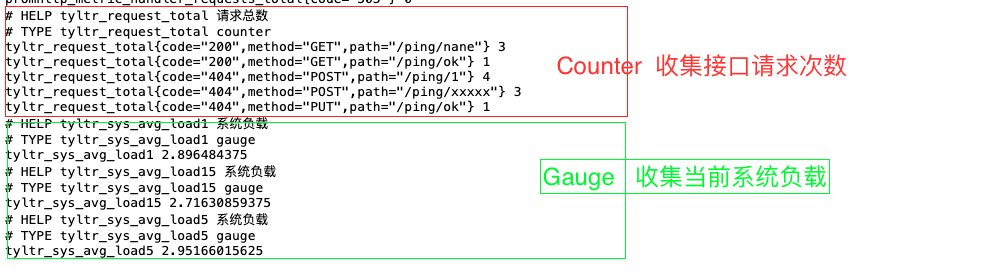

# 项目简述
## 代码版本
- 仓库地址: [https://github.com/prometheus/prometheus](https://github.com/prometheus/prometheus)
- commit: **c05c15512acb675e3f6cd662a6727854e93fc024**
- version: [v2.51.0](https://github.com/prometheus/prometheus/commits/v2.51.0)
- release: https://github.com/prometheus/prometheus/releases/tag/v2.51.0
- 官方文档: https://prometheus.io/docs/prometheus/2.51/getting_started/  

### 为何不选择LTS版本，而选择最新版本呢？
- Prometheus 小版本迭代周期约6周,更新周期快
- Prometheus LTS版本支持时长一年,只接受fixbug、安全性和文档的pr，再新功能
- Prometheus 建议通过升级版本的方式解决bug  https://prometheus.io/docs/introduction/release-cycle/#long-term-support

## 阅读环境
- vscode 
- docker(只是辅助工具，没有也可)


##  下载代码
```
git clone  git@github.com:prometheus/prometheus.git

# 代码版本
cd prometheus
git checkout  v2.51.0

# 依赖
go mod tidy
go mod vendor

```

## 手动编译安装
进入到项目的根目录，进行编译，命令如下：  
```
sudo  make build 
```
 
编译后，会创建两个可执行文件：   
 1. prometheus :  **prometheus的可执行文件**
 2. promtool  :   promtool 是 prometheus 提供的一个运维工具，用来对 Prometheus 进行检查.  


## 运行

```
 ./prometheus --config.file=documentation/examples/prometheus.yml
```

web界面    http://localhost:9090/graph

## http api
- 官方文档   https://prometheus.io/docs/prometheus/2.51/querying/api/
- 代码文档目录  `docs/querying/api.md`


## 拉取演示

### 服务upstream

服务upstream：返回请求的参数

docker-compose.yaml  
```
version: '3.1'

services:
  upstream:
    image: tylitianrui/upstream:v3
    restart: always
    container_name: upstream
    ports:
      - "5050:5050"
      - "5060:5060"
```

执行` docker-compose  up  -d `. 运行容器`upstream`

###  修改prometheus配置  

修改`prometheus`配置文件`prometheus.yml`。新增对服务`upstream`的监听。

```
scrape_configs:
  - job_name: "upstream"

    metrics_path : '/http/metrics'
    static_configs:
      - targets: ["localhost:5050"]

```

### 请求参数

```
{
	'method': 'GET',
	'url': 'http://localhost:5050/http/metrics',
	'headers': {
		'Host': 'localhost:5050',
		'User-Agent': 'Prometheus/2.51.0',
		'Accept': 'application/openmetrics-text;version=1.0.0;q=0.5,application/openmetrics-text;version=0.0.1;q=0.4,text/plain;version=0.0.4;q=0.3,*/*;q=2',
		'Accept-Encoding': 'gzip',
		'X-Prometheus-Scrape-Timeout-Seconds': '1'
	},
	'query_string': {},
	'body': None
}
```
注： `X-Prometheus-Scrape-Timeout-Seconds` 就是`prometheus.yml`中 `global.scrape_interval` .


## prometheus 自定义监控

[代码详见](./prom-target/main.go)  

**运行方式** 
 
```
# 进入prom-target 目录
cd  prom-target

# 第一次执行，需要拉取依赖。如果不是第一次执行，可以省略此步骤
go mod tidy
go  mod vendor

# 运行代码
go  run  main.go

```

访问  [http://127.0.0.1:9100/metrics](http://127.0.0.1:9100/metrics) 即可获取到`metric`指标。 

此段代码使用了两种指标类型:

 

- Counter  收集接口请求次数,指标名 `tyltr_request_total`  
- Gauge   收集当前系统负载，指标名 `tyltr_sys_avg_load1` 、`tyltr_sys_avg_load5` 、`tyltr_sys_avg_load15` 即 `uptime` 命令效果

