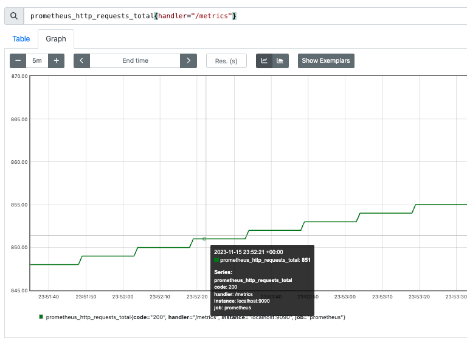
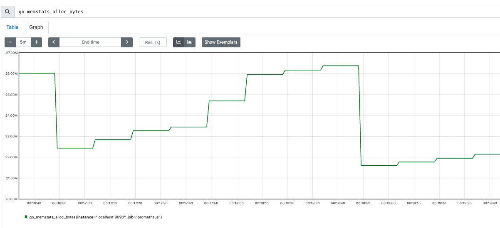
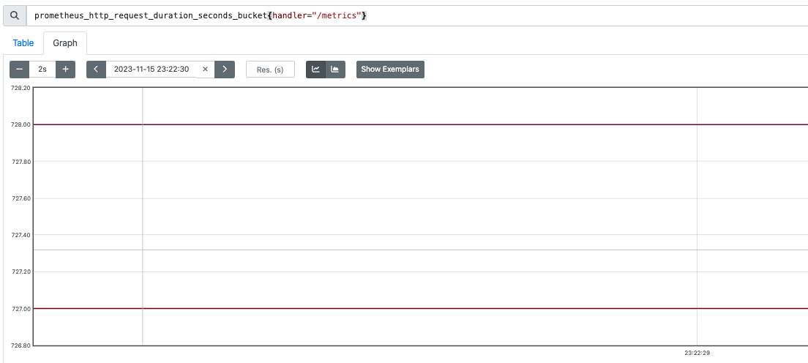
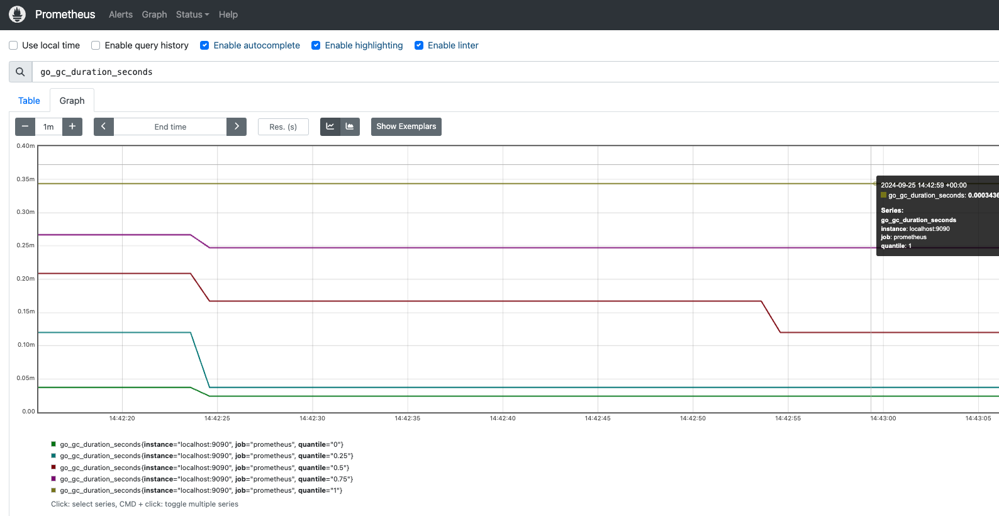
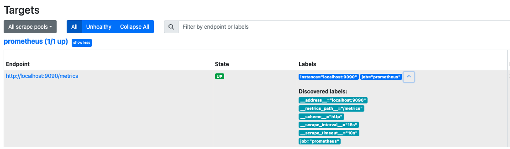
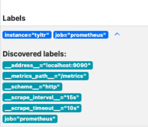
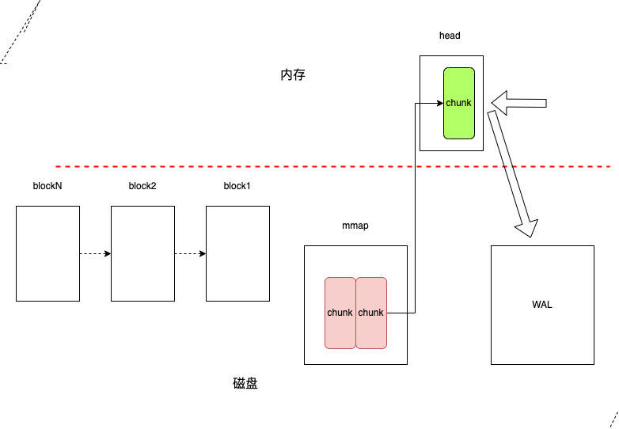

# prometheus简述


## 1.1 架构


**核心组件:**
- Prometheus server     
   - `Prometheus server`是`Prometheu`的核心组件.负责抓取、存储和查询指标数据,提供`API`以供访问。
   - `Prometheus Server`也是一个时序数据库(`TSDB`)，将采集到的监控数据按照时间序列的方式存储在本地磁盘当中。
   - 内置的`WEB UI`界面，通过这个UI可以直接通过`PromQL`实现数据的查询以及可视化（虽然内置ui界面，但ui过于简单，一般都不会使用内置ui界面，而是使用`grafana`等图形化界面，文档 [https://prometheus.io/docs/visualization/grafana/](https://prometheus.io/docs/visualization/grafana/)）
  
- Alertmanager 
  - `Alertmanager` 是告警管理器组件。实践中，会基于`PromQL`创建告警规则,如果满足PromQL定义的规则，就会产生一条告警;`Prometheus server`会将此告警`push`到`Alertmanager`;由`Alertmanager`完成告警管理(告警聚合、静默、告警等级、告警渠道等)

- PushGateway
  - `Prometheus`数据采集基于`Pull`模型进行设计，在网络环境必须要让`Prometheus Server`能够直接与`Exporter`进行通信，当这种网络需求无法直接满足时，就可以利用`PushGateway`来进行中转。营业将内部网络的监控数据主动`push`到`PushGateway`当中，`Prometheus Server`则可以采用同样`Pull`的方式从`PushGateway`中获取到监控数据。
  - 应用场景：
    - `Prometheus`和`target` 由于某些原因网络不能互通，需要经由`Pushgateway`代理
    - 短生命周期的任务。因为`Prometheus`是定期`pull`任务的监控信息，也就是有时间间隔；短生命周期的任务，可能采集的时候就已经退出了，那么监控信息都会消失，所以采用主动`push`的方式存入`PushGateway`。例如` kubernetes jobs` 或 `Cronjobs`中收集自定义指标

  
- Exporter
  - `Prometheus server`原理是通过 `HTTP` 协议周期性抓取被监控组件的状态，输出这些被监控的组件的 `Http` 接口为 `Exporter`。
  - `Prometheus server`通过轮询或指定的抓取器从`Exporter`提供的`Endpoint`端点中提取数据。
  
- Service Discovery
  - `Service Discovery`是服务发现功能，动态发现待监控的`Target`，完成监控配置的重要组件。例如`k8s`环境中的`pod`都是临时的，可变的。所以需要任务发现


## 1.2 功能介绍

### 1.2.1 服务发现
服务发现就是要解决`Prometheus server` 需要监控哪些服务的问题(采集哪些节点的信息)。获取监控对象的方式有两种:
  - 静态文件配置  
  - 动态服务发现  


#### 静态文件配置
在`Prometheus`的配置文件中，指定采集的目标。  
例如：  
```
scrape_configs:
  - job_name: "prometheus"
    metrics_path: "/metrics"
    static_configs:
      - targets: ["127.0.0.1:9090"]
```
采集对象的地址`127.0.0.1`,端口9090。采集对象暴露的api为`/metrics`。 `Prometheus server`定期请求`127.0.0.1:9090/metrics` 采集目标的数据。

如果监控的服务发生迁移、变更，则需要修改`prometheus`的配置文件并通知`prometheus`从新加载配置文件。
```
kill -HUP  <prometheus pid>
```
针对监控目标频繁变化的场景，静态文件配置就不能满足运维能力。因为`prometheus`提供了动态服务发现的方式来获取监控对象。

#### 动态服务发现  

在云原生环境下，动态服务发现就是必要的要求了。 
云原生特点： 
- 动态伸缩。
- 可以管理大量的容器。

**服务发现的流程**   
以`kubernetes`为例，简述服务发现的流程。
1. 在`prometheus`的配置文件`prometheus.yml`配置 **`kubernetes api server`地址** (*选填，不填则认为`prometheus`监控其所在的`kubernetes`集群*)和 **认证凭证**。 这样`prometheus`就可以获取到`kubernetes`集群的信息了。
2. `prometheus`的服务发现组件`watch` `kubernetes`集群的变化。无论新`node`加入`kubernetes`集群还是 新容器被创建/删除了，`prometheus`都可以感知到。

相关文档：
- 服务发现相关配置： https://prometheus.io/docs/prometheus/2.45/configuration/configuration/#configuration-file
- kubernetes相关配置： https://prometheus.io/docs/prometheus/2.45/configuration/configuration/#kubernetes_sd_config  

**对kubernetes服务发现代码简述**
- 服务发现配置字段：`xxxx_sd_config` 例如:`kubernetes_sd_config`.

```
// 配置注册.文件：discovery/registry.go
// RegisterConfig registers the given Config type for YAML marshaling and unmarshaling.
func RegisterConfig(config Config) {
	registerConfig(config.Name()+"_sd_configs", reflect.TypeOf(config), config)
}

// 文件：discovery/discovery.go
// 配置项解析
// A Config provides the configuration and constructor for a Discoverer.
type Config interface {
	// Name returns the name of the discovery mechanism.
	Name() string

	// NewDiscoverer returns a Discoverer for the Config
	// with the given DiscovererOptions.
	NewDiscoverer(DiscovererOptions) (Discoverer, error)
}


// 文件： discovery/kubernetes/kubernetes.go
// kubernetes SDConfig Name returns the name of the Config.
func (*SDConfig) Name() string { return "kubernetes" }

// NewDiscoverer returns a Discoverer for the Config.
func (c *SDConfig) NewDiscoverer(opts discovery.DiscovererOptions) (discovery.Discoverer, error) {
	return New(opts.Logger, c)
}

```
- 服务发现代码

```
// Discoverer provides information about target groups. It maintains a set
// of sources from which TargetGroups can originate. Whenever a discovery provider
// detects a potential change, it sends the TargetGroup through its channel.
//
// Discoverer does not know if an actual change happened.
// It does guarantee that it sends the new TargetGroup whenever a change happens.
//
// Discoverers should initially send a full set of all discoverable TargetGroups.

// 文件：discovery/discovery.go
type Discoverer interface {
	// Run hands a channel to the discovery provider (Consul, DNS, etc.) through which
	// it can send updated target groups. It must return when the context is canceled.
	// It should not close the update channel on returning.
	Run(ctx context.Context, up chan<- []*targetgroup.Group)
}


//文件： discovery/kubernetes/kubernetes.go
func (d *Discovery) Run(ctx context.Context, ch chan<- []*targetgroup.Group) {
  // .......
}


```

###  1.2.2 数据采集
通过静态配置/服务发现获取`targets`之后，`Prometheus`就会**定期**地通过http接口获取监控的数据。以静态配置为例
```
global:
  scrape_interval: 15s  

scrape_configs:
  - job_name: "prometheus"
    metrics_path: "/metrics"
    static_configs:
      - targets: ["127.0.0.1:9090"]
```
每隔15s获取请求一次 `127.0.0.1:9090/metrics` 获取监控数据。
请求：   
```
curl --location '127.0.0.1:9090/metrics' \
--header 'User-Agent: Prometheus/2.47.1' \
--header 'Accept: application/openmetrics-text;version=1.0.0;q=0.5,application/openmetrics-text;version=0.0.1;q=0.4,text/plain;version=0.0.4;q=0.3,*/*;q=2' \
--header 'X-Prometheus-Scrape-Timeout-Seconds: 15'
```

### 1.2.3 数据处理
通过定期拉取target的数据，那么就面临一些问题：
- 1.拉取到的数据是结构的？
- 2.怎么处理这些数据呢？

#### 数据类型
Prometheus有四种数据类型：Counter、Gauge、Histogram、Summary。  
  
**Counter(计数器类型)**   
Counter(计数器类型): 一般用于累计值，**只增不减**，例如记录请求次数、任务完成数、错误发生次数。类比:人生吃饭、喝水的次数  
  例如: 接口`/metrics`，状态码为`200`的请求次数
  ```
  prometheus_http_requests_total{code="200",handler="/metrics"} 851
  ```
  展示：  
      
  
   
**Gauge(仪表盘类型)**  
Gauge(仪表盘类型): 一般的监控指标，波动的指标，**可增可减**，例如cpu使用率，可用内存。类比:每顿吃了几碗饭。 
  
例如：`go`程序的内存分配情况  
```
# HELP go_memstats_alloc_bytes Number of bytes allocated and still in use.
# TYPE go_memstats_alloc_bytes gauge
go_memstats_alloc_bytes 2.1667616e+07
```  
  
展示  
 
  
  

**Histogram(直方图类型)**   
Histogram(直方图类型):表示一段时间范围内对数据进行采样（通常是请求持续时间或响应大小），并能够对其**指定区间**以及总数进行统计，通常它采集的数据展示为直方图。格式`xxxx_bucket{le="<数值>"[,其他标签]} <数值>`，*注：`le`是向上包含的*   

  例如：
  ```
  prometheus_http_request_duration_seconds_bucket{handler="/metrics",le="0.1"} 727
  prometheus_http_request_duration_seconds_bucket{handler="/metrics",le="0.2"} 727
  prometheus_http_request_duration_seconds_bucket{handler="/metrics",le="0.4"} 728
  prometheus_http_request_duration_seconds_bucket{handler="/metrics",le="1"} 728
  prometheus_http_request_duration_seconds_bucket{handler="/metrics",le="3"} 728
  prometheus_http_request_duration_seconds_bucket{handler="/metrics",le="8"} 728
  prometheus_http_request_duration_seconds_bucket{handler="/metrics",le="20"} 728
  prometheus_http_request_duration_seconds_bucket{handler="/metrics",le="60"} 728
  prometheus_http_request_duration_seconds_bucket{handler="/metrics",le="120"} 728
  prometheus_http_request_duration_seconds_bucket{handler="/metrics",le="+Inf"} 728
  ```
  `prometheus`，调用`/metrics`接口的监控数据。`request_time <= 0.1s`的请求数 727，`request_time <= 0.4s`的请求数 728。  

      
  展示：  
  
  
**Summary(摘要类型)**  
Summary(摘要类型):表示一段时间范围内对数据进行采样（通常是请求持续时间或响应大小)。格式`xxxx{quantile="< φ>"[,其他标签]} <数值>`，*注：`quantile`百分比*   
```
# HELP go_gc_duration_seconds A summary of the pause duration of garbage collection cycles.
# TYPE go_gc_duration_seconds summary

go_gc_duration_seconds{quantile="0"} 0.000024251
go_gc_duration_seconds{quantile="0.25"} 0.0003065
go_gc_duration_seconds{quantile="0.5"} 0.000597208
go_gc_duration_seconds{quantile="0.75"} 0. 000893082
go_gc_duration_seconds{quantile="1"} 0.001552459
```

  展示：  
  


#### 标签处理

目前，我们已经获取到了相关数据。那么怎么通过标签处理这些数据呢？
- 通过 `labels`可以实现添加自定义标签  
- 通过`relabel_configs`配置实现标签修改、过滤、删除等。
    


**案例一**： 添加自定义标签`service_name`. 

```
global:
  scrape_interval: 3s 
  evaluation_interval: 3s

scrape_configs:
  - job_name: "add_labels_demo"
    metrics_path: '/metrics'
    static_configs:
      - targets: 
        - "localhost:9090"
       labels:
          service_name: srv-1
      - targets: 
        - "127.0.0.1:9090"
       labels:
          service_name: srv-2
```
   
   

**案例二**： 改写`instance` 标签为 `tyltr`.  
  
```
global:
  scrape_interval: 15s # Set the scrape interval to every 15 seconds. Default is every 1 minute.
  evaluation_interval: 15s # Evaluate rules every 15 seconds. The default is every 1 minute.
  # scrape_timeout is set to the global default (10s).

scrape_configs:
  - job_name: "prometheus"
    metrics_path: '/metrics'
    static_configs:
      - targets: ["localhost:9090"]
    relabel_configs:
      - source_labels: [instance]
        replacement: 'tyltr'
        target_label: instance
        action: replace
```  
  
效果对比：  


| 更改instance标签前   | 更改instance标签后    |
| :-----| :---- |
|  |   |

注： 标签`instance`默认值是标签`__address__`的值，即`localhost:9090`；本次将标签`instance`值更改为`tyltr` 

  
**Action**   
   

| relabel_configs action | 修改对象| 说明    |
| :-----| :---- | :---- | 
|replace   | label|根据`regex`来去匹配`source_labels`标签上的值，并将改写到`target_label`中标签 | 
|keep     | target |根据`regex`来去匹配`source_labels`标签上的值，如果匹配成功，则采集此`target`,否则不采集 | 
|drop	    | target |根据`regex`来去匹配`source_labels`标签上的值，如果匹配成功，则不采集此`target`,用于排除，与keep相反|
|labeldrop	||使用regex表达式匹配标签，符合规则的标签将从target实例中移除|
|labelkeep|	|使用regex表达式匹配标签，仅收集符合规则的target，不符合匹配规则的不收集|
|labelmap	 | | 根据regex的定义去匹配Target实例所有标签的名称，并且以匹配到的内容为新的标签名称，其值作为新标签的值|

   


**案例三**： 排除`__address__`为`localhost`开头的`targets`  
   
`Prometheus`配置了两个`targets` : `localhost:9090`、`127.0.0.1:9090`,移除掉对 `localhost:9090`的监控。原配置如下:  
  
```
global:
  scrape_interval: 3s 
  evaluation_interval: 3s

scrape_configs:
  - job_name: "tyltr_drop"
    metrics_path: '/metrics'
    static_configs:
      - targets: ["localhost:9090","127.0.0.1:9090"]
```
  
添加`relabel_configs`配置，如下:  
  
```
global:
  scrape_interval: 3s 
  evaluation_interval: 3s

scrape_configs:
  - job_name: "tyltr_drop"
    metrics_path: '/metrics'
    static_configs:
      - targets: ["localhost:9090","127.0.0.1:9090"]
    relabel_configs:
      - source_labels: [__address__]
        regex: localhost.*
        action: drop
```
  

官方说明： [relabel_config](https://prometheus.io/docs/prometheus/latest/configuration/configuration/#relabel_config)


### 1.2.4 数据存储  

`Prometheus`的存储分为**本地存储**和**远程存储**。

#### 本地存储
`Prometheus`是自带时序数据库`TSDB (time series database)`。`TSDB` 有两个重要概念:`block` 和 `WAL`。
`Prometheus`将监控数据按照`2h`分割成一个`block`。`Prometheus`将当前`block`的数据保存在内存中，然后会通定期将数据刷到磁盘。随着时间增长，`block`就会越来越多，`block`会进行压缩、合并、清楚过期的`block`。
`Prometheus`将当前`block`的数据保存在内存中，为了防止应用崩溃而导致内存数据丢失，`Prometheus`实现了`WAL(write-ahead log)`机制。


上述的数据储存的目录由配置`storage.tsdb.path`指定，默认为`data`目录。由应用启动时指定，如下：
```
./prometheus  --config.file=documentation/examples/prometheus.yml   --storage.tsdb.path=<your storage pzth>
```

`storage.tsdb.path`目录(*默认为`data`*)由以下几部分组成：
- **block目录**  每个 `block`由`ulid` 标识。每个`block` 目录下包含以下部分：
  - 元信息  (必须)
  - tombstones   对数据进行软删除，`prometheus`采用了**标记删除**的策略，将删除记录保存在`tombstones`中，查询时会根据`tombstones`文件中的删除记录来过滤已删除的部分.
  - index        索引
  - chunks       用于保存时序数据。每个`chunks`目录下都有一个或者几个chunk,并且每个`chunk` 最大为512mb。超过的部分就会被截断新的`chunk`进行保存，每个`chunk`以数字编号命名。
- **chunks_head**
    todo
- **wal**
    todo

图示：  
  


**官方示例**   
```
./data
├── 01BKGV7JBM69T2G1BGBGM6KB12
│   └── meta.json
├── 01BKGTZQ1SYQJTR4PB43C8PD98
│   ├── chunks
│   │   └── 000001
│   ├── tombstones
│   ├── index
│   └── meta.json
├── 01BKGTZQ1HHWHV8FBJXW1Y3W0K
│   └── meta.json
├── 01BKGV7JC0RY8A6MACW02A2PJD
│   ├── chunks
│   │   └── 000001
│   ├── tombstones
│   ├── index
│   └── meta.json
├── chunks_head
│   └── 000001
└── wal
    ├── 000000002
    └── checkpoint.00000001
        └── 00000000
```


#### 远程存储

todo


### 1.2.5 告警
todo