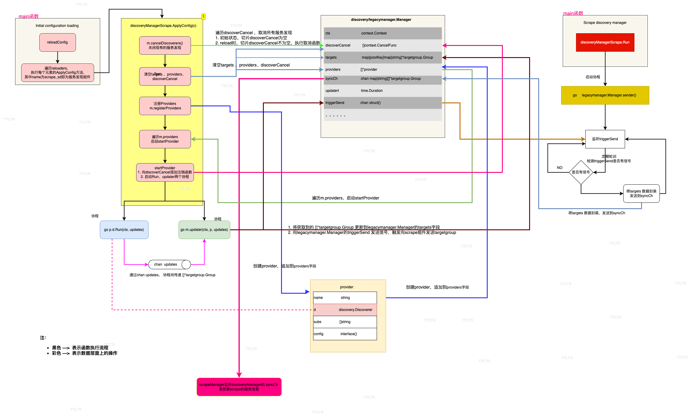

# 服务发现
作为监控系统，`prometheus`首先要解决的就是"`要监控谁`"的问题。静态配置比较适合`targets`基本稳定不变的场景，云原生体系下所有的被监控target都在动态的变化，如果使用静态配置就相形见绌了(*注：在[001.prometheus简述](001.prometheus简述.md)章节已经做了简述*）。本章主要讨论**服务发现**。

最新版本的`prometheus`(`v2.50`) 支持39种服务发现协议。配置关键字如下：  
- azure_sd_config
- consul_sd_config
- digitalocean_sd_config
- docker_sd_config
- dockerswarm_sd_config
- dns_sd_config
- ec2_sd_config
- openstack_sd_config
- ovhcloud_sd_config
- puppetdb_sd_config
- file_sd_config
- gce_sd_config
- hetzner_sd_config
- http_sd_config
- ionos_sd_config
- **kubernetes_sd_config**
- kuma_sd_config
- lightsail_sd_config
- linode_sd_config
- marathon_sd_config
- nerve_sd_config
- nomad_sd_config
- serverset_sd_config
- triton_sd_config
- eureka_sd_config
- scaleway_sd_config
- uyuni_sd_config
- vultr_sd_config
- **static_config**

由上述服务发现配置关键字，可以发现：
- 服务发现的配置都是以 `xxxx_sd_config`。因为`_sd_config`后缀是在代码中`hard-code`写死的，所以二开新的服务发现协议，需要遵守此命名规则。
- **static_config** 是一种特殊的服务发现。可以理解为target始终不变的服务发现。也是最简单的服务发现形式  

本章分别介绍 最简单的**static_config**和最常用的**kubernetes_sd_config** 服务发现。其他的服务发现实现逻辑是相同的，不再讲述。  

服务发现的配置详见: https://prometheus.io/docs/prometheus/2.50/configuration/configuration/


## 服务发现的核心逻辑  



说明：
todo


## Discovery Manager

`prometheus` 定义了很多`Manager`,例如负责服务发现的`discoveryManager`、

todo


## `Discoverer`实际执行者

`prometheus` 定义了 `Discoverer` 接口(*定义文件：`discovery/discovery.go`*)。`prometheus`中。 `Discoverer` 接口只有一个方法` Run(ctx context.Context, up chan<- []*targetgroup.Group) `。 `targets `变化都可以通过监听 `up chan` 获取到。我们将以`kubernetes`为例进行说明。  

**`Discoverer` 接口定义**:  
```go
// Discoverer provides information about target groups. It maintains a set
// of sources from which TargetGroups can originate. Whenever a discovery provider
// detects a potential change, it sends the TargetGroup through its channel.
//
// Discoverer does not know if an actual change happened.
// It does guarantee that it sends the new TargetGroup whenever a change happens.
//
// Discoverers should initially send a full set of all discoverable TargetGroups.

type Discoverer interface {
	// Run hands a channel to the discovery provider (Consul, DNS, etc.) through which
	// it can send updated target groups. It must return when the context is canceled.
	// It should not close the update channel on returning.
	Run(ctx context.Context, up chan<- []*targetgroup.Group)
}

```

## 新老版本Discovery Manager
todo