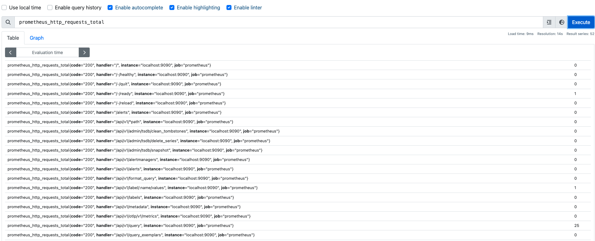

# PromQL

`Prometheus` 提供了一种功能表达式语言PromQL，允许用户**实时地**查询和聚合时间序列数据。查询出来的数据可以显示为图形、表格数据。也可以通过`RESTful API`被第三方系统获取。

官方文档: [https://prometheus.io/docs/prometheus/latest/querying/basics/](https://prometheus.io/docs/prometheus/latest/querying/basics/)  

## 语法与查询技巧

### 语法  

**查询结果的数据类型**

`PromQL` 查询结果有四种数据类型：  

- **`Instant vector`**（即时向量）每个时间序列，在任意时间点都**只包含一个样本**,例如：`prometheus` 接收到接口`/metrics`的请求数量`prometheus_http_requests_total{handler="/metrics"}` 。在截止到当前时间点，请求数量只有一个样本。如图：
    
  
- **`Range vector`**（范围向量）每个时间序列都包含一系列时间范围内的数据点，即**多个样本**,例如: `prometheus` 接收到接口`/metrics`的最近3分钟之内的请求数量 `prometheus_http_requests_total{handler="/metrics"}[3m]` 请求数量是一组样本。如图：
     

- `Scalar`（标量） 一个简单的浮点值。
- `String` 一个简单的字符串，目前暂未使用。暂时忽略；  
  
#### 时序选择器

在`PromQL` 中有两种时序选择器： `Instant Vector Selectors` 和 `Range Vector Selectors`。  

**Instant Vector Selectors**  

`Instant Vector Selectors` 是用于查询 `Instant vector`数据。 例如 `prometheus` 接收到`http`请求数量 `prometheus_http_requests_total`  如图：

    

查询所有http请求数量。

**过滤条件**  

- 使用`{}`添加过滤条件
- 使用逗号`,` 分割不同的过滤条件
- 标签匹配符
  - `=` 文本完全匹配，用于‘仅包含xxxx’的逻辑
  - `!=` 文本不匹配，用于‘排除xxxx’的逻辑
  - `=~` 选择正则表达式 匹配
  - `!~` 选择正则表达式 不匹配

例如:获取`/metrics`接口并且状态码为200的请求数量：  

```
prometheus_http_requests_total{handler="/metrics",code="200"}
```

例如:获取`/api/v1/` 为前缀的请求数量：

```
prometheus_http_requests_total{handler=~ "/api/v1/.+"}
```

**范围查询**  

- 使用`[]`表示时间范围
- 时间单位: 一般是秒级或者分钟级别的数据。
  - ms - milliseconds
  - s - seconds
  - m - minutes
  - h - hours
  - d - days - assuming a day always has 24h
  - w - weeks - assuming a week always has 7d
  - y - years - assuming a year always has 365d  
  
例如:获取`/api/v1/` 为前缀且3分钟内的请求数量

```
prometheus_http_requests_total{handler=~ "/api/v1/.+"}[3m]

```  
  
**分组**

- 使用关键字 `by`进行分组
  
例如: 获取请求`/api/v1/query`的请求总数量

```
sum(prometheus_http_requests_total{handler="/api/v1/query"})

``` 

    

*注：如果prometheus里暂时没有监控数据，可以手动向prometheus发请求，使prometheus获得http监控数据。例如：*

```shell

curl -X OPTIONS  http://127.0.0.1:9090/api/v1/query  
curl -X PUT http://127.0.0.1:9090/api/v1/query
curl   http://127.0.0.1:9090/api/v1/query  

```

针对上例，获取请求`/api/v1/query`的请求总数量,并且以状态码分组统计  

```shell

sum(prometheus_http_requests_total{handler="/api/v1/query"}) by (code)

``` 

    


### 技巧

常用的函数：

## 函数介绍

详见官方文档：[promql函数说明](https://prometheus.io/docs/prometheus/latest/querying/functions/)

### rate

[rate 官方文档](https://prometheus.io/docs/prometheus/latest/querying/functions/#rate)

## 解析promql语句

TODO

## 函数实现

`promql`本身只是普通的文本。在解析`promql`语句之后，`Prometheus`会根据用户查询意图执行响应的函数。当前版本`Prometheus`支持75个函数。
`FunctionCalls`(*文件：`promql/functions.go`*) 是一个包含`PromQL`支持的所有函数的`map`：

- `key`:`promql`中的函数名。例如：`rate`、··
- `value`:具体执行实现函数

```
var FunctionCalls = map[string]FunctionCall{
 "abs":                funcAbs,
 "absent":             funcAbsent,
 "absent_over_time":   funcAbsentOverTime,
 "acos":               funcAcos,
 "acosh":              funcAcosh,
 "asin":               funcAsin,
 "asinh":              funcAsinh,
 "atan":               funcAtan,
 "atanh":              funcAtanh,
 "avg_over_time":      funcAvgOverTime,
 "ceil":               funcCeil,
 "changes":            funcChanges,
 "clamp":              funcClamp,
    "rate":               funcRate,
    // .......
}
```
