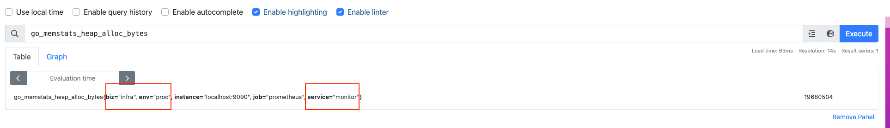

# Label和Relabeling

## 标签Label

### 内置标签/Meta标签

一般情况，`prometheus`以 "`__`"作为前缀的标签的是系统内置标签,定义了`Prometheus`的`Target`实例和指标的一些基本信息。
常见内部标签如下：

- `__address__`   当前`Target`实例的访问地址<`host`>:<`port`>，只供`Prometheus`执行期间使用，不会写入时序数据库中，也无法使用`promql`查询。
- `__scheme__`    采集`Target`指标的协议，`HTTP`或者`HTTPS` 默认是`HTTP`，只供`Prometheus`执行期间使用，不会写入时序数据库中，也无法使用`promql`查询。
- `__metrics_path__`  `Target`对外暴露的采集接口，默认`/metrics`，只供`Prometheus`执行期间使用，不会写入时序数据库中，也无法使用`promql`查询。
- `__name__`      `metrics`的名称，指标名会以 `__name__= <metric_name>`的形式，存储在时序数据库中，例如`__name__ = prometheus_http_requests_total`
- `job`   指标归属哪个 `job`
- `instance`   采集的实例，默认情况与`__address__`相同


> [!NOTE]
>
> 内置标签没有定义在`prometheus`项目，定义在`prometheus` 的公共依赖项目 [common](https://github.com/prometheus/common/blob/main/model/labels.go#L42)


### 自定义标签

`prometheus` 允许用户根据自己需求去定义标签，实现多维度、精细查询。使用关键字`labels`创建自定义标签。

#### 案例1:基本使用

要求： 针对当前`prometheus`得监控，为其指标标注归属部门`infra`、服务类型`monitor`、运行环境`prod`等  

配置如下： 

```yaml
global:
  scrape_interval: 15s # Set the scrape interval to every 15 seconds. Default is every 1 minute.
  evaluation_interval: 15s # Evaluate rules every 15 seconds. The default is every 1 minute.

scrape_configs:
  - job_name: "prometheus"
    static_configs:
      - targets: ["localhost:9090"]
        labels:
           env: prod
           service: monitor
           biz: infra  
```

展示效果：  

首先，我们先看一下`target`上有哪些`label`,访问[http://127.0.0.1:9090/targets?search=](http://127.0.0.1:9090/targets?search=)  如图：  


<br>

我们再看一下指标，**可任选指标**，本次选取`go_memstats_heap_alloc_bytes`展示  

 可见所有指标都被打上这些`env: prod`、`service: monitor`、`biz: infra`标签  


#### 案例2: 作用范围是target，而不是job

在[案例1:基本使用](#案例1基本使用)的基础上，再追加一个`target`目标为`http://127.0.0.1:9090/metrics`,`biz`标签设置为`internal`。两个相同的`target`,标签不同会是什么结果呢？

配置  

```yaml
global:
  scrape_interval: 15s # Set the scrape interval to every 15 seconds. Default is every 1 minute.
  evaluation_interval: 15s # Evaluate rules every 15 seconds. The default is every 1 minute.

scrape_configs:
  - job_name: "prometheus"
    static_configs:
      - targets: ["localhost:9090"]
        labels:
           env: prod
           service: monitor
           biz: infra  
      - targets: ["127.0.0.1:9090"]
        labels:
           env: prod
           service: monitor
           biz: internal
```

展示效果：
<br>
首先，我们先看一下`target`上有哪些`label`,访问[http://127.0.0.1:9090/targets?search=](http://127.0.0.1:9090/targets?search=), 如图:  


我们再看一下指标，**可任选指标**，本次选取`go_memstats_heap_alloc_bytes`展示 , 如图:  


可见：两个target获取的指标被打上不同的标签。**`labels`只作用于当前的`target`**

## Relabeling

`Relabeling`是`prometheus`的一种强大的功能，可以在拉取`targets`指标之前，动态地重写、增加、删除标签。 每个`scrape_config`中可以配置多个标签。它们会按照在配置文件中出现的先后顺序而作用与每个目标的标签集。

### 基本使用

`Relabeling` 需要配置在`prometheus`的配置文件中(*例如：`prometheus.yaml`*)。与服务发现配置为同一层级的`relabel_configs`模块下进行配置。
配置的关键字：

- `source_labels` 源标签，没有经过`relabel`处理之前的标签名字。
- `target_label` 目标标签，通过`relabel`处理之后的标签名字。
- `separator` 源标签的值的连接分隔符。默认是"`;`"。
- `regex` 正则表达式，匹配源标签的值默认是`(.*)`。
- `replacement`通过分组替换后标签（`target_label`）对应的值。默认是`$1`
- 具体处理的行为,即`action`，即如果`source_labels`指标满足`regex`规则，那么`prometheus`会进行“特定的处理”，将处理结果赋值给`target_label`。具体有哪些行为呢？ 如下表所示：  

| action    | 说明                                                         |
| :-------- | :----------------------------------------------------------- |
| replace   | 根据`regex`来去匹配`source_labels`标签上的值，并将改写到`target_label`中标签。如果未指定`action`，则默认就是`replace` |
| keep      | 根据`regex`来去匹配`source_labels`标签上的值，如果匹配成功，则采集此`target`,否则不采集 |
| drop      | 根据`regex`来去匹配`source_labels`标签上的值，如果匹配成功，则不采集此`target`,用于排除，与`keep`相反 |
| labelkeep | 使用`regex`表达式匹配标签，仅仅保留匹配成功的标签            |
| labeldrop | 使用`regex`表达式匹配标签，仅仅移除匹配成功的标签,用于排除，与`labelkeep`相反 |
| labelmap  | 根据`regex`的定义去匹配`Target`实例所有标签的名称，并且以匹配到的内容为新的标签名称，其值作为新标签的值。用于标签复制 |


#### Relabeling - replace 标签替换

#####  案例3: replace基本使用,作用范围是job

在[案例2: 作用范围是target，而不是job](#案例2: 作用范围是target，而不是job)的基础上，将标签`service` 的值改下成`prometheus_monitor`。配置如下 

``````yaml
global:
  scrape_interval: 15s # Set the scrape interval to every 15 seconds. Default is every 1 minute.
  evaluation_interval: 15s # Evaluate rules every 15 seconds. The default is every 1 minute.

scrape_configs:
  - job_name: "prometheus"
    static_configs:
      - targets: ["localhost:9090"]
        labels:
           env: prod
           service: monitor
           biz: infra  
      - targets: ["127.0.0.1:9090"]
        labels:
           env: prod
           service: monitor
           biz: internal
    relabel_configs:
    - source_labels:
      - "service"
      target_label: "service"
      action: replace
      replacement: prometheus_monitor
``````


说明： 

- 要处理的源标签(*配置`source_labels`*)`service`。如果标签`service`的值匹配正则`(.*)`,那么将配置`replacement`的值(*此例子中为常量`prometheus_monitor`*) 赋值给目标标签(*配置`target_label`*) ` service`。
- `Relabeling`规则的作用范围是`job`。上例中`relabel_configs`配置对` job_name：prometheus`下的所有`target`都生效。

展示


我们再看一下指标，**可任选指标**，本次选取`go_memstats_heap_alloc_bytes`展示 , 如图:  


##### 案例4: 使用replace新增自定义标签

在[案例2: 作用范围是target，而不是job](#案例2: 作用范围是target，而不是job)的基础上，将内置标签`__address__` 的`ip`地址部分改写成自定义标签`node`,并存入数据库。配置如下 

``````yaml
global:
  scrape_interval: 15s # Set the scrape interval to every 15 seconds. Default is every 1 minute.
  evaluation_interval: 15s # Evaluate rules every 15 seconds. The default is every 1 minute.

scrape_configs:
  - job_name: "prometheus"
    static_configs:
      - targets: ["localhost:9090"]
        labels:
           env: prod
           service: monitor
           biz: infra  
      - targets: ["127.0.0.1:9090"]
        labels:
           env: prod
           service: monitor
           biz: internal
    relabel_configs:
    - source_labels:
      - "__address__"
      regex: "(.*):(.*)"
      target_label: "node"
      action: replace
      replacement: $1
``````


说明：

- 内置标签 `__address__`  只供`Prometheus`内部使用，不会写入时序数据库中，也无法使用`promql`查询。
- 如果源标签 `__address__`的值匹配正则匹配`(.*):(.*)`,那么将`$1`位置上的值(*即:`ip`*部分) 赋值给自定义标签`node`；如果源标签 `__address__`的值不能匹配正则匹配`(.*):(.*)`,不进行赋值


展示


我们再看一下指标，**可任选指标**，本次选取`go_memstats_heap_alloc_bytes`展示 , 如图:  


##### 案例5: 慎用！！！replace改写内部标签

在[案例2: 作用范围是target，而不是job](#案例2: 作用范围是target，而不是job)的基础上，将内置标签`__address__` 的值改写成`biz`标签的值。配置如下 

``````yaml
global:
  scrape_interval: 15s # Set the scrape interval to every 15 seconds. Default is every 1 minute.
  evaluation_interval: 15s # Evaluate rules every 15 seconds. The default is every 1 minute.

scrape_configs:
  - job_name: "prometheus"
    static_configs:
      - targets: ["localhost:9090"]
        labels:
           env: prod
           service: monitor
           biz: infra  
      - targets: ["127.0.0.1:9090"]
        labels:
           env: prod
           service: monitor
           biz: internal
    relabel_configs:
    - source_labels:
      - "biz"
      regex: "(.*)"
      # target_label: "address"  
      target_label: "__address__"
      action: replace
      replacement: $1
``````


经过验证：修改了内置标签`__address__`之后，`prometheus`是无法采集`target`指标的。原因是内置标签是`prometheus`内部使用的，例如：`__address__`记录的是`target`的地址。在采集之前将`__address__`进行了修改，无法获取到真实的地址。

上面的解释是根本原因是【无法获取到真实的地址】导致的。那么虽然改写`__address__`，但是如果是正确的值,是否可以正常采集呢？答案是肯定的。我们进行如下验证。

- 我们使用`ifconfig`看一下本机的ip地址。本机ip为`192.168.0.105`

``````shell
en0: flags=8863<UP,BROADCAST,SMART,RUNNING,SIMPLEX,MULTICAST> mtu 1500
        options=400<CHANNEL_IO>
        ether 88:e9:fe:79:b0:d1 
        inet6 fe80::cca:ed6f:1ebf:92a1%en0 prefixlen 64 secured scopeid 0x4 
        inet 192.168.0.105 netmask 0xffffff00 broadcast 192.168.0.255
        nd6 options=201<PERFORMNUD,DAD>
        media: autoselect
        status: active
``````

- 将把`__address__`改写成`192.168.0.105`。 配置如下：

``````
global:
  scrape_interval: 15s # Set the scrape interval to every 15 seconds. Default is every 1 minute.
  evaluation_interval: 15s # Evaluate rules every 15 seconds. The default is every 1 minute.

scrape_configs:
  - job_name: "prometheus"
    static_configs:
      - targets: ["localhost:9090"]
        labels:
           env: prod
           service: monitor
           biz: infra  
      - targets: ["127.0.0.1:9090"]
        labels:
           env: prod
           service: monitor
           biz: internal
    relabel_configs:
    - source_labels:
      target_label: "__address__"
      action: replace
      replacement: "192.168.0.105:9090"
``````


说明：

- 运行正常。两个target的采集地址都是 `192.168.0.105:9090`

如图所示


我们再看一下指标，**可任选指标**，本次选取`go_memstats_heap_alloc_bytes`展示 , 如图:


#### Relabeling - keep与drop

##### 案例6：采集特定的target的指标

在[案例2: 作用范围是target，而不是job](#案例2: 作用范围是target，而不是job)的基础上，仅仅采集`__address__`为`127.0.0.1:9090`的`target`的指标

``````yaml
global:
  scrape_interval: 15s # Set the scrape interval to every 15 seconds. Default is every 1 minute.
  evaluation_interval: 15s # Evaluate rules every 15 seconds. The default is every 1 minute.

scrape_configs:
  - job_name: "prometheus"
    static_configs:
      - targets: ["localhost:9090"]
        labels:
           env: prod
           service: monitor
           biz: infra  
      - targets: ["127.0.0.1:9090"]
        labels:
           env: prod
           service: monitor
           biz: internal
    relabel_configs:
    - source_labels:
      - "__address__"
      regex: "127.0.0.1:9090"
      action: keep
      # action: drop   # 仅不采集__address__ =127.0.0.1:9090的 target
``````

说明：

- 仅采集`__address__= 127.0.0.1:9090`的target

如图所示


我们再看一下指标，**可任选指标**，本次选取`go_memstats_heap_alloc_bytes`展示 , 如图:  


若上例需求改为【在[案例2: 作用范围是target，而不是job](#案例2: 作用范围是target，而不是job)的基础上，不采集`__address__`为`127.0.0.1:9090`的`target`的指标】，则使用`drop`。`drop`与`keep`的作用相反。配置则为

``````yaml
global:
  scrape_interval: 15s # Set the scrape interval to every 15 seconds. Default is every 1 minute.
  evaluation_interval: 15s # Evaluate rules every 15 seconds. The default is every 1 minute.

scrape_configs:
  - job_name: "prometheus"
    static_configs:
      - targets: ["localhost:9090"]
        labels:
           env: prod
           service: monitor
           biz: infra  
      - targets: ["127.0.0.1:9090"]
        labels:
           env: prod
           service: monitor
           biz: internal
    relabel_configs:
    - source_labels:
      - "__address__"
      regex: "127.0.0.1:9090"
      action: drop
``````


#### Relabeling - labelkeep和labeldrop

##### 案例7：仅保留指标的部分标签

在[案例2: 作用范围是target，而不是job](#案例2: 作用范围是target，而不是job)的基础上，仅保留指标的`__xxxx__`形式的标签和`biz` 标签。配置如下：

``````yaml
global:
  scrape_interval: 15s # Set the scrape interval to every 15 seconds. Default is every 1 minute.
  evaluation_interval: 15s # Evaluate rules every 15 seconds. The default is every 1 minute.

scrape_configs:
  - job_name: "prometheus"
    static_configs:
      - targets: ["localhost:9090"]
        labels:
           env: prod
           service: monitor
           biz: infra  
      - targets: ["127.0.0.1:9090"]
        labels:
           env: prod
           service: monitor
           biz: internal
    relabel_configs:
      - regex: "__(.*)__|biz"
        action: labelkeep
``````


如图所示


我们再看一下指标，**可任选指标**，本次选取`go_memstats_heap_alloc_bytes`展示 , 如图:  


有些伙伴可能已经心细地发现了一个问题：为何没有`__xxxx__`形式的标签，而凭空出现一个`instance`标签呢？

首先，本例子中`__xxxx__`形式的标签(*即：`__address__` 、`__metrics_path__` 、`__schama__` 、`__scrape_interval__` 、`__scrape_timeout__`* )都是内置标签。内置标签只供`Prometheus`执行的中间过程使用，不会写入时序数据库中，也无法使用`promql`查询。这些内置标签最终不会出现在指标数据上

再者，如果用户没有在`relabel_configs`中配置  `instance`标签，那么`Prometheus`自动创建此标签。`instance`标签的默认值就是`__address__` 的值。


> [!WARNING]
>
> 如果案例7中正则匹配部分改为`regex: "biz"`即：仅保留`biz`标签，不保留`__xxxx__`形式的标签，结果会怎样呢？
>
> 结果会报错`Creating target failed" err="instance 0 in group 0: no address`。因为`__address__`是`Prometheus`拉取指标的地址。如果`__address__`被移除了，那么`Prometheus`将无法获取`target`的地址。所以会报错。
>
> 
>
> 在实际生产中，尽量不要处理`__xxxx__`形式的内置标签！！！


#### Relabeling - labelmap

##### 案例8：复制标签

在[案例2: 作用范围是target，而不是job](#案例2: 作用范围是target，而不是job)的基础上，复制内置标签到指标上，并且把 `__xxxx__`形式改为`xxxx`形式。配置如下：

``````yaml
global:
  scrape_interval: 15s # Set the scrape interval to every 15 seconds. Default is every 1 minute.
  evaluation_interval: 15s # Evaluate rules every 15 seconds. The default is every 1 minute.

scrape_configs:
  - job_name: "prometheus"
    static_configs:
      - targets: ["localhost:9090"]
        labels:
           env: prod
           service: monitor
           biz: infra  
      - targets: ["127.0.0.1:9090"]
        labels:
           env: prod
           service: monitor
           biz: internal
    relabel_configs:
      - regex: "__(.*)__"
        action: labelmap
``````

说明： 原本内置标签不会写入时序数据库中。本次将其拷贝到了指标数据中，并存储数据库中。

如图所示


我们再看一下指标，**可任选指标**，本次选取`go_memstats_heap_alloc_bytes`展示 , 如图:  


