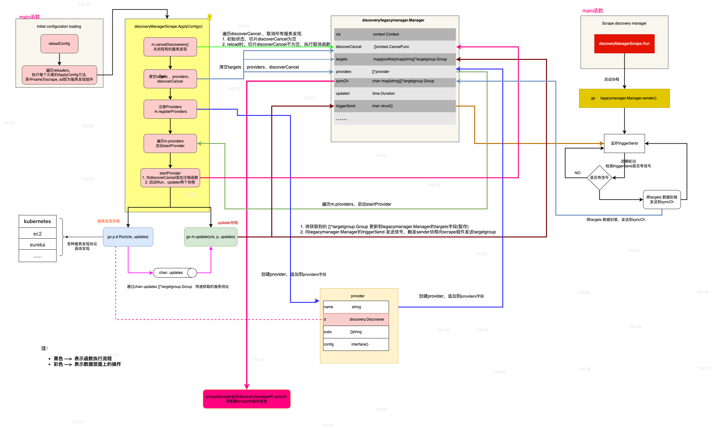

# 3.2 服务发现的核心逻辑

`prometheus`的服务发现由`Discovery Manager`进行管理和维护的。`prometheus 2.x`实现了两个`DiscoveryManager`：

- [legacymanager](https://github.com/prometheus/prometheus/blob/v2.53.0/discovery/legacymanager/manager.go#L87) 定义文件[`discovery/legacymanager/manager.go`](https://github.com/prometheus/prometheus/blob/v2.53.0/discovery/legacymanager/manager.go) 旧版本`DiscoveryManager`，`prometheus 2.x`中默认使用的`DiscoveryManager`。在本系列如果没有明确说明，指的就是[legacymanager](https://github.com/prometheus/prometheus/blob/v2.53.0/discovery/legacymanager/manager.go#L87)。本章节解读的代码也是[legacymanager](https://github.com/prometheus/prometheus/blob/v2.53.0/discovery/legacymanager/manager.go#L87)。

- [manager](https://github.com/prometheus/prometheus/blob/v2.53.0/discovery/manager.go#L133) 定义文件[`discovery/manager.go`](https://github.com/prometheus/prometheus/blob/v2.53.0/discovery/manager.go)  新版本的`DiscoveryManager`。`prometheus 2.x`启动时，设置参数`--enable-feature = new-service-discovery-manager`则使用新版本的`DiscoveryManager`。启动命令如下：

  ``````shell
  prometheus     --config.file=documentation/examples/prometheus.yml  --enable-feature=new-service-discovery-manager
  ``````

  `2024.09`发布的[v3.0.0-beta.0](https://github.com/prometheus/prometheus/releases/tag/v3.0.0-beta.0)指出`prometheus 3.x`默认使用新的`DiscoveryManager`，而不再使用老版本[legacymanager](https://github.com/prometheus/prometheus/blob/v2.53.0/discovery/legacymanager/manager.go#L87)。


`Discovery Manager`维护三种协程实现服务发现，每种协程负责不同的工作：

- 服务发现协程`discovery goroutine`: 负责执行服务发现的工作
- 更新协程`updater goroutine`：将服务发现获取的地址等信息更新到`DiscoveryManager`的缓存里
- 发送协程`sender goroutine`：将最新的target地址信息发送给拉取模块

各协程示意图  

  

## DiscoveryManager

`prometheus` 定义了很多`Manager`,例如负责服务发现的`DiscoveryManager`、负责拉取指标的`ScrapeManager`等。在源码中，`DiscoveryManager`被定义为名为[Manager的结构体](https://github.com/prometheus/prometheus/blob/v2.53.0/discovery/legacymanager/manager.go#L87)。
除此之外，还有[`provider`](https://github.com/prometheus/prometheus/blob/v2.53.0/discovery/legacymanager/manager.go#L37)也是比较重要的。它封装了各个服务发现的实例和配置。

DiscoveryManager  

```golang
// Manager maintains a set of discovery providers and sends each update to a map channel.
// Targets are grouped by the target set name.
type Manager struct {
	logger         log.Logger
	name           string
	mtx            sync.RWMutex
	ctx            context.Context
	discoverCancel []context.CancelFunc

	// Some Discoverers(eg. k8s) send only the updates for a given target group
	// so we use map[tg.Source]*targetgroup.Group to know which group to update.
	targets map[poolKey]map[string]*targetgroup.Group
	// providers keeps track of SD providers.
	providers []*provider
	// The sync channel sends the updates as a map where the key is the job value from the scrape config.
	syncCh chan map[string][]*targetgroup.Group

	// How long to wait before sending updates to the channel. The variable
	// should only be modified in unit tests.
	updatert time.Duration

	// The triggerSend channel signals to the manager that new updates have been received from providers.
	triggerSend chan struct{}

	// A registerer for all service discovery metrics.
	registerer prometheus.Registerer

	metrics   *discovery.Metrics
	sdMetrics map[string]discovery.DiscovererMetrics
}

```

重要字段说明：

- `targets map[poolKey]map[string]*targetgroup.Group`  存储了`prometheus`获取到的所有的服务发现信息
- `providers []*provider`  各个服务发现的实例 
- `syncCh chan map[string][]*targetgroup.Group`  向`scrape`模块发送服务发现结果
- `triggerSend chan struct{}`  通过此`channal`，`updater`协程向`sender`协程发送信号，通知服务发现有新更新。

私有结构体`provider` 定义：

```go
// provider holds a Discoverer instance, its configuration and its subscribers.
type provider struct {
	name   string
	d      discovery.Discoverer
	subs   []string
	config interface{}
}

```

重要字段：

- `d discovery.Discoverer`： `prometheus`支持多种服务发现的协议, 每种协议的实际“工作者”都必须实现`discovery.Discoverer`接口。`provider.d` 也就是一个个的服务发现的实际“执行者”。如果k8s，d就是[`kubernetes.Discovery`](https://github.com/prometheus/prometheus/blob/v2.53.0/discovery/kubernetes/kubernetes.go#L263)，


## discovery.Discoverer接口

`prometheus`支持多种服务发现的协议，所以需要为每种协议创建不同的对象来负责具体的服务发现。 例如:`kubernetes_sd_configs`协议对应的是[`kubernetes.Discovery`](https://github.com/prometheus/prometheus/blob/v2.53.0/discovery/kubernetes/kubernetes.go#L263)；`ec2_sd_config`协议对应的是[`aws.EC2Discovery`](https://github.com/prometheus/prometheus/blob/v2.53.0/discovery/aws/ec2.go#L146)等，


虽然是不同对象负责不同协议的服务发现，但每种协议的服务发现对象必须都实现[`discovery.Discoverer`](https://github.com/prometheus/prometheus/blob/v2.53.0/discovery/discovery.go#L35)接口。 `discovery.Discoverer`定义如下:

```golang 
// Discoverer provides information about target groups. It maintains a set
// of sources from which TargetGroups can originate. Whenever a discovery provider
// detects a potential change, it sends the TargetGroup through its channel.
//
// Discoverer does not know if an actual change happened.
// It does guarantee that it sends the new TargetGroup whenever a change happens.
//
// Discoverers should initially send a full set of all discoverable TargetGroups.
type Discoverer interface {
	// Run hands a channel to the discovery provider (Consul, DNS, etc.) through which
	// it can send updated target groups. It must return when the context is canceled.
	// It should not close the update channel on returning.
	Run(ctx context.Context, up chan<- []*targetgroup.Group)
}
```

<br> 

`discovery.Discoverer`接口只有一个方法`Run(ctx context.Context, up chan<- []*targetgroup.Group)`。其中参数`up chan<- []*targetgroup.Group`是`discovery`协程与`updater`协程交互的"渠道"。`discovery`协程会将服务发现的结果封装成`[]*targetgroup.Group`发送到`updater`协程。


## 服务发现协程`discovery goroutine`

`discovery`协程主要工作就是进行**服务发现**,获取`targets`拉取`metric`的地址。


`discovery.Discoverer`接口有一个方法`Run(ctx context.Context, up chan<- []*targetgroup.Group)`。`discovery`执行的就是这个`Run`方法，并通过`up chan<- []*targetgroup.Group`将服务发现的结果发送到`updater`协程。


<br>

`prometheus`配置文件中可以配置多个服务发现，`prometheus`会为每个服务发现配置开启独立的`discovery`协程和`updater`协程。  
例如: 配置文件(`配置demo1`)中设置了3处服务发现的配置，`job_name: kubernetes-apiservers-jobnanme` 设置1个服务发现配置，`job_name: kubernetes-nodes-jobnanme`设置2个服务发现配置。那么`Discovery Manager`会创建3个独立的`kubernetes.Discovery`实例，并且每个`kubernetes.Discovery`实例都会开启一个独立`discovery`协程，进行服务发现。除此次之外，`Discovery Manager`也会开启独3个`updater`协程分别接收`discovery`协程获取的服务信息。

**配置demo1**  

```yaml 
global:
  keep_dropped_targets: 100

scrape_configs:
  - job_name: "kubernetes-apiservers-jobnanme"
    scheme: https
    kubernetes_sd_configs:
      - api_server: https://192.168.0.107:6443
        role: endpoints
        namespaces:
          names: ["default"]
        bearer_token_file: /Users/ollie/opencode/prometheus/documentation/examples/k8s.token
        tls_config:
          insecure_skip_verify: true
    bearer_token_file:   /Users/ollie/opencode/prometheus/documentation/examples/k8s.token
    tls_config:
      insecure_skip_verify: true
    relabel_configs:
      - source_labels:
          [
            __meta_kubernetes_namespace,
            __meta_kubernetes_service_name,
            __meta_kubernetes_endpoint_port_name,
          ]
        action: keep
        regex: default;kubernetes;https

  - job_name: "kubernetes-nodes-jobnanme"
    scheme: https
    kubernetes_sd_configs:
      - api_server: https://192.168.0.107:6443
        role: node
        namespaces:
          names: ["default"]
        bearer_token_file: /Users/ollie/opencode/prometheus/documentation/examples/k8s.token
        tls_config:
          insecure_skip_verify: true
      - api_server: https://master:6443
        role: node
        namespaces:
          names: ["default"]
        bearer_token_file: /Users/ollie/opencode/prometheus/documentation/examples/k8s.token
        tls_config:
          insecure_skip_verify: true
    bearer_token_file:   /Users/ollie/opencode/prometheus/documentation/examples/k8s.token
    tls_config:
      insecure_skip_verify: true
    relabel_configs:
      - action: labelmap
        regex: __meta_kubernetes_node_label_(.+)
```

源码debug示意图  

  


## 更新协程`updater goroutine`

通过`up chan<- []*targetgroup.Group`,`updater`协程获取到服务发现的结果信息。`updater`协程将服务发现的结果更新到`Discovery Manager`实例的`targets`字段。并且通过`triggerSend`(类型`chan struct{}`)向`sender`协程发送信号，通知服务发现有新更新。
`targets`字段的类型`map[poolKey]map[string]*targetgroup.Group` : 

- `poolKey` 信息包含`job_name`和`服务发现类型`和`序号`。poolKey定义(以配置demo1为例)
  
```golang
type poolKey struct {
	setName  string    // job_name  例如:kubernetes-nodes-jobnanme
	provider string    // 服务类型和序号构成的string，例如:kubernetes/1  标明此服务发现是kubernetes协议的。prometheus有很多kubernetes服务发现，顺序上此为第1个
}
```

- `map[string]*targetgroup.Group` 每个`target`的具体地址等信息

## 发送协程`sender goroutine`

`sender`协程接受到`triggerSend`(类型`chan struct{}`)发来的信息，得知服务发现有新的更新。`sender`协程在`Discovery Manager`实例的`targets`字段里获取**全部**的服务发现信息。将服务发现的结果通过`syncCh chan map[string][]*targetgroup.Group`发送给`scrape`模块。


需要注意，服务发现的逻辑中定义了很多`map[string][]*targetgroup.Group`结构。`syncCh chan map[string][]*targetgroup.Group`中的`map[string][]*targetgroup.Group`：

- `key`,类型`string`。`prometheus`配置文件中的`job_name`，例如下面的配置中[`job_name: "prometheus"`](https://github.com/prometheus/prometheus/blob/v2.53.0/documentation/examples/prometheus.yml#L23)


>  ```yaml
>  # A scrape configuration containing exactly one endpoint to scrape:
>  # Here it's Prometheus itself.
>  scrape_configs:
>    # The job name is added as a label `job=<job_name>` to any timeseries scraped from this >  config.
>    - job_name: "prometheus"
>  
>      # metrics_path defaults to '/metrics'
>  ```


- `value`，类型 `[]*targetgroup.Group`, 每个`job_name`下的所有服务发现的**地址信息**、标签信息等。`scrape`模块就是根据这些地址信息去拉取指标的。


# 核心逻辑代码解析

代码执行图

  

