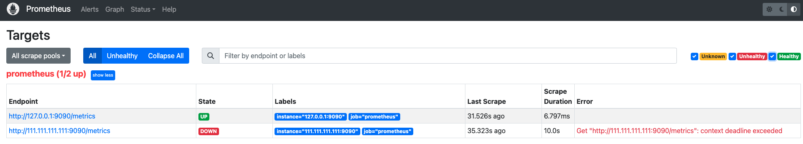

# 3.1 服务发现简述

作为监控系统，`prometheus`首先要解决的就是"`要监控谁`"的问题，即配置、感知、获取被监控服务。 被监控的服务一般称之为`target`，获取`target`的方式有两种:

- 静态文件配置  

  静态配置(`static_config`)将被监控对象地址"写死"在配置文件中，这比较适合被监控稳定不变的场景。

- 动态服务发现  


​	在云原生体系下，各种资源是动态分配的，是随着需求规模的变化而变化的，这也意味着没有固定的监控目标。这也就无法继续使用静态配置(`static_config`)方式处理被监控对象了。那怎么解决这问题呢？

​	目前最常规的策略就是**服务注册与服务发现**。被监控对象讲自身信息注册到**注册中心、存储或者第三方服务**。`prometheus`实现服务发现功能，在**注册中心、存储或者第三方服务**获取最新的监控目标的信息。


目前版本的`prometheus`(`v2.53.0`) 实现了多种协议的服务发现功能，具体可见[prometheus的配置文档](https://prometheus.io/docs/prometheus/2.53/configuration/configuration/)。最常见的是以下几种：

- **static_config**  静态配置

- **file_sd_config** 基于本地文件的服务发现。这种方式不需要依赖于第三方的注册中心、第三方存储、第三方服务，是最简单的服务发现方式。

  - `target`发生变化时，把信息更新到某个文件中;  

  - `prometheus`会定期地检查文件是否有变化，如果有变化，就从文件中读取最新的`target`信息。

    

- **kubernetes_sd_config** 基于`kubernetes api-server` 获取

  - `k8s`是`master-node`架构，每个`node`会定期地向`master` 报告自身的状态；
  - `kubernetes api-server`是`master`提供对外的`HTTP API`,可实现对集群的资源增删改查。 `promethues` 可以通过`kubernetes api-server` 查询到集群里的资源信息。


## static_config

配置文件：**prometheus.yml**

```yaml
global:
  scrape_interval: 15s # Set the scrape interval to every 15 seconds. Default is every 1 minute.
  evaluation_interval: 15s # Evaluate rules every 15 seconds. The default is every 1 minute.

scrape_configs:
    - job_name: "prometheus"
      metrics_path: "/metrics"
      static_configs:
        - targets: ["127.0.0.1:9090"]
```

如图：  


如果`target`的`IP`配置错了。例如下例配置了一个不存在的`IP`地址`111.111.111.111:9090`

配置文件：**prometheus.yml**

```
global:
  scrape_interval: 15s # Set the scrape interval to every 15 seconds. Default is every 1 minute.
  evaluation_interval: 15s # Evaluate rules every 15 seconds. The default is every 1 minute.

scrape_configs:
   - job_name: "prometheus"
     metrics_path: "/metrics"
     static_configs:
       - targets: ["127.0.0.1:9090","111.111.111.111:9090"]
```

如图：  



说明：

- 配置正确的状态是**UP**，正常拉取指标
- 错误的地址状态**DOWN**,无法获取指标，不会导致`Prometheus Server`崩溃


## file_sd_config


配置文件：**prometheus.yml**

```yaml
global:
  scrape_interval: 15s # Set the scrape interval to every 15 seconds. Default is every 1 minute.
  evaluation_interval: 15s # Evaluate rules every 15 seconds. The default is every 1 minute.

scrape_configs:
  - job_name: "prometheus_file_sd_configs"
    file_sd_configs:
      - files: ["./file_sd_config/*.yml"]
        refresh_interval: 15s
```


配置文件：**./file_sd_config/1.yml**

```yaml
- targets:
  - '127.0.0.1:9090'

  labels:
    times: "2"
```

上述配置，`prometheus`会定期读取文件中的内容读取文件内容。当文件中定义的内容发生变化时，不需要重启`prometheus`,即可加载`targets`实现监控。

- `files` 读取文件的目录。本处为`./file_sd_config/*.yml`，相对于`prometheus.yml`文件。
- `refresh_interval`设置读取`files`的时间间隔，本处为`15s`


如图：  
