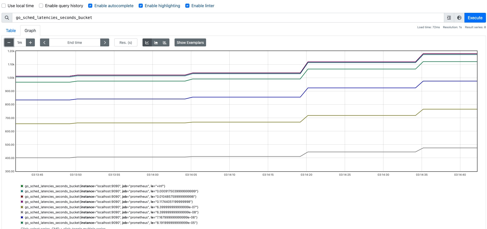

# 2.6 指标以及数学原理

本节的目标：

- 了解`Metrics`：`Metrics`四种类型以及各自的行为、应用场景

- 了解`Metric`背后的数学原理

  

## 1.指标(`Metric`)

`prometheus` 的指标数据由`target`服务提供的。`prometheus`服务器定时从`target`服务上收集这些指标。

### 1.1 指标(`Metric`)结构

`Prometheus`的指标(`Metric`)结构： 

```
<metric name>{<label_name_1>=<label_value_1>,<label_name_2>=<label_value_2>,...} 
```

说明：

- 每个时间序列由指标名称(`metric name`)以及若干组标签（可选）唯一标识

- 指标名称(`metric name`)：反映被监控的样本, 例如`prometheus_http_requests_total`表示 `Prometheus`接收到的`HTTP`请求数量; 

- 指标名称(`metric name`)命名必须满足如下规则：

  - 指标名称必须有字母、数字、下划线或者冒号组成
  - 不能以数字开头，也就是说必须满足`[a-zA-Z_:][a-zA-Z0-9_:]*`
  - 冒号`:`不得使用于`exporter`    注：冒号专门用来表示用户自定义的记录规则，不能在exporter或监控对象直接暴露的指标中使用冒号来表示指标名称。

- 标签(`label`)反映样本的特征维度,通过这些维度`Prometheus`可以对样本数据进行过滤，聚合等.标签命名必须满足如下规则：
  - 标签名称必须有字母、数字、下划线或者冒号组成

  - 标签名称不能以数字开头，也就是说必须满足`[a-zA-Z_][a-zA-Z0-9_]*`

  - 前缀为`__`标签，是为系统内部使用而预留的。

    
    
    

> [!TIP]
>
> `Prometheus`拉取到的指标(`Metric`)形式都是
>
> ```
>  <metric name>{<label_name_1>=<label_value_1>,<label_name_2>=<label_value_2>,...} 
> ```
>
> 但在数据库中，指标名称(`metric name`)将会以`__name__=<metric name>`的形式存储的。
>
> ```
> {__name__=<metric name>,<label_name_1>=<label_value_1>,<label_name_2>=<label_value_2>,...} 
> ```
>
> 是同一个时序的不同表示而已。
>
> 
>
> 例如： `metric`接口获取的指标`prometheus_http_requests_total{code="200",handler="/"}`会被转换成 `{__name__ = "prometheus_http_requests_total", code="200",handler="/"}`存储在数据库中。
>
> 


### 1.2 指标(`Metric`)类型

`Prometheus`采集到的`Metric`类型有四种：`Counter`、`Gauge`、`Histogram`、`Summary`。  

#### 1.2.1 Counter(计数器类型)

Counter(计数器类型): 一般用于累计值，**只增不减**，例如记录请求次数、任务完成数、错误发生次数。类比: 人吃饭、喝水的次数  
例如: 接口`/metrics`，状态码为`200`的请求次数

```text
prometheus_http_requests_total{code="200",handler="/metrics"}    851
```

展示：  


#### 1.2.2 Gauge(仪表盘类型)

Gauge(仪表盘类型): 一般的监控指标，波动的指标，**可增可减**，例如cpu使用率，可用内存。类比:人每顿吃了几碗饭。 

例如：`go`程序的内存分配情况  

```
# HELP go_memstats_alloc_bytes Number of bytes allocated and still in use.
# TYPE go_memstats_alloc_bytes gauge
go_memstats_alloc_bytes 2.1667616e+07
```

展示  
 


#### 1.2.3 Histogram(直方图类型) 

官方说明

``````text
A histogram samples observations (usually things like request durations or response sizes) and counts them in configurable buckets. It also provides a sum of all observed values.

Histogram(直方图类型):表示一段时间范围内对数据进行采样（通常是请求持续时间或响应大小），并能够对其指定区间以及总数进行统计。
``````


#####  数学中的直方图

直方图本质就是柱状图。先回顾一下数学中的柱状图。例如统计一个班级学生的两次成绩分布情况                                          


**要素**

- **采样次数** 每次统计的样本数都是 `57`，例如:一模中 `张三 73分`、`李四 46分`、`王五 91分`、.....  每个都是一个样本，一模成绩需要采样`57`个次。同样二模也需要采样`57`个次。
- **区间划分**
  - 上图中区间划分为   `分数 <=60` 、 `60< 分数 <=70`、 `70< 分数 <=80`、 `80< 分数 <=90`、`90<分数 <=100`;
  - 每个区间仅统计当前区间的数据量，例如一模考试中，`70~80`之间的有`19`人;
  - 查询多个区间数据需要进行加法运算，例如计算一模考试中 小于`90`分的人数`5+16+19+13=53`
- 计算平均值 `总分数/采样数`。`(73 + 46 + 91 +.....) / 57`
- 下一次考试成绩的统计不涉及本次考试成绩，一模成绩、二模成绩不能混淆统计。例如：二模中 `张三 69分` 不会统计在一模的 `60 <分数 <=70`区间中；


##### prometheus中的直方图

`prometheus`中的`直方图`(或`柱状图`)与数学的`直方图`(或`柱状图`)进行了"**优化**"：**累加直方图**  

注： 累加直方图数学定义 https://en.wikipedia.org/wiki/Histogram#Cumulative_histogram


说明：

- 数学直方图区间对应的就是`prometheus`中的`直方图`的桶，也就是`bucket`。每个桶的值是**小于或等于**桶的上限的数据之和。例如本次考试`成绩<= 60` 有`5`人，`60<成绩<=70`有`16`人，`70<成绩<=80`有`19`人；那么桶`60~70`部分就是`5+16=21` ,桶`70~80`部分就是`5+16+19=40`
- 查询多个区间数据不再需要加法运算，例如计算小于`90`分的人数直接获取`53`
- `prometheus`中的直方图是时间序列，时间序列本身是**累积**的。类比此例，就是本次考试成绩会计入下一次考试中。


**计算方式**

<table>
  <capital>统计流程</capital>
  <tr>
    <th>成绩采样</th>
    <th rowspan=2 > prometheus <br>直方图初始数据 </th>
    <th colspan=3 > 张三/73/一模 </th>
    <th colspan=3> 李四/46/一模 </th>
    <th colspan=3> 王五/91/一模 </th>
    <th colspan=3> 王二麻子/69/一模 </th>
    <th > ...</th>
  </tr>
  <tr>
    <th>区间</th>
    <th >采样</th>
    <th >数学直方图</th>
    <th >prometheus直方图</th>
    <th >采样</th>
    <th >数学直方图</th>
    <th >prometheus直方图</th>
    <th >采样</th>
    <th >数学直方图</th>
    <th >prometheus直方图</th>
    <th >采样</th>
    <th >数学直方图</th>
    <th >prometheus直方图</th>
    <th ></th>
  </tr>
    <tr>
    <th> 分数<=60 </th>
    <td >0</td>
    <td >0</td>
    <td >0</td>
    <td >0</td>
    <td >1</td>
    <td >1</td>
    <td >1</td>
    <td >0</td>
    <td >1</td>
    <td >1</td>
    <td >0</td>
    <td >1</td>
    <td >1</td>
    <td ></td>
  </tr>
  <tr>
    <th> 60<分数<=70 </th>
    <td >0</td>
    <td >0</td>
    <td >0</td>
    <td >0</td>
    <td >0</td>
    <td >0</td>
    <td >1</td>
    <td >0</td>
        <td >0</td>
    <td >1</td>
    <td >1</td>
        <td >1</td>
    <td >2</td>
    <td ></td>
  </tr>
  <tr>
    <th>70< 分数 <=80</th>
    <td >0</td>
    <td >1</td>
    <td >1</td>
    <td >1</td>
    <td >0</td>
    <td >1</td>
    <td >2</td>
    <td >0</td>
    <td >1</td>
    <td >2</td>
    <td >0</td>
    <td >1</td>
    <td >3</td>
    <td ></td>
  </tr>
    <tr>
    <th>80< 分数 <=90</th>
    <td >0</td>
    <td >0</td>
    <td >0</td>
    <td >1</td>
    <td >0</td>
        <td >0</td>
    <td >2</td>
    <td >0</td>
        <td >0</td>
    <td >2</td>
    <td >0</td>
        <td >0</td>
    <td >3</td>
    <td ></td>
  </tr>
    <tr>
    <th>90< 分数 <=100</th>
    <td >0</td>
    <td >0</td>
        <td >0</td>
    <td >1</td>
    <td >0</td>
        <td >0</td>
    <td >2</td>
    <td >1</td>
        <td >1</td>
    <td >3</td>
    <td >0</td>
        <td >1</td>
    <td >4</td>
    <td ></td>
  </tr>
    <tr>
    <th>总成绩</th>
    <td >0</td>
    <td >-</td>
    <td >73</td>
        <td >73</td>
    <td >-</td>
    <td >73+46=119</td>
    <td >73+46=119</td>
    <td >-</td>
    <td >73+46+91=210</td>
    <td >73+46+91=210</td>
    <td >-</td>
    <td >73+46+91+69=279</td>
    <td >73+46+91+69=279</td>
    <td >-</td>
  </tr>
    <tr>
    <th> 采样次数 </th>
    <td >0</td>
    <td colspan=3 >1</td>
    <td colspan=3 >2</td>
    <td colspan=3 >3</td>
    <td colspan=3 >4</td>
    <td ></td>
  </tr>
</table>


为了方便理解，咱们把数学中的直方图作为中间计算过程。如果真是采用这种运算方式，太复杂了。那么怎么运算呢？

``````text
分数<=60           0              0        1        1                 1                  1  

60<分数<=70        0              0        1        1                 1         1        2

70<分数<=80        0      1       1        1        2                 2         1        3

80<分数<=90        0      1       1        1        2                 2         1        3
 
90<分数<=100       0      1       1        1        2        1        3         1        4

总成绩

采样数量
``````


`prometheus`中的直方图格式`xxxx_bucket{le="<数值>"[,其他标签]} <数值>`，*注：`le`是**向上包含**的,即**小于等于**。

直方图指标由三个部分：  

- 采样次数即总样本数量，**累加的**，指标名称以`_count`结尾。
- 所有测量值之和,**累加的**，指标名称以`_sum`结尾。
- 一组直方图的桶，指标名称以`_bucket`结尾，标签包含`le`。每一个桶的数据是**累加的**。


**例如**：下例截取自`prometheus`的监控数据，`go_sched_latencies_seconds_bucket`此为`prometheus`项目里`goroutine`等待执行的时间。

```text
# HELP go_sched_latencies_seconds Distribution of the time goroutines have spent in the scheduler in a runnable state before actually running. Bucket counts increase monotonically.
# TYPE go_sched_latencies_seconds histogram
go_sched_latencies_seconds_bucket{le="6.399999999999999e-08"} 486
go_sched_latencies_seconds_bucket{le="6.399999999999999e-07"} 780
go_sched_latencies_seconds_bucket{le="7.167999999999999e-06"} 995
go_sched_latencies_seconds_bucket{le="8.191999999999999e-05"} 1143
go_sched_latencies_seconds_bucket{le="0.0009175039999999999"} 1196
go_sched_latencies_seconds_bucket{le="0.010485759999999998"} 1203
go_sched_latencies_seconds_bucket{le="0.11744051199999998"} 1203
go_sched_latencies_seconds_bucket{le="+Inf"} 1203
go_sched_latencies_seconds_sum 0.011981568
go_sched_latencies_seconds_count 1203
```

说明：

- 一共统计 `1203` 次，所有`goroutine`累计等待时长`0.011981568s`

- `等待时间 <= 6.399999999999999e-08s`的`goroutine`有 `486`个
- `等待时间 <= 6.399999999999999e-07s`的`goroutine`有 `780`个 ....

展示   




#####  累加直方图有什么好处？

###### 分位数计算简单

分位数：对一批数据进行排序之后，排在`p%`位置的数值大小。例如：有`100`个数字，按照从小到大的顺序排列，`P75`就是第`75`位置上的数、`P90`就是第`90`位置上的数。上面一模成绩而言，`P90` 应该是顺序在`51`( 即： *`57 * 90%  ≈ 51`* )位置上的分数 。


如果使用数学直方图 找第`51`位置上的分数。

- [0 , 60]       5人                                            5   <  51
- [0, 70]        5 + 16 = 21人                           21  < 51
- [0, 80]        5 + 16  + 19 =  40人                40  < 51
- [0, 90]        5 + 16  + 19  + 13 =  53人      53   > 51          ====>       排序第`51`位置上的分数在`(80, 90]`区间。

如果使用prometheus直方图 找第`51`位置上的分数。

- [0 , 60]       5人            5   <  51
- [0, 70]        21人         21  < 51
- [0, 80]        40人         40  < 51
- [0, 90]        53人         53   > 51          ====>       排序第`51`位置上的分数在` (80, 90]`区间。

使用`prometheus`直方图 查找分位数无需进行**累加**计算。

> [!TIP]
>
> 延伸：`prometheus`直方图计算分位数的逻辑  
>
> 在工作中，`prometheus`直方图经常通过函数`histogram_quantile`来**估算**分位数，例如响应`P90`、`P95`、`P99`等。`histogram_quantile`是如何进行估算的呢？
>
> 1. `采样次数 * P%`  获得第几位上的样本。例如上例 `P90` 是顺序在`51`( 即： *`57 * 90%  ≈ 51`* )位上的分数 。
>
> 2. 依次比较每个`bucket`的数量，获取样本所在区间，即找到对应的`bucket`。见上例查找过程。
>
> 3. 不妨将对应的`bucket`暂时命名为`bucketA`。`prometheus`直方图会认为`bucketA`的样本都是**线性均匀**分布在这个区间里的。` (80, 90]`区间里有`13`个样本，这`13`个样本均匀分布于`80~90`之间，那么每个样本之间的间隔就是`(90-80)/13`;  `P90`的分数是这个` (80, 90]`区间里的第`11`位，那么估计值为`80 + (90-80)/13 * 11`
>
>    综上：估算公式  `bucketStart + (bucketEnd-bucketStart)*float64(rank/count)`    
>
>    -  `rank`     分位数在当前`bucket`中是第几位  
>    - `count`   当前`bucket`中的样本数量。
>    - `bucketStart`、` bucketEnd`  表示当前`bucket`的开始边界、结束边。
>
> 
>
> 既然是估算，那么一定是存在**误差**的。prometheus直方图要做的就是尽量减少误差，以确保精确。


补充文档：

- 分位数误差     https://prometheus.io/docs/practices/histograms/#errors-of-quantile-estimation
- histogram_quantile函数  https://prometheus.io/docs/prometheus/latest/querying/functions/#histogram_quantile


#### 1.2.4 Summary

官方说明[Summary](https://prometheus.io/docs/concepts/metric_types/#summary)

```
Similar to a histogram, a summary samples observations (usually things like request durations and response sizes). While it also provides a total count of observations and a sum of all observed values, it calculates configurable quantiles over a sliding time window.

Summary(摘要类型):表示一段时间范围内 对数据进行采样（通常是请求持续时间或响应大小)，并能够对其指定比例以及总数进行统计。

```

**客户端**对**一段时间内**（默认的最长时间是`10 分钟`）的每个采样点进行统计，并形成分位图。格式`xxxx{quantile="<φ>"[,其他标签]} <数值>`，quantile**分位数**


`Summary`指标由三个部分：

- 一组**分位数**数据，指标标签包含`quantile`，即：中位数(`quantile="0.5"`)、`75`分位(`quantile="0.75"`)
- 观测对象发生的次数，指标名称以`_count`结尾。
- 所有测量值之和,指标名称以`_sum`结尾。


例如：

```text
# HELP go_gc_duration_seconds A summary of the pause duration of garbage collection cycles.
# TYPE go_gc_duration_seconds summary
go_gc_duration_seconds{quantile="0"} 2.4291e-05
go_gc_duration_seconds{quantile="0.25"} 3.75e-05
go_gc_duration_seconds{quantile="0.5"} 0.000167125
go_gc_duration_seconds{quantile="0.75"} 0.000247333
go_gc_duration_seconds{quantile="1"} 0.000343667
go_gc_duration_seconds_sum 0.001557791
go_gc_duration_seconds_count 10
```

从上面的样本

- `Prometheus Server` GO语言`GC`进行了`10`次，总耗时` 0.001557791s`
- 中位数(`quantile="0.5"`)耗时`0.000167125s`，即`50%` 的垃圾回收时长都小于等于`0.000167125s` ;
- `75`分位数(`quantile="0.75"`)耗时`0.000247333s`，即`75%` 的垃圾回收时长都小于等于`0.000247333` ;


展示  


##### Summary计算细节

官方文档上有这么一行表述
```
streaming φ-quantiles (0 ≤ φ ≤ 1) of observed events, exposed as <basename>{quantile="<φ>"}
```

1. 最多使用近`10分钟`的数据进行计算

  客户端计算`Summary`的时候，最多使用近[10分钟](https://github.com/prometheus/client_golang/blob/main/prometheus/summary.go#L75)的数据进行计算，不是将服务全时段的数据进行计算。

 因为时间越接近，数据的相关性越大。例如预测学生高考成绩，我们优选选择高三成绩作为样本去分析，而不是选择小学成绩去分析。


2. 误差

  表述里有`φ-quantiles (0 ≤ φ ≤ 1)`  表示误差，表示误差允许偏移几个分位数，准确的表述 `φ ± quantiles`

​	例如上例中，如果设置 `quantile="0.75"`的允许误差是 `0.05`，分位数在 `(0.70, 0.80)`范围内都是可以接受的。

``````
go_gc_duration_seconds{quantile="0.75"} 0.000247333
``````

​	表示：`0.000247333`  表示`go_gc_duration_seconds` 分位数在 `(0.70, 0.80)`范围内。

​	那么怎么设置误差呢？在客户端的代码里写死的。

​	下面是一段被监控服务的代码：

``````go
	respDurations = prometheus.NewSummaryVec(
		prometheus.SummaryOpts{
			Name:       "tyltr_request_duration",
			Help:       "响应时间",
			Objectives: map[float64]float64{0.5: 0.05, 0.9: 0.01, 0.99: 0.001},
		},
		[]string{"path"},
	)
``````


`Objectives` 就表示分位数和误差

- 分位数`0.5` 允许误差是`0.05`的分位数,即误差范围:`(0.45,0.55)`

- 分位数`0.9` 允许误差是`0.01`个分位数 ,即误差范围:`(0.89,0.91)`

- 分位数`0.99` 允许误差是`0.001`个分位数，即误差范围:`(0.989,0.991)`

  

#### Histogram与 Summary对比

- 被监控服务统计时，`Summary`结构有频繁的全局锁操作， `Histogram` 仅仅对每个桶做一个原子变量的计数。

- 通过`Histogram`计算分位数是由服务端计算出来的，`Summary`是由客户端计算出来的。

- `Summary` 的百分位是提前在客户端代码里指定的，在服务端观测指标数据时不能获取未指定的分为数。而 `Histogram` 则可以通过 `promql` 随便指定，虽然计算的不如 `Summary` 准确，但带来了灵活性。

- `Summary` 是不能聚合的。例如两个服务A、B 请求时延分别是：

  服务A:   `0.5s`、`0.25s` 、`0.21s`、`0.45s` 、`0.31s`   接受5次请求，那么中位数是`0.31s` 

  服务B:   `0.05s`、`0.015s` 、`0.001s`、`0.003s` 、`0.1s` 、`0.002s` 、`0.006s`    接受7次请求，那么中位数是`0.006s` 

  ❌如果使用`(0.31s +0.006s)/2 `  来聚合整体的中位数就大错特错了❌。


官方给了两条建议

1. 如果需要聚合，选择 `Histogram`。
2. 如果比较清楚要观测的指标的范围和分布情况，选择 `Histogram`。如果需要精确的分位数选择 `Summary`。


