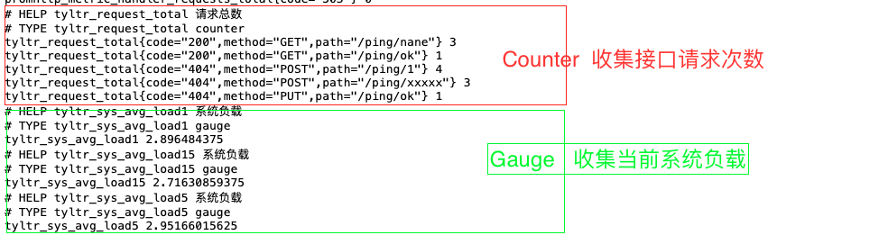

# 开发应用接入prometheus监控

**应用名** : `prom-target`

**功能** 

- 应用接入`prometheus`监控
- 打印`prometheus`采集指标时的请求信息  


**代码说明**  

[代码详见: prom-target/main.go ](./prom-target/main.go)

此段代码使用了两种指标类型:

- Counter  收集接口请求次数,指标名 `tyltr_request_total`。只要应用接受到请求，就会`tyltr_request_total` 就会累加  
  请求如下:  
    ```
    curl  -X GET  http://127.0.0.1:8520/ping/ok   -v
    ```
- Gauge   收集当前系统负载，指标名 `tyltr_sys_avg_load`, 实现 `uptime` 命令效果，每秒统计一次  


**运行方式** 

```
# 进入prom-target 目录
cd  prom-target

# 第一次执行，需要拉取依赖。如果不是第一次执行，可以省略此步骤
go mod tidy
go  mod vendor

# 运行代码
go  run  main.go

```

访问  [http://127.0.0.1:9100/metrics](http://127.0.0.1:9100/metrics) 即可获取到`metric`指标。 
**如图所示**  


 


