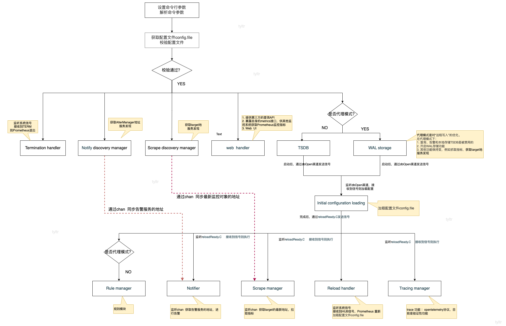

# 2.4 prometheus启动流程-main函数分析

在分析之前，我们需要先解决两个问题：

1. `prometheus`代码目录结构
2. 各模块`goroutine`的编排 管理。有赖于第三方依赖 [github.com/oklog/run](https://github.com/oklog/run),下文称之为`run`

## 1. 代码的目录结构

项目代码结构  

```text
prometheus
  ├── cmd                  程序入口
  │   ├── prometheus
  │   │    └── main.go     prometheus入口
  │   └── promtool
  │        └── main.go     promtool 入口
  ├── config               解析配置文件
  ├── discovery            服务发现模块
  │      ├── aws           aws服务发现模块
  │      ├── kubernetes    kubernetes服务发现模块
  │      ...   
  │      ├── 
  │      ├── discoverer_metrics_noop.go
  │      ├── discovery.go   
  │      ├── manager.go
  │      ├── metrics.go
  │      ├── metrics_k8s_client.go
  │      ├── metrics_refresh.go   
  │      └── util.go   
  ├── model   
  ├── notifier       notifier 告警模块
  ├── plugins        插件
  ├── prompb         proto文件
  ├── promql         promql查询实现
  ├── rules          规则管理模块。告警规则、记录规则的实现
  ├── scrape         拉取指标等相关代码
  ├── storage        存储相关代码。存储代理层
  ├── tracing   
  ├── tsdb           tsdb数据库
  ├── web                  
  │     ├── api      Prometheus API实现，http server   
  │     └── ui       Prometheus UI界面，前端
  └── util           工具类

```

在[项目简述与准备](./项目简述与准备.md)部分，代码编译时会创建两个二进制文件：`prometheus`、`promtool`，这两二进制文件入口函数分别是`cmd/prometheus/main.go`、`cmd/promtool/main.go`。本节的重点就是解析`cmd/prometheus/main.go`执行过程。


## 2. 各模块goroutine的编排管理

在`prometheus`中，使用了很多第三方库，为什么要单独说明这个依赖呢？ 因为`prometheus`所有组件`goroutine`都是通过依赖`github.com/oklog/run`(*注：下文简称`run`,代码仓库[https://github.com/oklog/run](https://github.com/oklog/run)*) 进行编排管理的。

### **API说明**

`run`有一个类型`Group`,`Group`有两个公共方法：`Add`、`Run`。

#### `func (g *Group) Add(execute func() error, interrupt func(error))` 

此方法的参数是两个函数:`execute func() error`, `interrupt func(error)`。函数`execute`、`interrupt`是成对出现的，这对函数对称之为`actor`。`Add`方法就是把以个`actor`函数对添加到`Group`对象。添加阶段并不会执行`execute`、`interrupt`函数。

函数`execute`、`interrupt`是需要开发伙自己去开发的。这两个函数必须满足：

- 函数`execute`：实际需要执行的业务逻辑，必须**同步运行**。
- 函数`interrupt`：**此函数执行会触发`execute`函数退出**。一般用于最后的**收尾**工作，例如资源回收、关闭网络连接、关闭文件句柄等。

#### `func (g *Group) Run() error`   

为每个执行函数`execute`都开启一个独立的`goroutine`去运行。如果某一个`execute`函数退出并且返回错误，所有的`interrupt`函数都会接受到这个错误。`interrupt`函数执行导致剩余的`execute`函数退出。一般在`interrupt`函数还会有资源回收、关闭网络连接、关闭文件句柄等**收尾**工作。

**demo**

[代码](https://github.com/tylitianrui/readcode/tree/master/prometheus/run_demo)

说明：

g1 监听系统信号，如果监听到信号则就退出

g2 、g3  每两秒打印一下时间


``````go
package main

import (
	"context"
	"fmt"
	"os"
	"os/signal"
	"syscall"
	"time"

	"github.com/oklog/run"
)

func main() {
	//  run.Group
	var g run.Group

	term := make(chan os.Signal, 1)

	cancel := make(chan struct{})
	signal.Notify(term, os.Interrupt, syscall.SIGTERM)

	time1 := NewXtimer("g2")
	time2 := NewXtimer("g3")

	g.Add(
		func() error {
			select {
			case sig := <-term:
				fmt.Println("g1接收到系统信号", sig.String())
				return fmt.Errorf("g1接收到系统信号 退出")
			case <-cancel:
				fmt.Println("cancel 有信号了")
			}
			return nil
		},
		func(err error) {
			fmt.Println("g1 --interrupt函数执行")
			close(cancel)
		},
	)

	g.Add(
		time1.PrintTime, time1.Stop,
	)
	g.Add(
		time2.PrintTime, time2.Stop,
	)

	if err := g.Run(); err != nil {
		fmt.Println("程序退出。。。")
		os.Exit(1)
	}

}

type Xtimer struct {
	Name   string
	ctx    context.Context
	cancel context.CancelFunc
}

func NewXtimer(name string) *Xtimer {
	ctx, cancel := context.WithCancel(context.TODO())
	return &Xtimer{
		Name:   name,
		ctx:    ctx,
		cancel: cancel,
	}
}

func (t *Xtimer) PrintTime() error {
	for {
		select {
		case <-t.ctx.Done():
			fmt.Println(t.Name, "退出")
			return fmt.Errorf("%v stop", t.Name)
		default:
			time.Sleep(2 * time.Second)
			fmt.Println(t.Name, time.Now())
		}
	}

}

func (t *Xtimer) Stop(err error) {
	t.cancel()
	fmt.Println(t.Name, "--interrupt函数执行")
}

``````

执行结果

``````text
g3 2024-11-02 12:23:39.600744 +0800 CST m=+8.003459771
g2 2024-11-02 12:23:39.600718 +0800 CST m=+8.003433977
g2 2024-11-02 12:23:41.601933 +0800 CST m=+10.004617856
g3 2024-11-02 12:23:41.606175 +0800 CST m=+10.008859959
^C    ctrl + c
g1接收到系统信号 interrupt
g1 --interrupt函数执行
g2 --interrupt函数执行
g3 --interrupt函数执行
g2 2024-11-02 12:23:43.603218 +0800 CST m=+12.005873143
g2 退出
g3 2024-11-02 12:23:43.606833 +0800 CST m=+12.009488438
g3 退出
程序退出。。。
exit status 1
``````


### **代码执行原理**

示意图如下


1. 函数`execute`、函数`interrupt` 都是成对出现的，这一对函数被称为一个`actor`。函数`execute`、函数`interrupt` 是开发者编写的。**编码的时候要求：如果退出函数`interrupt`被调用，那么对应的`execute`函数必须能感知到，并且退出**
2. `Add`方法会把这一对`actor`函数注册到`Group`类型对象里。`Group`类型对象里维护一个`actor`类型的切片(*注：切片go语言里的可变长数组，非go语言开发者理解为数组即可*)
3. `Run`方法
   1. 创建一个容量`chan error` ,容量与`actor`切片长度相等。
   2. 为每个函数`execute`都开启一个独立的`goroutine`去运行。如果某一个函数`execute`执行报错，错误就会被发送到`chan error` 
   3. 监听`chan error`。如果没有监听到错误，程序被阻塞；如果监听到错误，程序退出阻塞状态，执行后续的退出逻辑。
   4.  如果接收的error 是从`chan error`里接收的第一个`error`,遍历执行所有的`interrupt` 函数；
   5. `interrupt` 函数执行，对应的函数`execute`就会退出。函数`execute`退出时会向`chan error` 发生一个`error`类型的数据。退出逻辑接收到所有函数`execute`退出时的error，则认为函数`execute`全部退出。
   6. 程序关闭

**补充**

- [Release Party | Ways To Do Things with Peter Bourgon](https://www.youtube.com/watch?v=LHe1Cb_Ud_M&t=1376s)

  


## 3. main函数执行流程分析

`prometheus`的`main函数`中有12个使用[`run`](https://github.com/oklog/run)管理的代码模块，分别是:`Termination handler`、`Scrape discovery manager`、`Notify discovery manager`、`Web handler`、`TSDB`、`WAL storage` 、`Initial configuration`模块、`Scrape manager`、`Tracing manager`、`Notifier`、`Rule manager`、`Reload handler`。

执行流程：

1. 设置启动参数，解析参数
2. 根据启动参数`config.file`获取配置文件，校验配置文件的配置
3. 配置文件验证通过，使用第三方库[`run`](https://github.com/oklog/run)  开启各个代码模块：
   - 开启 `Termination handler` 监听系统信号，如接收到`TERM`信号，则`prometheus` 退出
   - 开启 `Scrape discovery manager`，对被监控对象`target`进行服务发现。将获取到的地址发送到自身的`chan`,供`Scrape manager`模块获取
   - 开启 `Notify discovery manager`，对告警服务进行服务发现，获取`AlterManager`地址。将获取到的`AlterManager`地址发送到自身的`chan`,供`Scrape manager`模块获取
   - 开启 `Web handler`模块
   - 如果是代理模式，开启`WAL storage` 模块；如果不是代理模式，启动`TSDB`
   - 开启`WAL storage` 模块或者`TSDB`之后，加载配置文件`config.file`内容
   - 加载配置文件`config.file`之后：
     - 启动`Scrape manager`模块，`Scrape manager`启动后，监听服务发现的`chan`,获取最新的被监控对象的地址，拉取监控指标。
     - 启动`Notifier`模块，`Notifier`启动后，监听 `Notify discovery manager`的`chan`,获取`AlterManager`的地址，以备发送告警使用。
     - 启动`Tracing manager`  链路追踪，目前是实验性的组件
     - 启动`Reload handler`  监听系统信号,，如接收到`HUP`信号，则`prometheus` 重新加载配置文件。
     - 如果不是代理模式，开启`Notifier`、`Rule manager`模块，否则不开启。

### 执行流程图  



