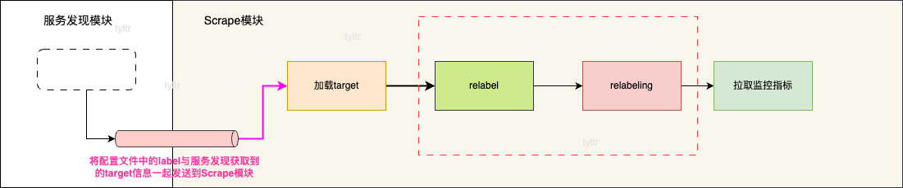
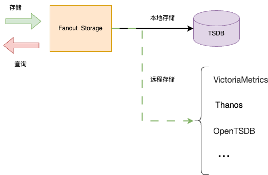

# prometheus server模块


注：此图选自[Prometheus官方图片](https://github.com/prometheus/prometheus/blob/main/documentation/images/internal_architecture.svg)

prometheus server 主要的功能模块：

- 服务发现模块：获取`target`的地址等信息，由`Scrape Discovery Manager`进行管理
- `Scrape`模块：拉取`target`的监控指标，由`Scrape Manager`是拉取监控指标的管理者
- 标签模块：在获取指标之前，指定打标签或改写标签的计划，按照此计划为获取的指标打标签或改写标签，即`label`与`relabeling` 功能。*注：功能嵌入在`Scrape`模块*
- 存储模块。`Fanout Storage`是存储层的代理，屏蔽了底层不同存储的实现。无论是本地存储远端存储都有`Fanout Storage`作代理。
- `PromQL`模块，解析执行`PromQL`
- 告警组件服务发现模块，由`Notifier Discovery Manager`进行管理
- 告警模块:`Notifier` 将告警信息发送给`AlertManager`
- 规则模块：主要作用是优化查询规则和触发告警规则，由`Rule Manager`管理规则。
- `TSDB`: `Prometheus`的内置的本地数据库

## 服务发现模块

在`prometheus`中`target`的服务发现由`Scrape Discovery Manager`进行统一管理的。`Scrape Discovery Manager`会不断获取`targets`最新的服务地址等信息；并且`Scrape Discovery Manager`将最新的全量`target`地址等信息封装成`targetgroup.Group`，并且通过`chan map[string][]*targetgroup.Group`发送给`Scrape Manager`。`Scrape Manager`根据服务发现的结果拉取`target`的指标。 

`chan map[string][]*targetgroup.Group`说明：

- `map`的`key`:   类型`string` 对应配置文件中`job`名称; 
  
- `map`的`value`  类型`[]*targetgroup.Group` 表示此`job`所包含的一系列`targetgroup.Group`。在在`prometheus`中，`target`的信息会由一组标签进行描述，节选部分标签例下:

```text
"__address__": "192.168.0.107:6443",
"__meta_kubernetes_endpoint_port_name": "https",
"__meta_kubernetes_endpoint_port_protocol": "TCP", 
"__meta_kubernetes_endpoint_ready": "true"
```
`targetgroup.Group`本质就是**一组描述服务地址的标签**和其他**公共标签**的集合体.


## Scrape模块

`Scrape Manager`负责的工作：

- 拉取`targe`t的监控指标
- 将获取到的指标样本发送个存储模块

`Scrape Manager`通过`chan map[string][]*targetgroup.Group`获取到服务信息。`Scrape Manager`会存储这些地址。如果有新的`target`，`prometheus`就会为其开启新的`ScrapeLoop`,定期去拉取监控指标。如果存在失效的`target`，`prometheus`就停止他的`ScrapeLoop`，即不再拉取它的监控指标。  

`Scrape`模块怎么知道哪些是失效的`target`，哪些是新加入的`target`呢？因为`Scrape模块`会存储所有的`target`地址信息；服务发现模块每次发送给`Scrape模块`是最新的全部的`target`地址信息。两者进行对比即可知道。如图：


## 标签模块

标签模块是嵌入在`Scrape`模块之中的，是在拉取之前制定的标签"计划"，按照此计划为获取的指标打标签或改写标签。执行阶段示意图：  




在代码中，是没有标签模块的。打标签和改写标签的相关代码分散在其他模块里的。例如初始化阶段，自定义的标签的规则就加载了。在服务发现模块，自定义标签就会随着`target`地址发送给`Scrape`模块。`Scrape`模块在拉取指标之前又会处理自定义的标签。 


> [!TIP]
>
> 上文可知，`服务发现模块`会将`target`地址信息封装成`targetgroup.Group`传递给`Scrape模块`。`targetgroup.Group`结构体的**公共标签**部分存放的就是自定义标签。
>
> **`targetgroup.Group`定义**
>
> > ```golang
> > type Group struct {
> >      Targets []model.LabelSet  // targets的地址
> >      Labels model.LabelSet     //公共标签，存放的自定义标签
> > 	   Source string
> >    }
> > ```
>
> `Labels`字段就是公共标签，每个`targets`都可以获取到的标签，它存放的就是自定义标签。


既然源码中不存在此模块，功能代码又分散。为什么解析此部分呢？
因为打标签和改写标签是`Prometheus`一项强大的功能。实际生产环境中，几乎每个`Prometheus`都会配置使用此功能。所以将其抽离出来，作为单独的模块进行讲解。


## 存储模块

`Prometheus`支持两种种存储方案：本地存储、远端存储。远端存储可以配置多种第三方的厂商的数据库。`Prometheus`就需要单独一个处理存储模块，来兼容本地存储、远端存储差异，屏蔽了底层不同存储的实现。

源码中，`Fanout Storage`就是存储层的代理，无论是本地存储还是远端存储都有`Fanout Storage`作代理。如图




`Prometheus`使用本地存储时，`Fanout Storage`会把数据写入到`tsdb`中。

`Prometheus`使用远端存储时，`Fanout Storage`不仅会把数据写入`tsdb`中，也会写入远端存储。`tsdb`会保留最近一段时间的数据，作为备份。一是为了防止网络等原因造成的写入远端不成功，造成的数据丢失；二是可以实现批量写入远端。

`Prometheus`使用远端存储时，本地存储时最新的数据，已经成功同步到远端的数据是没必要保存的；而远端数据是相对旧一点的数据，最新的数据很可能还没同步到远端存储。在查询时，`Fanout Storage`需要聚合远端数据和本地存储的数据，返回给用户。


## `PromQL`模块

`PromQL`模块负责`PromQL`的解析和处理，`PromQL`模块实现了函数、关键字等功能。


## 规则模块

`Prometheus`的规则模块主要实现了有两个规则：

- `Recording Rule` 记录规则，通过**预先计算经常需要的表达式**或**计算成本高昂的表达式**,将其结果保存为一组新的时间序列.来实现优化查询的目的
- `Alert Rule` 告警规则，触发告警规则，`Prometheus`就会生成一个警报，发送给`Alertmanager`。


## 告警组件服务发现模块和告警模块

`Prometheus`不直接发生告警给用户，而是发送告警信息给`alertmanager`服务。`Alertmanager`服务会处理告警信息，并发送用户。`Alertmanager`服务可以是静态地址，直接配置在`Prometheus`配置文件即可。在云原生环境下，就需要服务发现动态地获取到`alertmanager`服务地址。这就告警组件服务发现模块去实现此功能。

`Prometheus`需要预先配置告警规则。一旦触发到告警规则，`Prometheus`就会生成一个警报，发送给`Alertmanager`。`Alertmanager`地址由告警组件服务发现模块提供。
