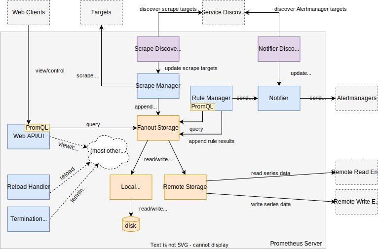

# prometheus server模块




注：此图选自[Prometheus官方图片](https://github.com/prometheus/prometheus/blob/main/documentation/images/internal_architecture.svg)

prometheus server 主要的功能模块：

- 服务发现模块：获取`target`的地址等信息，由`Scrape Discovery Manager`进行管理
- `Scrape`模块：拉取`target`的监控指标，由`Scrape Manager`是拉取监控指标的管理者
- 标签模块：在获取指标之前，指定打标签或改写标签的计划，按照此计划为获取的指标打标签或改写标签，即`label`与`relabeling` 功能。*注：功能嵌入在`Scrape`模块*
- 存储模块。`Fanout Storage`是存储层的代理，屏蔽了底层不同存储的实现。无论是本地存储远端存储都有`Fanout Storage`作代理。
- `PromQL`模块，解析执行`PromQL`
- 告警组件服务发现模块，由`Notifier Discovery Manager`进行管理
- 告警模块:`Notifier` 将告警信息发送给`AlertManager`
- 规则模块：主要作用是优化查询规则和触发告警规则，由`Rule Manager`管理规则。
- `TSDB`: `Prometheus`的内置的本地数据库

## 服务发现模块

在`prometheus`中`target`的服务发现由`Scrape Discovery Manager`进行统一管理的。`Scrape Discovery Manager`会不断获取`targets`最新的服务地址等信息；并且`Scrape Discovery Manager`将最新的全量`target`地址等信息封装成`targetgroup.Group`，并且通过`chan map[string][]*targetgroup.Group`发送给`Scrape Manager`。`Scrape Manager`根据服务发现的结果拉取`target`的指标。 

`chan map[string][]*targetgroup.Group`说明：

- `map`的`key`:   类型`string` 对应配置文件中`job`名称; 
  
- `map`的`value`  类型`[]*targetgroup.Group` 表示此`job`所包含的一系列`targetgroup.Group`。在在`prometheus`中，`target`的信息会由一组标签进行描述，节选部分标签例下:

```text
"__address__": "192.168.0.107:6443",
"__meta_kubernetes_endpoint_port_name": "https",
"__meta_kubernetes_endpoint_port_protocol": "TCP", 
"__meta_kubernetes_endpoint_ready": "true"
```
`targetgroup.Group`本质就是**一组描述服务地址的标签**和其他**公共标签**的集合体.


## Scrape模块

`Scrape Manager`负责的工作：

- 拉取target的监控指标
- 将获取到的指标样本发送个存储模块

`Scrape Manager`通过`chan map[string][]*targetgroup.Group`获取到服务信息。`Scrape Manager`会存储这些地址。如果有新的`target`，`prometheus`就会为其开启新的`ScrapeLoop`,定期去拉取监控指标。如果存在失效的`target`，`prometheus`就停止他的`ScrapeLoop`，即不再拉取它的监控指标。  

`Scrape`模块怎么知道哪些是失效的`target`，哪些是新加入的`target`呢？因为`Scrape模块`会存储所有的`target`地址信息；服务发现模块每次发送给`Scrape模块`是最新的全部的`target`地址信息。两者进行对比即可知道。如图：


## 标签模块

标签模块是嵌入在`Scrape`模块之中的，是在拉取之前制定的标签"计划"，按照此计划为获取的指标打标签或改写标签。执行阶段示意图：  


在代码中，是没有标签模块的。打标签和改写标签的相关代码分散在其他模块里的。例如初始化阶段，自定义的标签的规则就加载了。在服务发现模块，自定义标签就会随着`target`地址发送给`Scrape`模块。`Scrape`模块在拉取指标之前又会处理自定义的标签。 

引申:
> 上文可知，`服务发现模块`会将`target`地址信息封装成`targetgroup.Group`传递给`Scrape模块`。`targetgroup.Group`结构体的**公共标签**部分存放的就是自定义标签。
> 
>    
>     type Group struct {
>        Targets []model.LabelSet  // targets的地址
>        Labels model.LabelSet     //公共标签，存放的自定义标签
> 	     Source string
>       }
>  Labels字段就是公共标签，每个targets都可以获取到的标签，它存放的就是自定义标签。

<br/>

既然源码中不存在此模块，功能代码又分散。为什么解析此部分呢？  
因为打标签和改写标签是`Prometheus`一项强大的功能。实际生产环境中，几乎每个`Prometheus`都会配置使用此功能。所以作者将其抽离出来，作为单独的模块进行讲解。


## 存储模块

TODO


## `PromQL`模块

TODO

## Rule Manager

TODO


## 告警组件服务发现模块

TODO

## 告警模块

TODO

## 规则模块

TODO


## TSDB

TODO