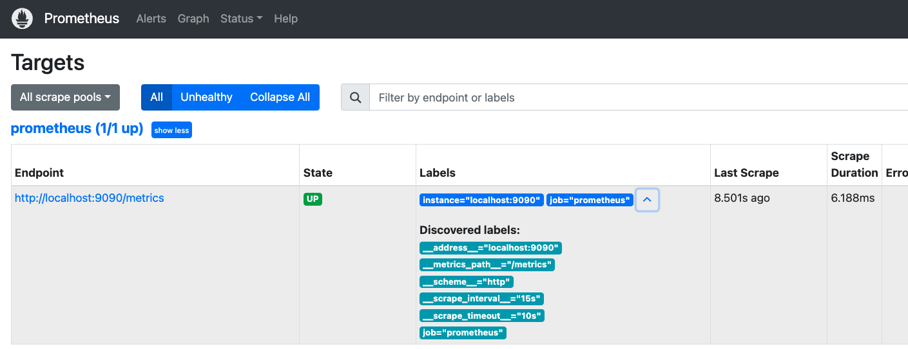

# 2.2 prometheus功能介绍

`prometheus`功能主要有：

- 服务发现
- 标签处理
- 指标采集
- 数据存储
  - 本地存储
  - 远端存储

- 查询
- 告警
- 规则管理
- `api`
  - `metrics api` ： `prometheus`作为可被监控的对象时，需要暴露自己的`metrics api`
  - 查询 `api`: 为第三方服务(例如`grafana`)提供查询指标数据的`API`

## 服务发现

服务发现就是要解决`Prometheus server` 需要监控哪些服务的问题(采集哪些节点的信息)。获取监控对象的方式有两种:

- 静态文件配置  
- 动态服务发现  


### 静态文件配置

在`Prometheus`的配置文件中，指定采集的目标。  
例如：  
```
scrape_configs:
  - job_name: "prometheus"
    metrics_path: "/metrics"
    static_configs:
      - targets: ["127.0.0.1:9090"]
```
采集对象的地址`127.0.0.1`,端口`9090`。采集对象暴露的`api`为`/metrics`。 `Prometheus server`定期请求`127.0.0.1:9090/metrics` 采集目标的数据。 如图: 


如果监控的服务发生迁移、变更，则需要修改`prometheus`的配置文件并通知`prometheus`从新加载配置文件。
```
kill -HUP  <prometheus pid>
```
针对监控目标频繁变化的场景，静态文件配置就不能满足运维能力。因为`prometheus`提供了动态服务发现的方式来获取监控对象。

### 动态服务发现  

在云原生环境下，动态服务发现就是必要的要求了。
云原生特点:

- 动态伸缩。
- 可以管理大量的容器。

**服务发现的流程**

以`kubernetes`为例，简述服务发现的流程。

1. 在`prometheus`的配置文件`prometheus.yml`配置 **`kubernetes api server`地址** (*选填，不填则认为`prometheus`监控其所在的`kubernetes`集群*)和 **认证凭证**。 这样`prometheus`就可以获取到`kubernetes`集群的信息了。
2. `prometheus`的服务发现组件`watch` `kubernetes`集群的变化。无论新`node`加入`kubernetes`集群还是 新容器被创建/删除了，`prometheus`都可以感知到。

相关文档：

- 服务发现相关配置：[https://prometheus.io/docs/prometheus/2.53/configuration/configuration/#configuration-file](https://prometheus.io/docs/prometheus/2.53/configuration/configuration/#configuration-file)
- kubernetes相关配置：[https://prometheus.io/docs/prometheus/2.53/configuration/configuration/#kubernetes_sd_config](https://prometheus.io/docs/prometheus/2.53/configuration/configuration/#kubernetes_sd_config)


## 标签处理-标签、relabel


通过静态配置/服务发现获取`targets`之后，我们就面临下一个问题：`targets`提供的指标、标签都是已经确定的了。指标的标签并不一定符合`prometheus`运维人员的需求，让`targets`开发人员去改又切实际。`prometheus`提供的`label`(打标签)、`relabeling`(标签改写)可以解决这些问题。


### 标签处理label

#### 示例:为target打标签

目前有两个`target`，分布是`localhost:9090`、`127.0.0.1:9090`。给`localhost:9090`指标打标签 `service: srv-1`;给`127.0.0.1:9090`监控指标打标签 `service: srv-2`。 配置如下：  

```yaml
global:
  scrape_interval: 15s # Set the scrape interval to every 15 seconds. Default is every 1 minute.
  evaluation_interval: 15s # Evaluate rules every 15 seconds. The default is every 1 minute.


scrape_configs:
  - job_name: "prometheus"
    static_configs:
      - targets: ["localhost:9090"]
        labels:
           service: srv-1
      - targets: ["127.0.0.1:9090"]
        labels:
           service: srv-2
```

**效果**： 

`target` 标签如图:  


<br>

任意选取一个metric,例如`go_memstats_heap_alloc_bytes`,对比标签


### relabeling

#### 示例:为job_name进行标签改写

基于[示例:为target打标签](#示例为target打标签),标签`instance`默认值是标签`__address__`的值，即两个`target`的`instance`标签分别是`localhost:9090`、`127.0.0.1:9090`；本次将标签`instance`值更改为`monitor` 

```yaml
global:
  scrape_interval: 15s # Set the scrape interval to every 15 seconds. Default is every 1 minute.
  evaluation_interval: 15s # Evaluate rules every 15 seconds. The default is every 1 minute.


scrape_configs:
  - job_name: "prometheus"
    static_configs:
      - targets: ["localhost:9090"]
        labels:
           service: srv-1
      - targets: ["127.0.0.1:9090"]
        labels:
           service: srv-2
    relabel_configs:
      - source_labels: [instance]
        replacement: 'monitor'
        target_label: instance
        action: replace  
```

**效果**： 

`target` 标签如图:  


<br>

任意选取一个metric,例如`go_memstats_heap_alloc_bytes`,对比标签


官方说明： [relabel_config](https://prometheus.io/docs/prometheus/latest/configuration/configuration/#relabel_config)


## 数据采集

### 数据采集的配置

通过静态配置/服务发现获取`targets`之后，`Prometheus`就会**定期**地通过`http`接口获取监控的数据。以静态配置为例  

```
global:
  scrape_interval: 15s  

scrape_configs:
  - job_name: "prometheus"
    metrics_path: "/metrics"
    static_configs:
      - targets: ["127.0.0.1:9090"]
```
每隔`15s`获取请求一次 `127.0.0.1:9090/metrics` 获取监控数据。

<br>
可以获取如下数据(截取部分数据)

```shell
# HELP prometheus_http_requests_total Counter of HTTP requests.
# TYPE prometheus_http_requests_total counter
prometheus_http_requests_total{code="200",handler="/"} 0
prometheus_http_requests_total{code="200",handler="/config"} 0
prometheus_http_requests_total{code="200",handler="/consoles/*filepath"} 0 0
prometheus_http_requests_total{code="200",handler="/version"} 0


# HELP prometheus_sd_discovered_targets Current number of discovered targets.
# TYPE prometheus_sd_discovered_targets gauge
prometheus_sd_discovered_targets{config="config-0",name="notify"} 0
prometheus_sd_discovered_targets{config="prometheus",name="scrape"} 1


# HELP prometheus_http_response_size_bytes Histogram of response size for HTTP requests.
# TYPE prometheus_http_response_size_bytes histogram
prometheus_http_response_size_bytes_bucket{handler="/metrics",le="100"} 0
prometheus_http_response_size_bytes_bucket{handler="/metrics",le="1000"} 0
prometheus_http_response_size_bytes_bucket{handler="/metrics",le="10000"} 34
prometheus_http_response_size_bytes_bucket{handler="/metrics",le="100000"} 2599
prometheus_http_response_size_bytes_bucket{handler="/metrics",le="1e+06"} 2599
prometheus_http_response_size_bytes_bucket{handler="/metrics",le="1e+07"} 2599
prometheus_http_response_size_bytes_bucket{handler="/metrics",le="1e+08"} 2599
prometheus_http_response_size_bytes_bucket{handler="/metrics",le="1e+09"} 2599
prometheus_http_response_size_bytes_bucket{handler="/metrics",le="+Inf"} 2599
prometheus_http_response_size_bytes_sum{handler="/metrics"} 2.7129601e+07
prometheus_http_response_size_bytes_count{handler="/metrics"} 2599

# HELP prometheus_rule_group_duration_seconds The duration of rule group evaluations.
# TYPE prometheus_rule_group_duration_seconds summary
prometheus_rule_group_duration_seconds{quantile="0.01"} NaN
prometheus_rule_group_duration_seconds{quantile="0.05"} NaN
prometheus_rule_group_duration_seconds{quantile="0.5"} NaN
prometheus_rule_group_duration_seconds{quantile="0.9"} NaN
prometheus_rule_group_duration_seconds{quantile="0.99"} NaN
prometheus_rule_group_duration_seconds_sum 0
prometheus_rule_group_duration_seconds_count 0

```


## 数据存储  

`Prometheus`的存储分为**本地存储**和**远程存储**。

### 本地存储

`Prometheus`是自带时序数据库`TSDB (time series database)`，用来存储和管理时间序列数据。  
`Prometheus`启动时,可以通过参数来数据路径和保存时间：

- `storage.tsdb.path` 指定数据储存的目录，默认为启动路径的`data`目录 
- `storage.tsdb.retention` 数据保留时间，默认`15`天  

例如：`prometheus` tsdb 将数据存储于`/home/tyltr/tsdb/data`，保留7天
```
./prometheus  --config.file=documentation/examples/prometheus.yml   --storage.tsdb.path=/home/tyltr/tsdb/data  --storage.tsdb.retention=7d
```

`prometheus`本地存储有个很严重的缺点:`Prometheus`自带的`TSDB`是非集群化的数据库，只能存储在本地磁盘。然而机器磁盘空间有限，无法存储大量的监控数据。即便是`TSDB V3` 提升了数据压缩率，但也不能从根本上解决**单节点存储的限制**.为了解决这个问题，`prometheus`提供了**远程读写**的接口，让用户选择合适的时序数据库来实现存储。


**本地存储的流程示意图**


### 远程存储

为了解决单节点存储的限制，`prometheus`提供了两个接口`remote_write`(远程写)、`remote_read`(远程读)。用户可以基于这两个接口将数据存储于第三方的存储中或者在第三方的存储中读取数据

#### 远程写


通过配置`remote_write`，可实现远程写。 例如：

```
remote_write:
  - url: "http://remote-write-url"
```


说明:  

- `url` 用于指定远程写的`http`服务地址,即`Adaptor`的地址。必选配置。

通过`HTTP`协议,`Prometheus`调用`remote_write.url`接口,将采集到的数据发送给`Adaptor`。`Adaptor`会数据存储在第三方存储里。列举部分实现了远程写的第三方存储： 

- [Thanos](https://github.com/thanos-io/thanos)  
- [AWS Timestream](https://github.com/dpattmann/prometheus-timestream-adapter)  
- [Elasticsearch](https://www.elastic.co/guide/en/beats/metricbeat/master/metricbeat-metricset-prometheus-remote_write.html)  
- [InfluxDB](https://docs.influxdata.com/influxdb/v1/supported_protocols/prometheus/)  
- [kafka](https://github.com/Telefonica/prometheus-kafka-adapter)  
- [OpenTSDB](https://github.com/prometheus/prometheus/tree/main/documentation/examples/remote_storage/remote_storage_adapter)  

详细列表见[Remote Endpoints and Storage](https://prometheus.io/docs/operating/integrations/#remote-endpoints-and-storage)


**演示**

咱们使用`promethues + grafana +VictoriaMetrics`[演示](./stoarge_remote介绍.md#远程存储配置) 远端存储功能。


**远端存储的流程示意图**


#### 远程读


通过配置`remote_read`，可实现远程读。


官方文档：https://prometheus.io/docs/operating/integrations/#remote-endpoints-and-storage


## 查询

`Prometheus` 提供了一种功能表达式语言`PromQL`，允许用户实时选择和汇聚时间序列数据。表达式的结果可以在浏览器中显示为图形，也可以显示为表格数据，或者由外部系统通过`HTTP API` 调用。  
`PromQL`的语法与使用、实践、源码解析，见[PromQL篇](./promql.md)

`Prometheus`可以通过`PromQL` 可以在本地数据库`TSDB`或者第三方存储里的查询监控数据。那么会不会存在查询缓慢的情况，例如`Mysql`可以通过索引来解决慢查询的问题。`Prometheus`有没有什么解决此类问题的策略呢？答案是肯定的。  
`Prometheus`通过`recording rules`来解决这个问题。`recording rules`是通过**预先计算经常需要的表达式**或**计算成本高昂的表达式**，并将其结果保存为一组新的时间序列，查询时直接使用这组新的时间序列。`recording rules`功能是由`Prometheus`的`RuleManager`实现的。`RuleManager`除了实现`recording rules`功能之外，也实现了触发告警的`Alert Rules`功能。

## 告警

`Prometheus` 告警功能需要`Prometheus server` 与组件`Alertmanager`共同完成。`Prometheus server`负责触发告警，并将告警推送到`Alertmanager`。`Alertmanager`负责管理和路由警报。


用户需要在`Prometheus Server`上编写告警触发规则。一旦`Prometheus`的`Alert Rules`功能检测到指标触发了告警阈值，`Prometheus`就会生成一个警报，并且通过`http`协议将告警通知发送给`Alertmanager`。  

`Alertmanager`接收到 `Prometheus Server`发来的告警通知之后，会对告警进行处理(例如：去重、分组等)，并且根据其**标签**将警报路由到不同的接收者,例如:`email`,`webhook`等。除此之外，`Alertmanager`支持对特定警报进行静默，直到静默条件恢复才会解除屏蔽。


## Rule功能

`Prometheus`的规则功能有两个：

- `Recording Rule` 记录规则，通过**预先计算经常需要的表达式**或**计算成本高昂的表达式**,将其结果保存为一组新的时间序列.来实现优化查询的目的
- `Alert Rule` 告警规则，触发告警规则，`Prometheus`就会生成一个警报，发送给`Alertmanager`。


## API

### 可以被监控

`Prometheus` 提供的`metrics`接口是`/metrics` ,默认端口`9090`   

在流量器打开 [http://127.0.0.1:9090/metrics](http://127.0.0.1:9090/metrics)就可以看到`Prometheus` 的指标信息


### 指标可查询

见视频演示

