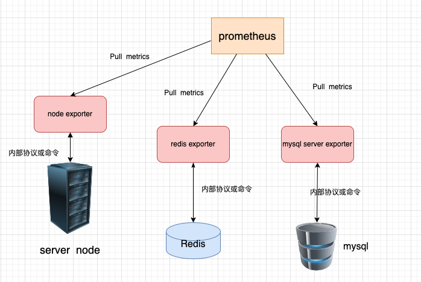

# 2.1 prometheus系统简述


## prometheus监控系统的架构


## 核心组件

### Prometheus Server

`Prometheus Server`是`Prometheus`体系里最核心的组件。负责**服务发现**、**拉取监控指标**、**存储和查询指标数据**、**触发告警**。
`Prometheus Server`也是一个时序数据库(`TSDB`)，将采集到的监控数据按照时间序列的方式存储在本地磁盘当中。

`http server` 作用

- 暴露自身的`metrics`接口，供其他监控服务来监控`prometheus`
- 为第三方系统(例如:`grafana`)提供查询指标数据的`API`

### Prometheus Web UI

内置的`WEB UI`界面，通过这个UI可以直接通过`PromQL`实现数据的查询以及可视化。虽然内置ui界面，但`UI`过于简单，生产环境中一般都不会使用内置`UI`界面，而是使用`grafana`等图形化界面，文档 [https://prometheus.io/docs/visualization/grafana/](https://prometheus.io/docs/visualization/grafana/)。在后续文档中，会介绍`grafana`的应用。

### AlertManager

`AlertManager` 是告警管理器组件。实践中，会基于`PromQL`创建告警规则,如果满足`PromQL`定义的规则，就会产生一条告警;`Prometheus server`会将此告警`push`到`AlertManager`;由`AlertManager`完成告警管理(告警聚合、静默、告警等级、告警渠道等)和通知

### PushGateway

`Prometheus`数据采集基于`Pull`模型进行设计，在网络环境必须要让`Prometheus Server`能够直接与`Exporter`进行通信，当这种网络需求无法直接满足时，就可以利用`PushGateway`来进行中转。营业将内部网络的监控数据主动`push`到`PushGateway`当中，`Prometheus Server`则可以采用同样`Pull`的方式从`PushGateway`中获取到监控数据。

应用场景：短生命周期的任务。因为`Prometheus`是定期`pull`任务的监控信息，也就是有时间间隔；短生命周期的任务，可能采集的时候就已经退出了，那么监控信息都会消失，所以采用主动`push`的方式存入`PushGateway`。例如`kubernetes jobs` 或 `Cronjobs`中收集自定义指标

### Exporter

`Prometheus`已经成为云原生监控的行业标准，很多服务、中间件都实现了`Prometheus`监控接口(例如etcd、k8s等)。他们可以直接接入`Prometheus`监控。对于在`Prometheus` 出现之前就存在的中间件和服务(例如mysql、redis等，甚至是操作系统) ,他们是没有设计和实现`Prometheus`监控接口。还有一部分系统因为安全性、稳定性等考虑，也不愿意实现在自己系统里加入`Prometheus`监控接口。

为了解决对这些没有实现`Prometheus metrics`接口的服务实现监控，`Prometheus`提供了`exporter`解决方案：

- `exporter`是一个代理，`exporter` 实现了`Prometheus`监控接口。`Prometheus`从`exporter`拉取监控数据。

- `exporter` 与 被监控服务之间使用**内部协议或者命令**交互，获取被监控对象的状态信息。有些`exporter` 是`Prometheus`官方提供的 ，例如：`node exporter`、`mysql server exporter`等，还有一些事第三方开发维护的，例如：`redis exporter`。以`redis exporter`为例说明一下：`redis exporter`通过`redis`命令 `INFO ALL`来获取`redis`的运行信息的。

`Prometheus`与`exporter`交互示意图：




####  安装 `node exporter`

`node exporter`用于监控服务器运行状态。我们使用一台`debian`系统的机器进行验证

服务器ip:`192.168.0.102`


下载地址 ： https://github.com/prometheus/node_exporter/releases

``````shell
# 下载
wget  https://github.com/prometheus/node_exporter/releases/download/v1.8.2/node_exporter-1.8.2.linux-amd64.tar.gz

#解压
tar  -zxvf node_exporter-1.8.2.linux-amd64.tar.gz

# 进入解压目录
cd node_exporter-1.8.2.linux-amd64

# 运行
./node_exporter

# 验证
curl  http://127.0.0.1:9100/metrics

``````


修改`prometheus.yml` ， 新增`node`监控任务。如下

``````
# my global config
global:
  scrape_interval: 15s # Set the scrape interval to every 15 seconds. Default is every 1 minute.
  evaluation_interval: 15s # Evaluate rules every 15 seconds. The default is every 1 minute.
  # scrape_timeout is set to the global default (10s).

# A scrape configuration containing exactly one endpoint to scrape:
# Here it's Prometheus itself.
scrape_configs:
  # The job name is added as a label `job=<job_name>` to any timeseries scraped from this config.
  - job_name: "prometheus"

    static_configs:
      - targets: ["localhost:9090"]

  - job_name: "node"
    metrics_path : '/metrics'
    scheme: 'http'
    static_configs:
      - targets: ["192.168.0.102:9100"]
``````


