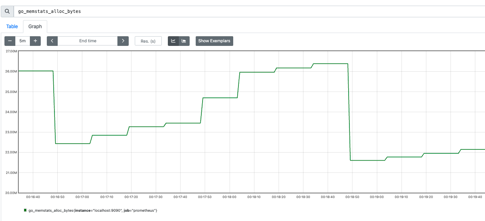

# prometheus简述


## 1.1 架构


**核心组件:**
- Prometheus server     
   - `Prometheus server`是`Prometheu`的核心组件.负责抓取、存储和查询指标数据,提供`API`以供访问。
   - `Prometheus Server`也是一个时序数据库(`TSDB`)，将采集到的监控数据按照时间序列的方式存储在本地磁盘当中。
   - 内置的`WEB UI`界面，通过这个UI可以直接通过`PromQL`实现数据的查询以及可视化（虽然内置ui界面，但ui过于简单，一般都不会使用内置ui界面，而是使用`grafana`等图形化界面，文档 [https://prometheus.io/docs/visualization/grafana/](https://prometheus.io/docs/visualization/grafana/)）
  
- Alertmanager 
  - `Alertmanager` 是告警管理器组件。实践中，会基于`PromQL`创建告警规则,如果满足PromQL定义的规则，就会产生一条告警;`Prometheus server`会将此告警`push`到`Alertmanager`;由`Alertmanager`完成告警管理(告警聚合、静默、告警等级、告警渠道等)

- PushGateway
  - `Prometheus`数据采集基于`Pull`模型进行设计，在网络环境必须要让`Prometheus Server`能够直接与`Exporter`进行通信，当这种网络需求无法直接满足时，就可以利用`PushGateway`来进行中转。营业将内部网络的监控数据主动`push`到`PushGateway`当中，`Prometheus Server`则可以采用同样`Pull`的方式从`PushGateway`中获取到监控数据。
  - 应用场景：
    - `Prometheus`和`target` 由于某些原因网络不能互通，需要经由`Pushgateway`代理
    - 短生命周期的任务。因为`Prometheus`是定期`pull`任务的监控信息，也就是有时间间隔；短生命周期的任务，可能采集的时候就已经退出了，那么监控信息都会消失，所以采用主动`push`的方式存入`PushGateway`。例如` kubernetes jobs` 或 `Cronjobs`中收集自定义指标

  
- Exporter
  - `Prometheus server`原理是通过 `HTTP` 协议周期性抓取被监控组件的状态，输出这些被监控的组件的 `Http` 接口为 `Exporter`。
  - `Prometheus server`通过轮询或指定的抓取器从`Exporter`提供的`Endpoint`端点中提取数据。
  
- Service Discovery
  - `Service Discovery`是服务发现功能，动态发现待监控的`Target`，完成监控配置的重要组件。例如`k8s`环境中的`pod`都是临时的，可变的。所以需要任务发现


## 1.2 功能介绍

### 1.2.1 服务发现
服务发现就是要解决`Prometheus server` 需要监控哪些服务的问题(采集哪些节点的信息)。获取监控对象的方式有两种:
  - 静态文件配置  
  - 动态服务发现  


#### 静态文件配置
在`Prometheus`的配置文件中，指定采集的目标。  
例如：  
```
scrape_configs:
  - job_name: "prometheus"
    metrics_path: "/metrics"
    static_configs:
      - targets: ["127.0.0.1:9090"]
```
采集对象的地址`127.0.0.1`,端口9090。采集对象暴露的api为`/metrics`。 `Prometheus server`定期请求`127.0.0.1:9090/metrics` 采集目标的数据。

如果监控的服务发生迁移、变更，则需要修改`prometheus`的配置文件并通知`prometheus`从新加载配置文件。
```
kill -HUP  <prometheus pid>
```
针对监控目标频繁变化的场景，静态文件配置就不能满足运维能力。因为`prometheus`提供了动态服务发现的方式来获取监控对象。

#### 动态服务发现  

在云原生环境下，动态服务发现就是必要的要求了。 
云原生特点： 
- 动态伸缩。
- 可以管理大量的容器。

**服务发现的流程**   
以`kubernetes`为例，简述服务发现的流程。
1. 在`prometheus`的配置文件`prometheus.yml`配置 **`kubernetes api server`地址** (*选填，不填则认为`prometheus`监控其所在的`kubernetes`集群*)和 **认证凭证**。 这样`prometheus`就可以获取到`kubernetes`集群的信息了。
2. `prometheus`的服务发现组件`watch` `kubernetes`集群的变化。无论新`node`加入`kubernetes`集群还是 新容器被创建/删除了，`prometheus`都可以感知到。

相关文档：
- 服务发现相关配置： https://prometheus.io/docs/prometheus/2.53/configuration/configuration/#configuration-file
- kubernetes相关配置： https://prometheus.io/docs/prometheus/2.53/configuration/configuration/#kubernetes_sd_config  

**对kubernetes服务发现代码简述**
- 服务发现配置字段：`xxxx_sd_config` 例如:`kubernetes_sd_config`.

```
// 配置注册.文件：discovery/registry.go
// RegisterConfig registers the given Config type for YAML marshaling and unmarshaling.
func RegisterConfig(config Config) {
	registerConfig(config.Name()+"_sd_configs", reflect.TypeOf(config), config)
}

// 文件：discovery/discovery.go
// 配置项解析
// A Config provides the configuration and constructor for a Discoverer.
type Config interface {
	// Name returns the name of the discovery mechanism.
	Name() string

	// NewDiscoverer returns a Discoverer for the Config
	// with the given DiscovererOptions.
	NewDiscoverer(DiscovererOptions) (Discoverer, error)

	// NewDiscovererMetrics returns the metrics used by the service discovery.
	NewDiscovererMetrics(prometheus.Registerer, RefreshMetricsInstantiator) DiscovererMetrics
}


// 文件： discovery/kubernetes/kubernetes.go
// kubernetes SDConfig Name returns the name of the Config.
func (*SDConfig) Name() string { return "kubernetes" }

// NewDiscoverer returns a Discoverer for the Config.
func (c *SDConfig) NewDiscoverer(opts discovery.DiscovererOptions) (discovery.Discoverer, error) {
	return New(opts.Logger, c)
}

```
- 服务发现代码

```
// Discoverer provides information about target groups. It maintains a set
// of sources from which TargetGroups can originate. Whenever a discovery provider
// detects a potential change, it sends the TargetGroup through its channel.
//
// Discoverer does not know if an actual change happened.
// It does guarantee that it sends the new TargetGroup whenever a change happens.
//
// Discoverers should initially send a full set of all discoverable TargetGroups.

// 文件：discovery/discovery.go
type Discoverer interface {
	// Run hands a channel to the discovery provider (Consul, DNS, etc.) through which
	// it can send updated target groups. It must return when the context is canceled.
	// It should not close the update channel on returning.
	Run(ctx context.Context, up chan<- []*targetgroup.Group)
}


//文件： discovery/kubernetes/kubernetes.go
func (d *Discovery) Run(ctx context.Context, ch chan<- []*targetgroup.Group) {
  // .......
}


```

### 1.2.2 数据采集

#### 数据采集的配置

通过静态配置/服务发现获取`targets`之后，`Prometheus`就会**定期**地通过http接口获取监控的数据。以静态配置为例
```
global:
  scrape_interval: 15s  

scrape_configs:
  - job_name: "prometheus"
    metrics_path: "/metrics"
    static_configs:
      - targets: ["127.0.0.1:9090"]
```
每隔15s获取请求一次 `127.0.0.1:9090/metrics` 获取监控数据。

请求：   
```
curl --location '127.0.0.1:9090/metrics' \
--header 'User-Agent: Prometheus/2.53.0' \
--header 'Accept: application/openmetrics-text;version=1.0.0;q=0.5,application/openmetrics-text;version=0.0.1;q=0.4,text/plain;version=0.0.4;q=0.3,*/*;q=2' \
--header 'X-Prometheus-Scrape-Timeout-Seconds: 15'
``` 
<br>
可以获取如下数据(截取部分数据)

```shell
# HELP prometheus_http_requests_total Counter of HTTP requests.
# TYPE prometheus_http_requests_total counter
prometheus_http_requests_total{code="200",handler="/"} 0
prometheus_http_requests_total{code="200",handler="/config"} 0
prometheus_http_requests_total{code="200",handler="/consoles/*filepath"} 0 0
prometheus_http_requests_total{code="200",handler="/version"} 0

# HELP prometheus_http_response_size_bytes Histogram of response size for HTTP requests.
# TYPE prometheus_http_response_size_bytes histogram
prometheus_http_response_size_bytes_bucket{handler="/metrics",le="100"} 0
prometheus_http_response_size_bytes_bucket{handler="/metrics",le="1000"} 0
prometheus_http_response_size_bytes_bucket{handler="/metrics",le="10000"} 218

# HELP prometheus_rule_group_duration_seconds The duration of rule group evaluations.
# TYPE prometheus_rule_group_duration_seconds summary
prometheus_rule_group_duration_seconds{quantile="0.01"} NaN
prometheus_rule_group_duration_seconds{quantile="0.05"} NaN
prometheus_rule_group_duration_seconds{quantile="0.5"} NaN
prometheus_rule_group_duration_seconds{quantile="0.9"} NaN
prometheus_rule_group_duration_seconds{quantile="0.99"} NaN
prometheus_rule_group_duration_seconds_sum 0
prometheus_rule_group_duration_seconds_count 0

# HELP prometheus_sd_discovered_targets Current number of discovered targets.
# TYPE prometheus_sd_discovered_targets gauge
prometheus_sd_discovered_targets{config="config-0",name="notify"} 0
prometheus_sd_discovered_targets{config="prometheus",name="scrape"} 1
```

这些数据就是一个个的指标(`Metric`)。 


#### 指标(`Metric`)


##### 指标

`Prometheus`的指标(`Metric`)被统一定义为： 

```
 <metric name>{<label_name_1>=<label_value_1>,<label_name_2>=<label_value_2>,...} 
```

说明：

- 指标名称(`metric name`)：反映被监控的样本,例如`prometheus_http_requests_total`表示 `Prometheus`接收到的`HTTP`请求数量; 指标名称(metric name)命名必须满足如下规则：
  - 指标名称必须有字母、数字、下划线或者冒号组成
  - 不能以数字开头，也就是说必须满足`[a-zA-Z_:][a-zA-Z0-9_:]*`
  - 冒号`:`不得使用于`exporter`
- 标签(`label`)反映样本的特征维度,通过这些维度`Prometheus`可以对样本数据进行过滤，聚合等.标签命名必须满足如下规则：
  - 标签名称必须有字母、数字、下划线或者冒号组成
  - 标签名称不能以数字开头，也就是说必须满足`[a-zA-Z_:][a-zA-Z0-9_:]*`
  - 前缀为`__`标签，是为系统内部使用而预留的。

注：`Prometheus`拉取到的指标(`Metric`)形式都是` <metric name>{<label_name_1>=<label_value_1>,<label_name_2>=<label_value_2>,...} `的。但在存储上，指标名称(`metric name`)将会以`__name__=<metric name>`的形式保存在数据库中的.例如`prometheus_http_requests_total{code="200",handler="/"}`① 会被转换成 `{__name__ = "prometheus_http_requests_total", code="200",handler="/"}`②。所以①、②是同一时序的不同表示而已。


##### 四种`Metric`类型

`Prometheus`采集到的`Metric`类型有四种：`Counter`、`Gauge`、`Histogram`、`Summary`。  
  
##### Counter(计数器类型)

Counter(计数器类型): 一般用于累计值，**只增不减**，例如记录请求次数、任务完成数、错误发生次数。类比:人生吃饭、喝水的次数  
  例如: 接口`/metrics`，状态码为`200`的请求次数
  ```
  prometheus_http_requests_total{code="200",handler="/metrics"} 851
  ```
  展示：  
      
  
   
##### Gauge(仪表盘类型)

Gauge(仪表盘类型): 一般的监控指标，波动的指标，**可增可减**，例如cpu使用率，可用内存。类比:每顿吃了几碗饭。 
  
例如：`go`程序的内存分配情况  
```
# HELP go_memstats_alloc_bytes Number of bytes allocated and still in use.
# TYPE go_memstats_alloc_bytes gauge
go_memstats_alloc_bytes 2.1667616e+07
```  
  
展示  
 
  

##### Histogram(直方图类型) 

Histogram(直方图类型):表示一段时间范围内对数据进行采样（通常是请求持续时间或响应大小），并能够对其**指定区间**以及总数进行统计，通常它采集的数据展示为直方图。格式`xxxx_bucket{le="<数值>"[,其他标签]} <数值>`，*注：`le`是向上包含的*   

  例如：
  ```
  prometheus_http_request_duration_seconds_bucket{handler="/metrics",le="0.1"} 727
  prometheus_http_request_duration_seconds_bucket{handler="/metrics",le="0.2"} 727
  prometheus_http_request_duration_seconds_bucket{handler="/metrics",le="0.4"} 728
  prometheus_http_request_duration_seconds_bucket{handler="/metrics",le="1"} 728
  prometheus_http_request_duration_seconds_bucket{handler="/metrics",le="3"} 728
  prometheus_http_request_duration_seconds_bucket{handler="/metrics",le="8"} 728
  prometheus_http_request_duration_seconds_bucket{handler="/metrics",le="20"} 728
  prometheus_http_request_duration_seconds_bucket{handler="/metrics",le="60"} 728
  prometheus_http_request_duration_seconds_bucket{handler="/metrics",le="120"} 728
  prometheus_http_request_duration_seconds_bucket{handler="/metrics",le="+Inf"} 728
  ```
  `prometheus`，调用`/metrics`接口的监控数据。`request_time <= 0.1s`的请求数 727，`request_time <= 0.4s`的请求数 728。  

      
  展示：  
  
  
##### Summary(摘要类型)

Summary(摘要类型):表示一段时间范围内对数据进行采样（通常是请求持续时间或响应大小)。格式`xxxx{quantile="< φ>"[,其他标签]} <数值>`，*注：`quantile`百分比*   
```
# HELP go_gc_duration_seconds A summary of the pause duration of garbage collection cycles.
# TYPE go_gc_duration_seconds summary

go_gc_duration_seconds{quantile="0"} 0.000024251
go_gc_duration_seconds{quantile="0.25"} 0.0003065
go_gc_duration_seconds{quantile="0.5"} 0.000597208
go_gc_duration_seconds{quantile="0.75"} 0. 000893082
go_gc_duration_seconds{quantile="1"} 0.001552459
```

  展示：  
  


### 1.2.3 数据处理

通过定期拉取`target`的数据，那么就面临一些问题：怎么处理这些数据呢？

#### 标签处理

目前，我们已经获取到了相关数据。那么怎么通过标签处理这些数据呢？
- 通过 `labels`可以实现添加自定义标签  
- 通过`relabel_configs`配置实现标签修改、过滤、删除等。
    


**案例一**： 添加自定义标签`service_name`. 

```
global:
  scrape_interval: 3s 
  evaluation_interval: 3s

scrape_configs:
  - job_name: "add_labels_demo"
    metrics_path: '/metrics'
    static_configs:
      - targets: 
        - "localhost:9090"
       labels:
          service_name: srv-1
      - targets: 
        - "127.0.0.1:9090"
       labels:
          service_name: srv-2
```
   
   

**案例二**： 改写`instance` 标签为 `tyltr`.  
  
```
global:
  scrape_interval: 15s # Set the scrape interval to every 15 seconds. Default is every 1 minute.
  evaluation_interval: 15s # Evaluate rules every 15 seconds. The default is every 1 minute.
  # scrape_timeout is set to the global default (10s).

scrape_configs:
  - job_name: "prometheus"
    metrics_path: '/metrics'
    static_configs:
      - targets: ["localhost:9090"]
    relabel_configs:
      - source_labels: [instance]
        replacement: 'tyltr'
        target_label: instance
        action: replace
```  
  
效果对比：  


| 更改instance标签前   | 更改instance标签后    |
| :-----| :---- |
|  |   |

注： 标签`instance`默认值是标签`__address__`的值，即`localhost:9090`；本次将标签`instance`值更改为`tyltr` 

  
**Action**   
   

| relabel_configs action | 修改对象| 说明    |
| :-----| :---- | :---- | 
|replace   | label|根据`regex`来去匹配`source_labels`标签上的值，并将改写到`target_label`中标签 | 
|keep     | target |根据`regex`来去匹配`source_labels`标签上的值，如果匹配成功，则采集此`target`,否则不采集 | 
|drop	    | target |根据`regex`来去匹配`source_labels`标签上的值，如果匹配成功，则不采集此`target`,用于排除，与keep相反|
|labeldrop	||使用regex表达式匹配标签，符合规则的标签将从target实例中移除|
|labelkeep|	|使用regex表达式匹配标签，仅收集符合规则的target，不符合匹配规则的不收集|
|labelmap	 | | 根据regex的定义去匹配Target实例所有标签的名称，并且以匹配到的内容为新的标签名称，其值作为新标签的值|

   


**案例三**： 排除`__address__`为`localhost`开头的`targets`  
   
`Prometheus`配置了两个`targets` : `localhost:9090`、`127.0.0.1:9090`,移除掉对 `localhost:9090`的监控。原配置如下:  
  
```
global:
  scrape_interval: 3s 
  evaluation_interval: 3s

scrape_configs:
  - job_name: "tyltr_drop"
    metrics_path: '/metrics'
    static_configs:
      - targets: ["localhost:9090","127.0.0.1:9090"]
```
  
添加`relabel_configs`配置，如下:  
  
```
global:
  scrape_interval: 3s 
  evaluation_interval: 3s

scrape_configs:
  - job_name: "tyltr_drop"
    metrics_path: '/metrics'
    static_configs:
      - targets: ["localhost:9090","127.0.0.1:9090"]
    relabel_configs:
      - source_labels: [__address__]
        regex: localhost.*
        action: drop
```
  

官方说明： [relabel_config](https://prometheus.io/docs/prometheus/latest/configuration/configuration/#relabel_config)


### 1.2.4 数据存储  

`Prometheus`的存储分为**本地存储**和**远程存储**。

#### 本地存储

`Prometheus`是自带时序数据库`TSDB (time series database)`，用来存储和管理时间序列数据。  
`Prometheus`启动时,可以通过参数来数据路径和保存时间：

- `storage.tsdb.path` 指定数据储存的目录，默认为启动路径的`data`目录 
- `storage.tsdb.retention` 数据保留时间，默认15天  

例如：`prometheus` tsdb 将数据存储于`/home/tyltr/tsdb/data`，保留7天
```
./prometheus  --config.file=documentation/examples/prometheus.yml   --storage.tsdb.path=/home/tyltr/tsdb/data  --storage.tsdb.retention=7d
```

`prometheus`本地存储有个很严重的缺点:机器磁盘空间有限，无法存储大量的监控数据。即便是`prometheus2.x` 提升了数据压缩率，但也不能从根本上解决**单节点存储的限制**.为了解决这个问题，`prometheus`提供了**远程读写**的接口，让用户选择合适的时序数据库来实现存储。

#### 远程存储

为了解决单节点存储的限制，`prometheus`提供了两个接口`remote_write`(远程写)、`remote_read`(远程读)。用户可以基于这两个接口将数据存储于第三方的存储中或者在第三方的存储中读取数据

##### 远程写


通过配置`remote_write`，可实现远程写。 例如：

```
remote_write:
  - url: "http://remote-write-url"

```
<br> 

说明:  

- url 用于指定远程写的http服务地址,即`Adaptor`的地址。必选配置。

通过`HTTP`协议,`Prometheus`调用`remote_write.url`接口,将采集到的数据发送给`Adaptor`。`Adaptor`会数据存储在第三方存储里。列举部分实现了远程写的第三方存储： 

- [Thanos](https://github.com/thanos-io/thanos)  
- [AWS Timestream](https://github.com/dpattmann/prometheus-timestream-adapter)  
- [Elasticsearch](https://www.elastic.co/guide/en/beats/metricbeat/master/metricbeat-metricset-prometheus-remote_write.html)  
- [InfluxDB](https://docs.influxdata.com/influxdb/v1/supported_protocols/prometheus/)  
- [kafka](https://github.com/Telefonica/prometheus-kafka-adapter)  
- [OpenTSDB](https://github.com/prometheus/prometheus/tree/main/documentation/examples/remote_storage/remote_storage_adapter)  

详细列表见[Remote Endpoints and Storage](https://prometheus.io/docs/operating/integrations/#remote-endpoints-and-storage)

##### 远程读


通过配置`remote_read`，可实现远程读。


官方文档：https://prometheus.io/docs/operating/integrations/#remote-endpoints-and-storage


### 1.2.5 查询

todo 

### 1.2.6 告警

todo


