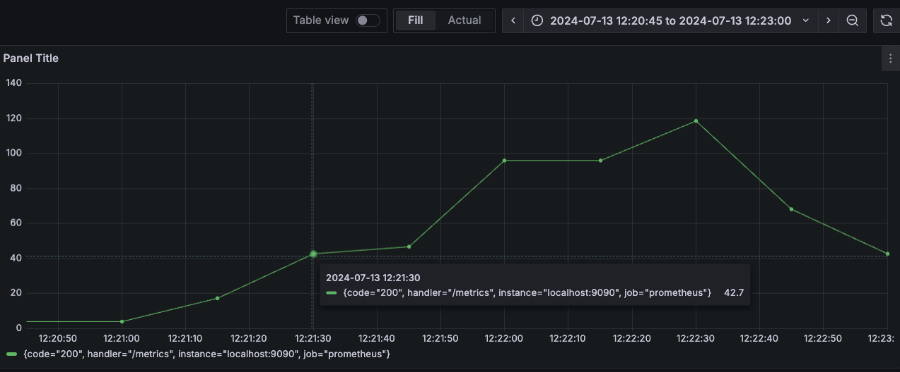

# PromQL聚合操作符与函数

在实际工作中，`sum`、`avg`、`rate`、`increase`等经常被使用到，但很少人关注哪些是聚合操作符，哪些又是函数。有些伙伴在官方文档的函数部分查找`sum`、`avg`的使用是找不到的。因为`sum`、`avg`并不是函数，而是`prometheus`内置的**聚合操作符**。聚合操作符和函数的底层实现也不一样。本涨将详细说明聚合操作符和函数的使用，后续章节将介绍聚合操作符和函数的底层原理和实现。

## 聚合操作符

聚合操作符用于聚合某一个`instant vector`的数据的。上述中`sum`、`avg`就是聚合操作符，目前`prometheus`有`12`个聚合操作符：  

| 操作符   | 作用     |说明     |应用场景     |
| :-----| :---- | :---- |:---- |
| **sum** | 累加 | 计算指定指标的所有样本值的和|计算资源使用总量、请求总数等，例如计算cpu使用总率，总内存使用量|
| **avg**  | 平均值 |  ||
| **min**  | 最小值 |  ||
| **max**  | 最大值 |  ||
| **stddev**  | 标准差 |  ||
| **stdvar**  | 标准方差 |  ||
| **count**  | 计数 |  ||
| **count_values**  | 对value进行计数 |  ||
| **bottomk**  | 最少的n条时序 |  ||
| **topk**  | 最多的n条时序 |  ||
| **quantile**  | 分位数 |  ||
| **group**  | 分组 |all values in the resulting vector are 1  ||


### 使用方法

```text
<aggr-op> [without|by (<label list>)] ([parameter,] <vector expression>)
```

或者

```text
<aggr-op>([parameter,] <vector expression>) [without|by (<label list>)]
```


**说明**  

- **aggr-op** 聚合操作符
- **by** 指定参与聚合操作的标签，使用`by (label1,label2,...)`
- **without** 不参与聚合操作的标签，`by`操作的取反，使用`without (label1,label2,...)`
- **label list** 标签列表

#### 案例一：统计QPS>0的接口

`prometheus_http_requests_total`记录`prometheus`接受到的`http`请求的总量。
截取部分指标样本如下：

```text
prometheus_http_requests_total{code="200",handler="/graph"} 6
prometheus_http_requests_total{code="200",handler="/manifest.json"} 6
prometheus_http_requests_total{code="200",handler="/metrics"} 4032
...
```

计算每个接口的`QPS`的`promql`语句

```text
sum(rate(prometheus_http_requests_total[5m])) by (handler) > 0
```

效果如图：  


说明：

- `rate(prometheus_http_requests_total[5m])` 统计`5m`内`http`的请求速率,每个`prometheus_http_requests_total`指标的变化率  
- `sum(<expr>) by (handler)` 以`handler`标签为维度进行分组,计算每组的和
- `<expr> > 0` 判断是否大于`0`，大于`0`的予以保留，否则丢弃

**分步解析**  

以`/api/v1/query_range`接口为例解析每步的执行过程,`/api/v1/query_range`相关指标如下：  


```text
prometheus_http_requests_total{code="200",handler="/api/v1/query_range"} 234
prometheus_http_requests_total{code="400",handler="/api/v1/query_range"} 477
prometheus_http_requests_total{code="422",handler="/api/v1/query_range"} 4
```

执行步骤解析如下：

**第一步**：执行`rate(prometheus_http_requests_total[5m])`  
`/api/v1/query_range`接口的执行结果如下：

```text
prometheus_http_requests_total{code="200",handler="/api/v1/query_range"}  0.15789362881663987
prometheus_http_requests_total{code="400",handler="/api/v1/query_range"}  0.5438558325906485
prometheus_http_requests_total{code="422",handler="/api/v1/query_range"}  0
```

**第二步**：`sum(rate(prometheus_http_requests_total[5m])) by (handler)`  

将第一步的结果按照`handler`分组，统计每组的和。接口`/api/v1/query_range`的指标和为`0.15789362881663987 + 0.5438558325906485 + 0 = 0.7017494614072883`


**第三步**：`sum(rate(prometheus_http_requests_total[5m])) by (handler)  > 0` 
筛选第二步(*即：`sum(rate(prometheus_http_requests_total[5m])) by (handler)`*)结果大于0的指标，`/api/v1/query_range`接口部分的计算结果为`0.7017494614072883 > 0` 保留。

`/api/v1/query_range`执行结果如图：


#### 案例二：统计状态码大于400的接口QPS

计算每个接口的`QPS`的`promql`语句

```text
sum(irate(prometheus_http_requests_total{code =~ "[4|5].*"}[5m])) by (handler,code)  > 0
```

效果如图：  


#### 案例三：统计最近5分钟请求量前10的接口

`promql`语句如下：

```text
topk(10, sum without (instance,job,code) (increase(prometheus_http_requests_total{}[5m])))
```


说明：

- `without`是`by`的取反。本例中`without (instance,job,code)`排除标签`instance`,`job`,`code`,剩余的标签参与分组聚合。因为`prometheus_http_requests_total` 只有4个标签：`handler`、`instance`、`job`、`code`，那么`without (instance,job,code)`与 `by (handler)`等价关系。
- `sum without (instance,job,code) (increase(prometheus_http_requests_total{}[5m]))` 统计出5min内所有接口的请求量
- `topk(10, <expr>)` 排序，找出`top 10`的指标


## 内置函数

Prometheus提供了其它大量的内置函数，可以对时序数据进行的处理。本部分将列举常见的函数进行说明。其余函数请查看[官方文档](https://prometheus.io/docs/prometheus/latest/querying/functions/)

常用的函数：


| 操作符 |说明    |应用场景  |
| :-----| :---- |:----    |
| **increase**  | 计算增加量    |           |
| **rate**      | 计算平均速率  |计算接口QPS等|
| **irate**     | 计算实时速率  |计算接口错误率|
| **histogram_quantile** |    |计算`P99`，`P95`等指标使用|

### increase

`increase`函数获取区间向量中的第一个和最后一个样本并返回其增长量。  

**使用**  

```text
increase(v range-vector)
```  

例如:  

- `increase(prometheus_http_requests_total{handler="/metrics"}[1m])`
- `increase(prometheus_tsdb_reloads_total{instance='localhost:9090'}[40s])`

**计算方法**

```
时间区间的最后一个样本 -  时间区间的第一个样本
```
示例 

| 时间   | t1  |t2=t1+15s  |t3=t1+30s  |t4=t1+45s |t5=t1+60s |t6=t1+75s |t7=t1+90s |t8=t1+105s |
| :-----| :---- | :---- |:---- |:---- |:---- |:---- |:---- |:---- |
| `xxxx_total` | v1 | v2  |v3  |v4 |v5| v6  |v7  |v8 |
| `increase(xxxx_total[1m])` | -| -| -| -| `v5-v1`| `v6-v2`| `v7-v3`| `v8-v4`|


### rate

函数用于计算在指定时间范围内计数器**平均每秒**的增加量。

**使用**  

```text
rate(v range-vector)
```

例如:

- `rate(prometheus_http_requests_total{handler="/metrics"}[1m])`
- `rate(prometheus_tsdb_reloads_total{instance='localhost:9090'}[40s])`

**计算方法**

```
 (时间区间的最后一个样本 -  时间区间的第一个样本） ➗ 时间区间长度
```
示例 

| 时间   | t1  |t2=t1+15s  |t3=t1+30s  |t4=t1+45s |t5=t1+60s |t6=t1+75s |t7=t1+90s |t8=t1+105s |
| :-----| :---- | :---- |:---- |:---- |:---- |:---- |:---- |:---- |
| `xxxx_total` | v1 | v2  |v3  |v4 |v5| v6  |v7  |v8 |
| `increase(xxxx_total[1m])` | -| -| -| -|`(v5-v1)/60s`| `(v6-v2)/60s`| `(v7-v3)/60s`| `(v8-v4)/60s`|

注： 采样间隔15s


#### 线性外插

先看下面两个案例

**案例一：失真的increase**  

我们先看一下 **`increase(prometheus_http_requests_total{handler="/metrics"}[1m])`** 图形

 

其中`12:21:15`时刻，`increase(prometheus_http_requests_total{handler="/metrics"}[1m])`是小数，而不是正数。实际场景中，接口的访问次数都是正数，为何此处是小数呢？ 


**案例二：失真的rate**  

再看一下rate的案例

图片一：**`prometheus_http_requests_total{handler="/metrics"}`** 图形

 
<br>

图片二：**`rate(prometheus_http_requests_total{handler="/metrics"}[1m])`** 图形
 


**统计表**
在采集时刻的临界点上计算

| 时间   | 12:20:00  |12:20:15  |12:20:30  |12:20:45 |12:21:00 |12:21:15 |12:21:30 |12:21:45 |12:22:00 |12:22:15 |12:22:30 |12:22:45 |12:23:00 |
| :-----| :---- | :---- |:---- |:---- |:---- |:---- |:---- |:---- |:---- |:---- |:---- |:---- |:---- |
| `prometheus_http_requests_total{handler="/metrics"}` | `131` | `132`  |`133`  |`134` |`135`| `146`  |`166`  |`170`  |`218` |`238`| `259`  |`269`  |`270` |
| `rate(prometheus_http_requests_total{handler="/metrics"}[1m])` | - | `0.0667` | `0.0667` | `0.0667` | `0.0667` | `0.289` |  `0.711` |  `0.778` |  `1.60` | `1.60` | `1.98` | `1.13` | `0.771` | 

<br>

我们验证一下，本文`rate`计算，以`12:21:15`(指标`146`)、`12:20:15`(指标`132`)为例进行验证；
```
(146-132) ➗ 60s ~= 0.233
```
`0.233` 不等于表里的 `0.289`。这是什么原因呢？这就是本节要说的**线性外插**。

<br>

`rate`和 `increase`函数都需要查询时间区间的第一个和最后一个样本参与运算。然而现实情况，**查询的时间区间**与**采样时间**不难完全重合，因此无法得到准确的数值。


### irate

`rate`函数计算的是样本的**平均**增长速率，没办法很好的反应瞬时**瞬时**增长率，并且无法避免时间窗口范围内的**长尾问题**。
`irate`通过区间向量中最后两个两本数据来计算区间向量的增长速率，解决时间窗口内的**长尾问题**，并且提高了瞬时变化的灵敏度。

**使用** 

```text
irate(v range-vector)
```

实现计算方法如下：


| 时间   | t1  |t2  |t3  |t4 |t5 |t6 |t7 |t8 |
| :-----| :---- | :---- |:---- |:---- |:---- |:---- |:---- |:---- |
| 采样 | v1 | v2  |v3  |v4 |v5| v6  |v7  |v8 |
| irate | -|`(v2-v1)/(t2-t1)`|`(v3-v2)/(t3-t2)` |`(v4-v3)/(t4-t3)` |`(v5-v4)/(t5-t4)`|`(v6-v5)/(t6-t5)`|`(v7-v6)/(t7-t6)` |`(v8-v7)/(t8-t7)` |

注： 采样间隔15s

<br>

示例:  `prometheus_http_requests_total{handler="/metrics"}`再一段时间范围内的采样与`irate(prometheus_http_requests_total{handler="/metrics"}[1m])`的计算结果

| 时间   | 12:20:00  |12:20:15  |12:20:30  |12:20:45 |12:21:00 |12:21:15 |12:21:30 |12:21:45 |12:22:00 |12:22:15 |12:22:30 |12:22:45 |12:23:00 |
| :-----| :---- | :---- |:---- |:---- |:---- |:---- |:---- |:---- |:---- |:---- |:---- |:---- |:---- |
| `prometheus_http_requests_total{handler="/metrics"}` | `131` | `132`  |`133`  |`134` |`135`| `146`  |`166`  |`170`  |`218` |`238`| `259`  |`269`  |`270` |
| `irate(prometheus_http_requests_total{handler="/metrics"}[1m])` | - | `0.0667` | `0.0667` | `0.0667` | `0.0667` | `0.733` |  `1.33` |  `0.267` |  `3.2` | `1.33` | `1.40` | `0.667` | `0.667` | 

**如图所示**  

**`prometheus_http_requests_total{handler="/metrics"}`**

 

<br>

**`irate(prometheus_http_requests_total{handler="/metrics"}[1m])`**
 


#### 长尾问题的解决

`rate`计算的是均值,会将瞬间峰值**削平**了，无法反映时间窗口内样本数据的快速变化。

`rate`与 `irate`对比图：

 

- 黄色 `irate(prometheus_http_requests_total{handler="/api/v1/status/buildinfo"}[5m])` 
- 绿色 `rate(prometheus_http_requests_total{handler="/api/v1/status/buildinfo"}[5m])`


