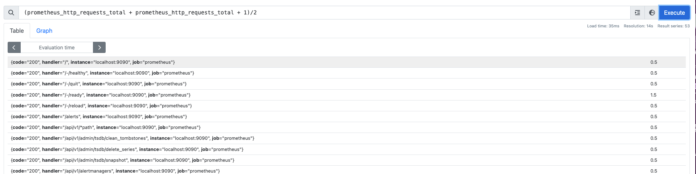
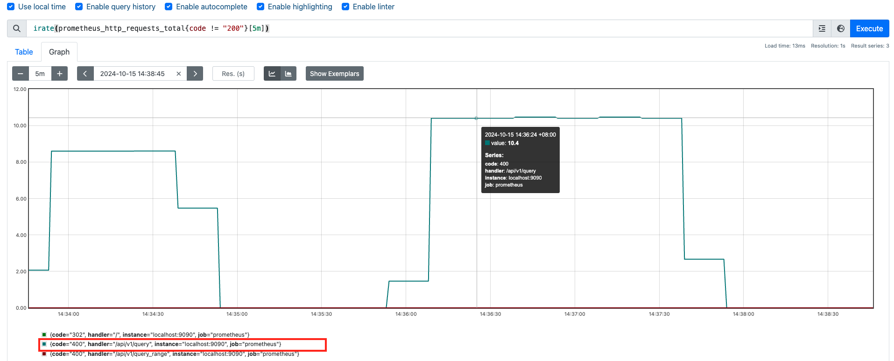
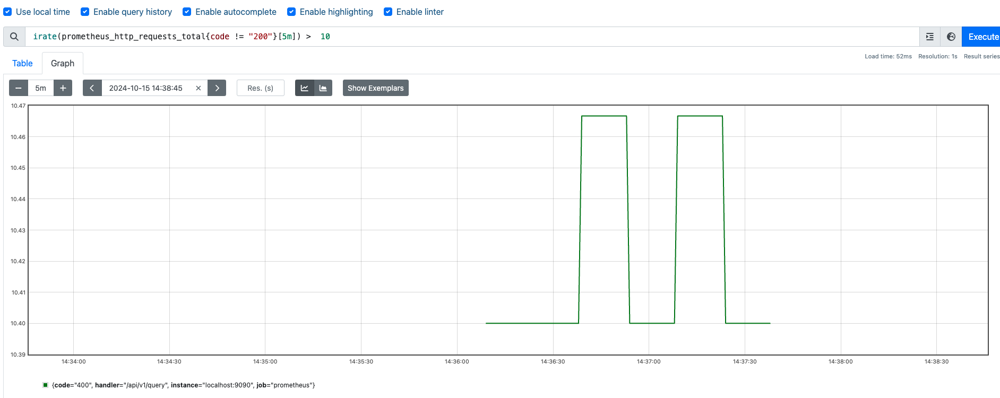
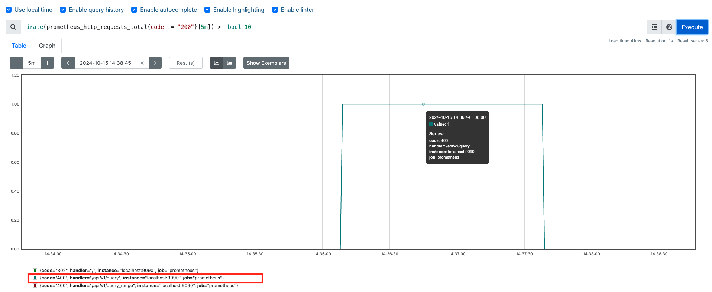
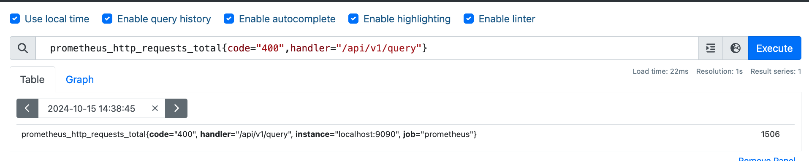
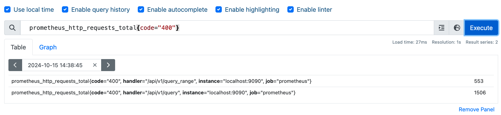
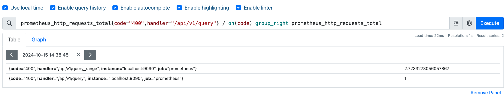

# 8.1 PromQL基本语法

`Prometheus` 提供了一种查询语言`PromQL`，`PromQL`允许用户**实时地**去查询和聚合时序数据。查询出来的结果可以被展示为图形、表格等形式。

第三方系统可以通过`RESTful API` 获取`PromQL`执行结果，例如`grafana`、`Prometheus web UI`

官方文档: [https://prometheus.io/docs/prometheus/latest/querying/basics/](https://prometheus.io/docs/prometheus/latest/querying/basics/)  


## 表达式或子表达式的数据类型


`PromQL` 表达式有四种数据类型：**`Instant vector`**（即时向量）、**`Range vector`**（范围向量）、标量、字符串

- **`Instant vector`**（即时向量）获取指定时序在指定时间点的采样样本，即**一个时间点的采样数据**。例如：`prometheus` 接收到接口`/metrics`的请求数量`prometheus_http_requests_total{handler="/metrics"}` 。如图：
    
  
- **`Range vector`**（范围向量）获取指定时序，一段指定时间范围的所有采样样本，即**一段时间范围的所有采样点**。例如:  获取`prometheus_http_requests_total{handler="/metrics"}[30s]`在最近30s内的所有样本。如图：
     

- `Scalar`（标量） 一个简单的浮点值。1.2   6   1000
- `String` 一个简单的字符串，目前暂未使用。暂时忽略；  


在`PromQL` 中有两种时序选择器： `Instant Vector Selectors`(即时向量选择器) 和 `Range Vector Selectors`（范围向量选择器）。  

#### Instant Vector Selectors(即时向量选择器)

`Instant Vector Selectors`(即时向量选择器) 查出即时向量的选择器就是即时向量选择器，是以查询出的结果看的

即时向量选择器由两部分组成：

- `metric name`：指标名，指定一组时序，必选;
- 标签选择器: 用于过滤时序上的标签，定义于`{}`内，多个过滤条件使用逗号`,` 分割。可选。标签过滤有四种运算符：
  - `=`      文本完全匹配
  - `!=`    文本不匹配
  - `=~`    选择正则表达式 匹配
  - `!~`    选择正则表达式 不匹配

<br>

最简单形式的即时向量选择器只有`metric name`。 例如： `prometheus_http_requests_total` 表示 `prometheus` 接收到`http`请求数量。如图：    


<br>

带有标签过滤的即时向量选择器。例如:获取`/metrics`接口并且状态码为`200`的请求数量：  

```text
prometheus_http_requests_total{handler="/metrics",code="200"}
```

<br>

例如:获取`/api/v1/` 为前缀的请求数量：

```text
prometheus_http_requests_total{handler=~"/api/v1/.+"}
```

#### Range Vector Selectors（范围向量选择器）

`Range Vector Selectors`（范围向量选择器）查询出范围向量就是范围向量选择器。范围向量选择器需要在表达式后紧跟一个方括号`[]`来表示选择的时间范围<br>

范围向量选择器支持的时间单位如下，但在生产环境中，一般使用**秒**或者**分钟**级别的数据。

- `ms` - milliseconds  毫秒
- `s` - seconds  秒
- `m` - minutes 分钟
- `h` - hours  小时
- `d` - days - assuming a day always has 24h  天
- `w` - weeks - assuming a week always has 7d  周
- `y` - years - assuming a year always has 365d  年

<br>

例如:获取指标`prometheus_http_requests_total{handler=~ "/api/v1/.+"}` 在最近3分钟内所有的采样数据

```
prometheus_http_requests_total{handler=~ "/api/v1/.+"}[30s]
```


#### offset  时间位移操作

上文无论即间向量查询还是范围向量的查询都是基于**当前时间点**的。 `prometheus_http_requests_total{handler="/metrics"}` 表示最新的一次采集样本的数据；`prometheus_http_requests_total{handler="/metrics"}[30s]`表示最近`30s`内的所有采样数据。示意图如下：如果**当前**时间是`00:01:05` ，查询 `prometheus_http_requests_total{handler="/metrics"}`  返回的是`采样F`;查询`prometheus_http_requests_total{handler="/metrics"}[30s]`返回的数据列表是`采样D`、`采样F`。


这是时间是基于当前时间的。如果我们想基于一个过去时间去查询指标呢？例如基于`15s`之前的数据。这时候就需要 时间位移操作`offset`了。

**用法** `offset <时间间隔>`   

我们看一下 `prometheus_http_requests_total{handler="/metrics"} offset 15s`  这个查询语句。如果**当前**时间是`00:01:05` ，那么`offset 15s`  表示时间向过去偏移`15s` ,也就是`00:00:50` 。那么以`00:00:50` 为基准，获取过期最近一次的采集数据就是`指标D`。

同理，`prometheus_http_requests_total{handler="/metrics"}[30s] offset 15s`   获取的采样数据列表就是 `样本C ` 、`数据D`。 如图所示


## PromQL运算符

`PromQL`运算符有三种类型:

- 算术运算符
- 比较运算符
- 逻辑运算符

### 算数运算符

`prometheus`支持6种算数运算符：加(`+`)、减(`-`)、乘(`*`)、除(`/`)、取模(`%)`、乘方(`^`)。这6种运算符只能使用于`instant vector`(即时向量) 和 `Scalar`(标量)的计算，不能用于`Range vector`（范围向量）。如果计算的双方都是**即时向量**，必须遵守[向量匹配](#向量匹配vector-matching)原则

#### **示例1**：算数运算符基本使用  

执行`(prometheus_http_requests_total + prometheus_http_requests_total + 1 )/2`

  

<br>

#### **示例2**：**错误示例** `Range vector`参与算数运算符  

执行`prometheus_http_requests_total + prometheus_http_requests_total[1m] + 1` ,会报错`parse error: binary expression must contain only scalar and instant vector types`

原因： 算数运算符不能用于`Range vector`（范围向量)

<br>

 

<br>

#### **示例3** 标签匹配

算数运算的双方都是即时向量时，会将左侧即时向量的标签与右侧即时向量的标签进行对比。只有两者标签相同，才能进行算数运算，否则不能计算。这就是[向量匹配](#向量匹配vector-matching). 
<br>

执行`prometheus_http_requests_total{handler="/api/v1/query"} +  prometheus_http_requests_total{handler="/api/v1/query",code="200"}`  
只能输出` prometheus_http_requests_total{handler="/api/v1/query",code="200",...} `的结果，不可能输出 ` prometheus_http_requests_total{handler="/api/v1/query",code="400",...} `结果  


如图：
 


#### **示例4**：不同指标之间的算数运算

上述示例使用`prometheus_http_requests_total`指标进行演示的，那么不同指标是否可以进行算术运算呢？ 答案当然是可以的，但是必须遵守**标签匹配**的原则，即[向量匹配](#向量匹配vector-matching). 

不同指标分为如下几种场景：

- 同一类型的不同指标,例如`go_memstats_mallocs_total + prometheus_engine_query_samples_total`  前后都是`counter`类型

- 不同类型的指标,例如：`go_gc_cycles_automatic_gc_cycles_total+go_sched_goroutines_goroutines`,  前者是`counter`类型，后者是`gauge`类型

  


### 比较运算符

`prometheus`支持比较算符有6种：等于(`==`)、不等于(`!=`)、大于(`>`)、大于等于(`>=`)、小于(`<`)、小于等于(`<=`)。只能使用于`instant vector`(即时向量) 和 `Scalar`(标量)的运算，不能用于`Range vector`（范围向量)。

日常工作中，关键字`bool` 经常配合比较运算符使用。`bool`关键字会直接跟在比较运算符之后，如果比较运算为`true`，则返回`1`.否则返回`0`。很适合告警的场景中。在告警场景中,并不需要关心指标值具体是多少，只需关心是否触发告警(即：`true` 或 `false`) 即可。具体应用细节会在[告警](./告警.md)说明。

<br>

#### **示例1:** 比较运算符基本使用

查询指标`prometheus_http_requests_total`大于`50`的时间序列，即 `prometheus_http_requests_total > 50`  如图  

 

<br>

#### **示例2:错误率统计**  

工作中，比较运算符最常用在错误率统计、告警这类场景中。一般情况下，这类场景都会设定一个阈值。

下面我们在在监控面板上查询 接口状态码非`200`并且 `qps`大于10的请求，查询语句`irate(prometheus_http_requests_total{code != "200"}[5m]) > 10`

`prometheus` 提供很多[API](https://prometheus.io/docs/prometheus/2.53/querying/api/) ，我们任选一个模拟参数错误的请求。例如获取即时向量的接口`GET /api/v1/query`   人为地传递错误的参数,如下：

``````shell
curl  http://127.0.0.1:9090/api/v1/query  -i 
``````


批量地发送上面请求

``````shell
``````


语句`irate(prometheus_http_requests_total{code != "200"}[5m])` 执行效果，如下图：




语句`irate(prometheus_http_requests_total{code != "200"}[5m]) > 10`  执行效果，如下图：




#### **示例3:** bool配合比较运算符使用

语句``irate(prometheus_http_requests_total{code != "200"}[5m])> bool 10`表示 只有状态码不是`200` 并且`QPS`超过10，才返回`1`；否则返回`0`。 

执行结果，如下图：




### 逻辑运算符

`prometheus`支持逻辑运算符 `and`(交集)、`or`(并集)、`unless`(差集)，只用于`instant vector`之间的运算。为了方便读者理解，本节所有案例使用相同的样本进行说明。
在[http://127.0.0.1:9090/metrics](http://127.0.0.1:9090/metrics)任意选择两个样本，本次选取`go_gc_duration_seconds`、`prometheus_tsdb_wal_fsync_duration_seconds`。  

```text
# HELP go_gc_duration_seconds A summary of the pause duration of garbage collection cycles.
# TYPE go_gc_duration_seconds summary
go_gc_duration_seconds{quantile="0"} 0.000036501
go_gc_duration_seconds{quantile="0.25"} 0.000103208
go_gc_duration_seconds{quantile="0.5"} 0.000133374
go_gc_duration_seconds{quantile="0.75"} 0.000158749
go_gc_duration_seconds{quantile="1"} 0.0.000524
go_gc_duration_seconds_sum 0.001737125
go_gc_duration_seconds_count 15


# HELP prometheus_tsdb_wal_fsync_duration_seconds Duration of write log fsync.
# TYPE prometheus_tsdb_wal_fsync_duration_seconds summary
prometheus_tsdb_wal_fsync_duration_seconds{quantile="0.5"} NaN
prometheus_tsdb_wal_fsync_duration_seconds{quantile="0.9"} NaN
prometheus_tsdb_wal_fsync_duration_seconds{quantile="0.99"} NaN
prometheus_tsdb_wal_fsync_duration_seconds_sum 0
prometheus_tsdb_wal_fsync_duration_seconds_count 0
```


#### **示例1:** 逻辑运算符-交集基本使用

`A and B`过滤出`A`、`B`的标签相等的指标`A`。 文氏图表示：
  

<br>

上面两个`go_gc_duration_seconds`和 `prometheus_tsdb_wal_fsync_duration_seconds` 只有`quantile="0.5"`一个标签一致。那么执行`go_gc_duration_seconds  and  prometheus_tsdb_wal_fsync_duration_seconds`，则返回`go_gc_duration_seconds{quantile="0.5"} 0.000133583`。 如图： 


#### **示例2:** 逻辑运算符-并集基本使用

`A or B` 文氏图表示：
  

<br>

上面两个`go_gc_duration_seconds`和 `prometheus_tsdb_wal_fsync_duration_seconds` 只有`quantile="0.5"`一个标签一致，其他都不一致。那么执行`go_gc_duration_seconds or  prometheus_tsdb_wal_fsync_duration_seconds`，则返回`go_gc_duration_seconds`和 `prometheus_tsdb_wal_fsync_duration_seconds`的并集。 如图： 


#### **示例3:** 逻辑运算符-差集基本使用

`A unless B` 文氏图表示：
  

上面两个`go_gc_duration_seconds`和 `prometheus_tsdb_wal_fsync_duration_seconds` 只有`quantile="0.5"`一个标签一致，其他都不一致。那么执行`go_gc_duration_seconds unless  prometheus_tsdb_wal_fsync_duration_seconds`，则返回`go_gc_duration_seconds`和 `prometheus_tsdb_wal_fsync_duration_seconds`的差集。 如图： 


## 向量匹配Vector Matching

在上面讲述里，我们可以看到，即时向量之间运算时会遵守匹配规则。
`PromQL`中有中匹配模式有两种：

- `一对一（one-to-one`）
- `多对一（many-to-one）或一对多（one-to-many）`。

### 一对一向量匹配

即时向量之间运算时会遵守匹配规则

- 在两侧的即时向量中，找**标签完全一致**的样本，进行运算
- 如果找不到标签不一致，则不会出现在计算结果里

用法:

```
<vector expr>  <bin-op>  [ignoring(<label list>)]  <vector expr>
<vector expr>  <bin-op>  [on(<label list>)]        <vector expr>
```


一对一向量匹配是是**唯一**的，针对左侧的时序样本，只有唯一的右侧与之匹配

  


如果计算**http状态码为302的请求数**占**采集metrics请求数**的比例，即(`prometheus_http_requests_total{code ="302"}` *与* `prometheus_http_requests_total{handler="/metrics"}`的比值)。如果直接使用`prometheus_http_requests_total{code ="302"} / prometheus_http_requests_total{handler="/metrics"}` 计算，可以看到没有匹配任何结果。 如图:  

<br>

  

原因  


|`prometheus_http_requests_total{code ="302"}`| `prometheus_http_requests_total{handler="/metrics"}`  |匹配结果(标签完全匹配)   |分析   |
| :-----| :---- | :---- | :---- |
| `prometheus_http_requests_total{code="302", handler="/", instance="localhost:9090", job="prometheus"}      2` | `prometheus_http_requests_total{code="200", handler="/metrics", instance="localhost:9090", job="prometheus"}  1010` | 无  |标签`code`、`handler`不匹配 |

原因就在于需要左右侧标签完全一致，才可以匹配, 本例子中不能完全匹配，所以结果为空。


如果只需要操作符左右两侧**部分标签进行匹配**，就需要使用关键字进行处理

- `on(label1[,label2, label3,...])`  只使用指定的`label`进行匹配,例如 `on(code，handler)` 只使用`code`，`handler`标签进行匹配
- `ignoring(label1[,label2, label3,...])` 排除指定的`label`，使用剩余的`label`进行匹配,例如 `ignoring(code，handler)` 标签`code`，`handler`不参与匹配。

那我们使用`ignoring(code，handler)`让标签`code`，`handler`不参与匹配，即`prometheus_http_requests_total{code ="302"} / ignoring(code,handler) prometheus_http_requests_total{handler="/metrics"}`,则可以获取**http状态码为302的请求数**占**采集metrics请求数**的比例。如图  

 

由图可以看到，匹配的标签只有`instance` ,`job`。


同样我们可以使用`on`来处理上述案例，我们只需要使用`instance` ,`job`标签匹配,即`prometheus_http_requests_total{code ="302"} / on(instance,job) prometheus_http_requests_total{handler="/metrics"}` 也可以达到相同的效果。


`一对一`向量匹配每个样本的匹配是唯一的，并不是输出结果是唯一的，输出结果可以是多对。 例如 `prometheus_http_requests_total{code !="302"} /(prometheus_http_requests_total{handler=~"/api/v1/label.*"} + 1)` 结果就是多对。

 


### 一对多或者多对一向量匹配

- 操作符左侧一个样本值对应右侧的多个样本(一对多)或者操作符左侧的多个样本对应右侧一个样本值(多对一)
- 必须使用`group_left`或者`group_right`指定"多"的一侧
- 使用`on`或者`ignoring` 筛选参与匹配的标签

用法:

```
<vector expr> <bin-op> ignoring(<label list>) group_left(<label list>) <vector expr>
<vector expr> <bin-op> ignoring(<label list>) group_right(<label list>) <vector expr>
<vector expr> <bin-op> on(<label list>) group_left(<label list>) <vector expr>
<vector expr> <bin-op> on(<label list>) group_right(<label list>) <vector expr>
```


案例说明：

语句 `prometheus_http_requests_total{code="400",handler="/api/v1/query"}`




语句`prometheus_http_requests_total{code="400"}`




语句`prometheus_http_requests_total{code="400",handler="/api/v1/query"} / on(code) group_right prometheus_http_requests_total`


