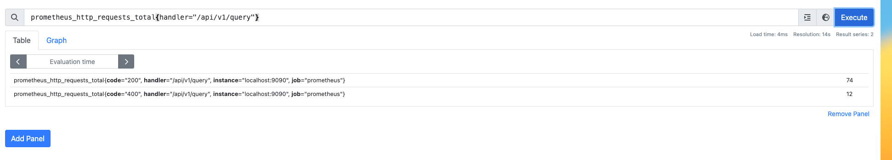
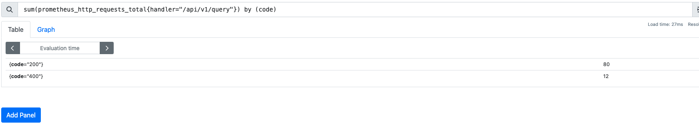

# PromQL基本语法

## 基本语法

### 查询结果的数据类型

`PromQL` 查询结果有四种数据类型：  

- **`Instant vector`**（即时向量）每个时间序列，在任意时间点都**只包含一个样本**,例如：`prometheus` 接收到接口`/metrics`的请求数量`prometheus_http_requests_total{handler="/metrics"}` 。在截止到当前时间点，请求数量只有一个样本。如图：
    
  
- **`Range vector`**（范围向量）每个时间序列都包含一系列时间范围内的数据点，即**多个样本**,例如: `prometheus` 接收到接口`/metrics`的最近3分钟之内的请求数量 `prometheus_http_requests_total{handler="/metrics"}[3m]` 请求数量是一组样本。如图：
     

- `Scalar`（标量） 一个简单的浮点值。
- `String` 一个简单的字符串，目前暂未使用。暂时忽略；  
  
### 时序选择器

在`PromQL` 中有两种时序选择器： `Instant Vector Selectors`(即时向量选择器) 和 `Range Vector Selectors`（范围向量选择器）。  

#### Instant Vector Selectors(即时向量选择器)

`Instant Vector Selectors`(即时向量选择器) 对象是一组指定的时间序列，获取每个时序在某个给定的时间戳上的一个样本。官方说明：  

```text
Instant vector selectors allow the selection of a set of time series and a single sample value for each at a given timestamp (point in time).
```

<br>

即时向量选择器由两部分组成：

- metric name：指标名，指定一组时序，必选;
- 标签选择器: 用于过滤时序上的标签，定义于`{}`内，多个过滤条件使用逗号`,` 分割。可选; 标签过滤有四种运算符：
  - `=` 文本完全匹配，用于‘仅包含xxxx’的逻辑
  - `!=` 文本不匹配，用于‘排除xxxx’的逻辑
  - `=~` 选择正则表达式 匹配
  - `!~` 选择正则表达式 不匹配

<br>

最简单形式的即时向量选择器只有`metric name`。 例如： `prometheus_http_requests_total` 表示 `prometheus` 接收到`http`请求数量。如图：

    


<br>

带有标签选择器的即时向量选择器。例如:获取`/metrics`接口并且状态码为200的请求数量：  

```text
prometheus_http_requests_total{handler="/metrics",code="200"}
```

<br>

例如:获取`/api/v1/` 为前缀的请求数量：

```text
prometheus_http_requests_total{handler=~ "/api/v1/.+"}
```

#### Range Vector Selectors（范围向量选择器）

`Range Vector Selectors`（范围向量选择器）对象是**一组指定的时间序列**，获取每个时序在给定的**时间范围**上的**一组**样本。范围向量选择器需要在表达式后紧跟一个方括号`[]`来表示选择的时间范围。官方说明：

```text
Range vector literals work like instant vector literals, except that they select a range of samples back from the current instant. Syntactically, a time duration is appended in square brackets ([]) at the end of a vector selector to specify how far back in time values should be fetched for each resulting range vector element. 
```

<br>

支持的时间单位如下，但在生产环境中，一般使用秒级或者分钟级别的数据。

- ms - milliseconds
- s - seconds
- m - minutes
- h - hours
- d - days - assuming a day always has 24h
- w - weeks - assuming a week always has 7d
- y - years - assuming a year always has 365d  

<br>

例如:获取`/api/v1/` 为前缀且3分钟内的请求数量

```
prometheus_http_requests_total{handler=~ "/api/v1/.+"}[3m]
```  

## PromQL操作符与关键字

### PromQL操作符

#### 算数运算符

`prometheus`支持算数运算符加(+)、减(-)、乘(*)、除(/)、取模(%)、乘方(^)。只能使用于`instant vector` 和 `Scalar`类型的计算。不能用于`Range vector`（范围向量）。  

**示例1**：算数运算符  

执行` (prometheus_http_requests_total + prometheus_http_requests_total + 1)/2  `   

  

<br>

**示例2**：**错误示例** `Range vector`参与算数运算符   
执行` prometheus_http_requests_total + prometheus_http_requests_total[1m] + 1  ` ,会报错`parse error: binary expression must contain only scalar and instant vector types`    

原因： 算数运算符不能用于`Range vector`（范围向量）  
<br>

 

<br>

**`instant vector` 与 `instant vector`之间使用算数运算**

`instant vector` 与 `instant vector`之间使用算数运算时，会将左侧`instant vector`的标签与右侧`instant vector`的标签进行对比，只有两者标签相同，才能进行算数运算输出结果. 
<br>

**示例3**   

执行`prometheus_http_requests_total{handler="/api/v1/query"} +  prometheus_http_requests_total{handler="/api/v1/query",code="200"} `    
只能输出` prometheus_http_requests_total{handler="/api/v1/query",code="200",...} `的结果，不可能输出 ` prometheus_http_requests_total{handler="/api/v1/query",code="400",...} `结果  

如图：
 


#### 比较运算符

`prometheus`支持比较算符 等于(==)、不等于(!=)、大于(>)、大于等于(>=)、小于(<)、小于等于(<=)。只能使用于`instant vector` 和 `Scalar`类型的计算。不能用于`Range vector`（范围向量）。  除了这些比较运算符之外，关键字`bool` 经常配合比较运算符使用。    

`bool`关键字会直接跟在比较运算符之后，如果比较运算为true，则返回1.否则返回0。应用于告警的场景中，在后续【告警】#TODO 进行说明

<br>

**示例:** 比较运算符基本使用   

查询出请求量大于50的指标 ` prometheus_http_requests_total > 50`  如图  

 

<br>

**示例:** bool配合比较运算符使用   

查询请求量大于50的指标,如果大于50，返回1；否则返回0  ` prometheus_http_requests_total >  bool 50`  如图  

 


#### 逻辑算符

### 关键字

TODO

#### 分组

使用关键字 `by`进行分组
  
例如: 获取请求`/api/v1/query`的请求总数量

```text
sum(prometheus_http_requests_total{handler="/api/v1/query"})

```

    

*注：如果prometheus里暂时没有监控数据，可以手动向prometheus发请求，使prometheus获得http监控数据。例如：*

```shell

curl -X OPTIONS  http://127.0.0.1:9090/api/v1/query  
curl -X PUT http://127.0.0.1:9090/api/v1/query
curl   http://127.0.0.1:9090/api/v1/query  

```

针对上例，获取请求`/api/v1/query`的请求总数量,并且以状态码分组统计  

```shell

sum(prometheus_http_requests_total{handler="/api/v1/query"}) by (code)

```

    


