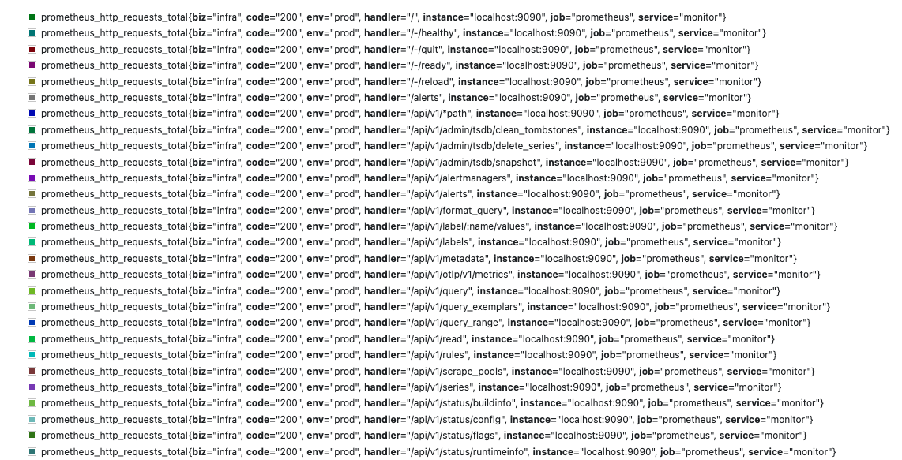

# Label和Relabeling

## 标签Label

### 内置标签/Meta标签

一般情况，`prometheus`以 "`__`"作为前缀的标签的是系统内置标签,定义了`Prometheus`的`Target`实例和指标的一些基本信息。
内置标签[定义在common项目里](https://github.com/prometheus/common/blob/main/model/labels.go#L42)，常见内部标签如下：

- `__address__`   当前`Target`实例的访问地址<`host`>:<`port`>，只供`Prometheus`使用，不会写入时序数据库中，也无法使用`promql`查询。
- `__scheme__`    采集`Target`指标的协议，`HTTP`或者`HTTPS` 默认是`HTTP`，只供`Prometheus`使用，不会写入时序数据库中，也无法使用`promql`查询。
- `__metrics_path__`  `Target`对外暴露的采集接口，默认`/metrics`，只供`Prometheus`使用，不会写入时序数据库中，也无法使用`promql`查询。
- `__name__`      `metrics`的名称，指标名会以 `__name__=<metric_name>`的形式，存储在时序数据库中，例如`__name__=prometheus_http_requests_total`
- `job`   指标归属哪个 `job`
- `instance`   采集的实例，默认情况与`__address__`相同


### 自定义标签

`prometheus` 允许用户根据自己需求去定义标签，实现多维度、精细查询。使用关键字`labels`创建自定义标签。

#### 案例1:基本使用

要求： 针对当前`prometheus`得监控，为其指标标注归属部门`infra`、服务类型`monitor`、运行环境`prod`等  
<br> 
配置如下： 

```yaml
global:
  scrape_interval: 15s # Set the scrape interval to every 15 seconds. Default is every 1 minute.
  evaluation_interval: 15s # Evaluate rules every 15 seconds. The default is every 1 minute.

scrape_configs:
  - job_name: "prometheus"
    static_configs:
      - targets: ["localhost:9090"]
        labels:
           env: prod
           service: monitor
           biz: infra  
```

展示效果



可见所有指标都被打上这些`env: prod`、`service: monitor`、`biz: infra`标签  

### Relabeling


`Relabeling`是`prometheus`的一种强大的功能，可以在拉取`targets`指标之前，动态地重写、增加、删除标签。 每个scrape_config中可以配置多个标签。它们会按照在配置文件中出现的先后顺序而作用与每个目标的标签集


# relabel使用

| relabel_configs action | 修改对象| 说明    |
| :-----| :---- | :---- | 
|replace   | label|根据`regex`来去匹配`source_labels`标签上的值，并将改写到`target_label`中标签 | 
|keep     | target |根据`regex`来去匹配`source_labels`标签上的值，如果匹配成功，则采集此`target`,否则不采集 | 
|drop	    | target |根据`regex`来去匹配`source_labels`标签上的值，如果匹配成功，则不采集此`target`,用于排除，与keep相反|
|labeldrop	||使用regex表达式匹配标签，符合规则的标签将从target实例中移除|
|labelkeep|	|使用regex表达式匹配标签，仅收集符合规则的target，不符合匹配规则的不收集|
|labelmap	 | | 根据regex的定义去匹配Target实例所有标签的名称，并且以匹配到的内容为新的标签名称，其值作为新标签的值|
