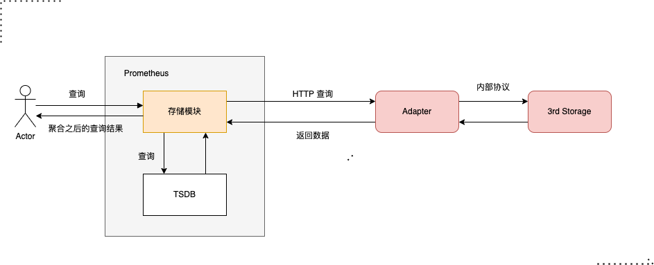

# remote存储介绍

在[prometheus功能介绍|远程存储](prometheus功能介绍.md#远程存储)中，简单地介绍了远端存储的功能。既然`prometheus`本身自带时序数据库`TSDB`,为啥要引入远端存储呢？  
`prometheus`本地存储受所在机器磁盘的限制。为了突破单节点的限制，`prometheus`引入了**远程存储**。本节将系统地剖析远端存储。

## 功能介绍

`prometheus`没有实现远程存储，但是提供了远程存储的两个接口：`remote write`和`remote read`。实现两这两个接口的第三方存储组件就可以实现`prometheus`的存取。  

**远端写示意图**  


**远端读示意图**  



### 远程存储配置

在配置项`remote_write`中配置`url`写入地址即可。示例如下：  

```yaml
# my global config
global:
  scrape_interval: 15s # Set the scrape interval to every 15 seconds. Default is every 1 minute.
  evaluation_interval: 15s # Evaluate rules every 15 seconds. The default is every 1 minute.
  # scrape_timeout is set to the global default (10s).

# A scrape configuration containing exactly one endpoint to scrape:
# Here it's Prometheus itself.
scrape_configs:
  # The job name is added as a label `job=<job_name>` to any timeseries scraped from this config.
  - job_name: "prometheus"

    # metrics_path defaults to '/metrics'
    # scheme defaults to 'http'.

    static_configs:
      - targets: ["localhost:9090"]

remote_write:
  - url: "http://remote-write-url"

```

**演示说明**

我们以 `prometheus` +`VictoriaMetrics` + `grafana`  演示说明：

1. 以docker 安装`VictoriaMetrics`


