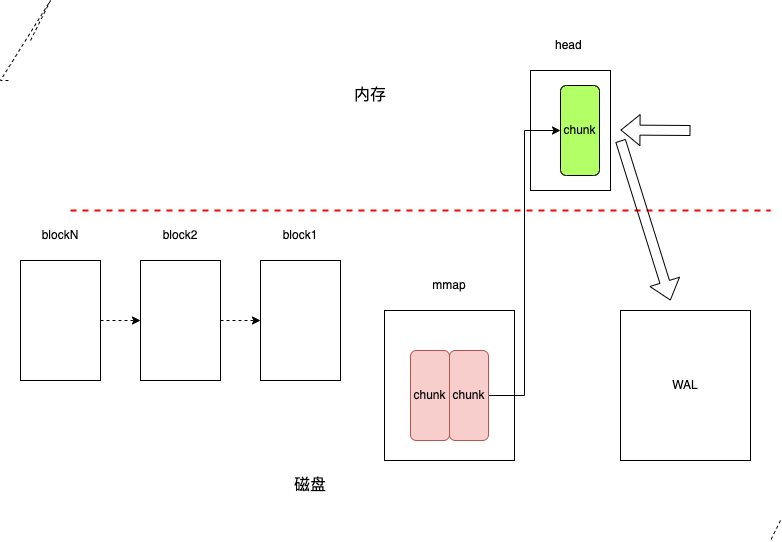

# tsdb
todo : 本章主要讲解`tsdb`   

## 简述

### 时序数据

按照时间顺序记录的数据，就是时序数据，例如某人每顿吃几碗饭、每天的气温、cup使用率等  

例如:两台物理机(a,b)它们的cup使用率
```  
    ^ cpu使用率 
    │ 
    │ 
  a │       10%          12%         10%          6%          50%
    │ 
  b │        6%          8%           12%          8%          3%
    │ 
    └───────────────────────────────────────────────────────────────────>
            12:00        12:01       12:02       12:03        12:04      time

```

机器a、b的`cup使用率`，可以表示成如下形式： 

``` 
  a ->  (12:00, 10%),(12:01, 12%),(12:02, 10%),(12:03, 6%),(12:04, 50%), ......
  b ->  (12:00, 6%), (12:01, 8%), (12:02, 12%),(12:03, 8%),(12:04, 3%) , ......
```


不仅仅是上例。通常情况,时序数据都可使用表示成

```
 identifier  -> (t1,v1),(t2,v2),(t3,v3),(t4,v4), ... 
```  

<br/>

时序数据库特点:  

-  数据以**时间推进**而产生  
- 数据无需更新。 
- 本质是一系列的`K-V`数据`(t,value)`, `key`为时间，`value`就是记录的数据。

<br/>

### prometheus data model
 
**`metric name`与`label`**

格式：
```
<metric name>{<label name>=<label value>, ...} 
```
例如：`prometheus`拉取target的指标时，获取到的原始数据，如下：
```
tyltr_request_total{code="200",method="GET",path="/ping/1"} 1
tyltr_request_total{code="404",method="POST",path="/pingq"} 34
tyltr_request_total{code="404",method="POST",path="/XXXXX"} 5
tyltr_request_total{code="404",method="GET",path="/pingq"} 2
```
说明
-  `metric name`:  `tyltr_request_total`
-  `label`: `code`、`method`、`path`


`prometheus`会将`metric name`与`label`解析成如下格式： 
```
{__name__="tyltr_request_total",code="200",method="GET",path="/ping/1"} 
{__name__="tyltr_request_total",code="404",method="POST",path="/pingq"} 
{__name__="tyltr_request_total",code="404",method="POST",path="/XXXXX"} 
{__name__="tyltr_request_total",code="404",method="GET",path="/pingq"}

```

<details>
  <summary>注: 解析过程</summary>

---
  
   >  ###  函数调用链
   >
   >`func (sl *scrapeLoop) scrapeAndReport(last, appendTime time.Time, errc chan<- error) time.Time `     -->     `func (sl *scrapeLoop) append(app storage.Appender, b []byte, contentType string, ts time.Time) (total, added,    >seriesAdded int, err error) `     -->    **`p.Metric(&lset) ` 解析 metrics 数据**   -->   `lset = sl.sampleMutator(lset)`设置最终的label
   >
   >
   >**p.Metric(&lset)  解析获取到的metrics数据**
   >
   >详见[解析metric](004.scrape.md)

---

</details>

最终，一组指标解析成下面的数据： 

```
{ __name__="tyltr_request_total", instance="127.0.0.1:9100", job="prom_target",code="200",method="GET",path="/ping/1"}    1711809974984          1
{ __name__="tyltr_request_total", instance="127.0.0.1:9100", job="prom_target",code="404",method="POST",path="/pingq"}    1711810012158         34
{ __name__="tyltr_request_total", instance="127.0.0.1:9100", job="prom_target",code="404",method="POST",path="/XXXXX"}    1711810012158          5
{ __name__="tyltr_request_total", instance="127.0.0.1:9100", job="prom_target",code="404",method="GET",path="/pingq" }    1711810032980          2

 |_____________________________|  |_________________________________________________________________________________|     |___________|        |___|                 prometheus 数据
        metric name                                                lables                                                    timestamp       sample value
 |__________________________________________________________________________________________________________________|     |___________|                               time-series 
                                                 一些列的series                                                                时间

 |_____________________________________________________________________________________________________________________________________|       |___|                  时序数据的抽象k-v结果      
                                      带有时间属性的key                                                                                           value

```
<br/>  

**强调:什么是series?**

**series** 指的是`metric_name + labels `构成的"标识",而单单是一类指标metric。例如上例:   
1. 下面四个:
  - `{__name__="tyltr_request_total",instance="127.0.0.1:9100",job="prom_target",code="200",method="GET",path="/ping/1"} `
  - `{__name__="tyltr_request_total",instance="127.0.0.1:9100",job="prom_target",code="404",method="POST",path="/pingq"} `
  - `{__name__="tyltr_request_total",instance="127.0.0.1:9100",job="prom_target",code="404",method="POST",path="/XXXXX"}`
  - `{__name__="tyltr_request_total",instance="127.0.0.1:9100",job="prom_target",code="404",method="GET",path="/pingq" }`  
都属不同**series**
1. 上述四个的**series**都属于 `__name__="tyltr_request_total"`的指标数据  


上述的监控指标，通过二维坐标(*x 轴是时间，y轴是序列series*)可以表示成 

```                                                                                                                     
                                                                                                                         ^  series
                                                                                                                         │  
{ __name__="tyltr_request_total", instance="127.0.0.1:9100", job="prom_target",code="200",method="GET",path="/ping/1"}   │          1                 .                                                  .             .
                                                                                                                         │             
{ __name__="tyltr_request_total", instance="127.0.0.1:9100", job="prom_target",code="404",method="POST",path="/pingq"}   │          .                 34                  .               .                           
                                                                                                                         │            
{ __name__="tyltr_request_total", instance="127.0.0.1:9100", job="prom_target",code="404",method="POST",path="/XXXXX"}   │          .                 5                   .               .               .             . 
                                                                                                                         │             
{ __name__="tyltr_request_total", instance="127.0.0.1:9100", job="prom_target",code="404",method="GET",path="/pingq" }   │          .                 .                   2                                           
                                                                                                                         │             
                                                                                                                         └── ~ ───────────────────────────────────────────────────────────────────────────────────────────────────>
                                                                                                                              1711809974984        1711810012158       1711810032980      ..             ..             ..     timestamp


```
## 时序数据库简述

**时序数据库应用场景**   
- **监控**,例如系统监控、设备监控等
- **数据分析**，例如股票、外汇等金融交易等；气温气候检测等  

<br/>

**时序数据库特点**   

- 只有**写**和**读**操作，没有更新操作。
- 实际应用中，**多读写少** 
- 大量的**统计、聚合**查询
- 一般情况，新数据查询多，老数据查询少。**新热老冷** <!-- 涉及到历史数据的处理问题  -->  

<br/>

<!-- 
**历史数据的处理策略**

一般情况，时序数据库中新数据查询多，老数据查询少(**新热老冷** )。如何处理很少被用到的历史数据，是所有时序数据库必须解决的问题。 

 -->  


## `TSDB V2`简述

`prometheus TSDB`经历了两个主要的版本:  
- `prometheus v1.x`使用`TSDB V2`版本
- `prometheus v2.x`使用`TSDB V3`版本

本节说明一下`TSDB V2`版本

**`TSDB V2`特性**  

- **每一个`serie`分别存放到不同的,独立的文件中**
   > 例如: 上例中四个`serie`会各种存放在四个独立的文件中。例如:
   >   - `{__name__="tyltr_request_total",instance="127.0.0.1:9100",job="prom_target",code="200",method="GET",path="/ping/1"} ` 存储于文件a
   >   - `{__name__="tyltr_request_total",instance="127.0.0.1:9100",job="prom_target",code="404",method="POST",path="/pingq"} ` 存储于文件b
   >   - `{__name__="tyltr_request_total",instance="127.0.0.1:9100",job="prom_target",code="404",method="POST",path="/XXXXX"}`  存储于文件c
   >   - `{__name__="tyltr_request_total",instance="127.0.0.1:9100",job="prom_target",code="404",method="GET",path="/pingq" }`  存储于文件d  
   >  
  也就是说`TSDB V2`存在大量的文件，读写时需要保持大量文件处于打开状态,**容易触发系统最大打开文件数**


  <details>
    <summary>引申: linux系统最大打开文件数</summary>  

     - 查看**系统**允许打开的最大文件数
        > ```
        > sysctl fs.file-max
        > ```

    - 查看**进程**允许打开的最大文件数
        >```
        > ulimit -n
        > ```
 
 
    -  执行如下命令
     
       > ```
       >   ubuntu~$  sysctl fs.file-max
       >   fs.file-max = 6815744
       >   
       >   ubuntu~$  ulimit -n
       >   1024
       > ```
     
       > **疑问:为什么执行数据不一致呢？**
     
       > - `sysctl fs.file-max`：表示**系统**的能够打开的文件的数量。是对**整个系统**的限制，并不是针对用户进程的。
       >  - `ulimit -n`：标识**进程**能够打开的文件的数量，例如nginx可以打开的最多文件句柄
  </details>


  <br/>

- **`time series`的最新数据都会缓存到内存，然后批量落盘**
  > 每一个`time series`对应内存中的独立的`chunk(1KiB)`，没有`WAL`,机器宕机，存储在内存的数据就会丢失
  <br/>
- **随机读写**
  > 每个文件是顺序批量写，但`tsdb v2`会读写大量的文件，就会产生随机读写的问题。
  <br/>
- **Series Churn**
  > `Series Churn` 指的是**一个时间序列集合变得不活跃，即不再接收数据点；取而代之的是出现一组新的活跃序列**  
  >  如果上例的进程部署在云原生环境中，`instance`用来表示指标来自于哪个实例。如果我们为此服务执行了滚动更新`rolling update`，`instance`就会变化，而产生新的序列。`prometheus`接收不到原序列的指标。除此之外，`Kubernetes`的 scaling 也会导致`Series Churn`
  示意图：

  ```
  series
  ^
  │   . . . . . .
  │   . . . . . .
  │   . . . . . .
  │               . . . . . . .
  │               . . . . . . .
  │               . . . . . . .
  │                             . . . . . .
  │                             . . . . . .
  │                                         . . . . .
  │                                         . . . . .
  │                                         . . . . .
  |
  └── ~ ────────────────────────────────────────────────────>
                                                          time 
  ```

  <br/>
- **写放大的问题** 
  > 虽然为了节约内存，将`chunk`限制为`1KiB`。但如果是`SSD`硬盘,就可能导致**写放大**问题

  <details>

    <summary>引申: SSD的写放大</summary> 
      <hr>
      todo
      <hr>
  </details>


## `TSDB V3`

由于`TSDB V2`版本面临上述的诸多问题，`TSDB V3`应运而生。目前`prometheus v2.x`使用就是`TSDB V3`。 2017年,`Prometheus v2`发布之初,将`Prometheus v2`和 `Prometheus 1.8`存储方面进行了比较(详见:[storage:Prometheus v2 vs Prometheus 1.8](https://prometheus.io/blog/2017/11/08/announcing-prometheus-2-0/#storage) ),可见`TSDB V3`对`Prometheus`的性能显著提升了。 本章的重点就是阐述`TSDB V3`


`storage.tsdb.path`目录(*默认为`data`*)由以下几部分组成：
- **block目录**    
  每个 `block`由`ulid` 标识。每个`block` 目录下包含以下部分：
  - 元信息  (必须)
  - tombstones   对数据进行软删除，`prometheus`采用了**标记删除**的策略，将删除记录保存在`tombstones`中，查询时会根据`tombstones`文件中的删除记录来过滤已删除的部分.
  - index        索引
  - chunks       用于保存时序数据。每个`chunks`目录下都有一个或者几个`chunk`,并且每个`chunk` 最大为512mb。超过的部分就会被截断新的`chunk`进行保存，每个`chunk`以数字编号命名。
- **chunks_head**  
`prometheus`把新采集到的数据存储在内存的`head chunk`。此`chunk` 只能写入120 个样本。如果写满 120 个样本后，才开始进行 `mmap`映射写入写磁盘。然后生成一个空的`chunk` 继续存储新的样本。
通过`mmap`映射写入写磁盘的数据就存储 `chunks_head`目录下，`chunks_head`下的数据也以数字编号命名。  
- **wal**  
  `prometheus` 为了防止应用崩溃而导致内存数据丢失，引入了`WAL` 机制。`WAL` 被分割成默认大小为 `128MB` 的`segment`，`segment`以数字命名，例如 `00000000`、 `00000001`


图示：  
  


**官方示例**   
```
./data
├── 01BKGV7JBM69T2G1BGBGM6KB12
│   └── meta.json
├── 01BKGTZQ1SYQJTR4PB43C8PD98
│   ├── chunks
│   │   └── 000001
│   ├── tombstones
│   ├── index
│   └── meta.json
├── 01BKGTZQ1HHWHV8FBJXW1Y3W0K
│   └── meta.json
├── 01BKGV7JC0RY8A6MACW02A2PJD
│   ├── chunks
│   │   └── 000001
│   ├── tombstones
│   ├── index
│   └── meta.json
├── chunks_head
│   └── 000001
└── wal
    ├── 000000002
    └── checkpoint.00000001
        └── 00000000
```
    

    
**思考题**
-   `block`选择`ulid` 作为标识有什么优势吗？为何不选择`uuid`？
 
ULID基于时间戳生成，因此可以按照时间戳进行排序

-  很多数据库基本都使用`wal`机制，既然`wal`是写磁盘，而记录到`block`也是写磁盘。为什么不直接写`block`，而引入`wal`呢？
todo

-  零拷贝技术主要有`mmap`、`sendfile`,为何不使用`sendfile`？
todo


