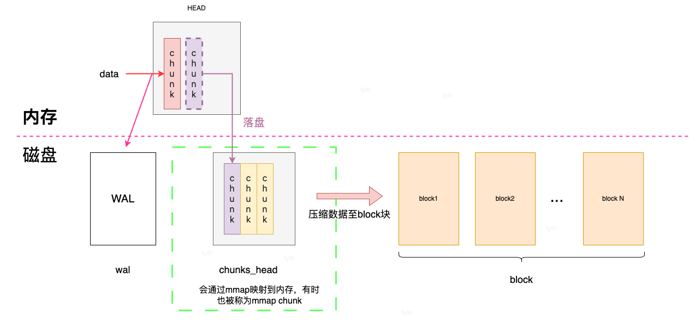

# TSDB v3 概述

本章的重点就是阐述`TSDB V3`。以后没有特别说明`TSDB`指的就是`TSDB V3`

## `TSDB V3`数据库数据文件

`Prometheus`启动参数`storage.tsdb.path`来指定`tsdb`数据存储位置，默认是`data`目录。我们先看一下`tsdb`数据文件的结构。

目录结构  

```text
./data
├── 01BKGV7JBM69T2G1BGBGM6KB12
│   └── meta.json
├── 01BKGTZQ1SYQJTR4PB43C8PD98
│   ├── chunks
│   │   └── 000001
│   ├── tombstones
│   ├── index
│   └── meta.json
├── 01BKGTZQ1HHWHV8FBJXW1Y3W0K
│   └── meta.json
├── 01BKGV7JC0RY8A6MACW02A2PJD
│   ├── chunks
│   │   └── 000001
│   ├── tombstones
│   ├── index
│   └── meta.json
├── chunks_head
│   └── 000001
└── wal
    ├── 000000002
    └── checkpoint.00000001
        └── 00000000
```

由上可以看到，文件目录分为三类：`block目录`、`chunks_head`、`wal`

### block目录

目录名为`01BKGV7JBM69T2G1BGBGM6KB12`、`01BKGTZQ1SYQJTR4PB43C8PD98`、  `01BKGTZQ1HHWHV8FBJXW1Y3W0K`就是一个个的`block`。  

默认情况下，`prometheus`以`2个小时`为一个时间窗口，即将`2小时`内产生的数据存  储在一个`block`中。那么监控数据就会被以时间段的形式被拆分成不同的`block`，所  以`prometheus`会产生很多`block`。每个`block`由`ulid`进行标识，例如  `01BKGV7JBM69T2G1BGBGM6KB12`、`01BKGTZQ1SYQJTR4PB43C8PD98`...

每个`block` 目录下包含以下部分：

  - meta.json    元信息  (必须),记录此block的基本信息，例如标识、起始时间时间 戳、终止时间时间戳等
  - tombstones   对数据进行软删除，`prometheus`采用了**标记删除**的策略，将 删除记录保存在`tombstones`中，查询时会根据`tombstones`文件中的删除记录来过 滤已删除的部分.
  - index        索引。
  - chunks       用于保存时序数据。每个`chunks`目录下都有一个或者几个 `chunk`,并且每个`chunk` 最大为`512mb`。超过的部分就会被截断新的`chunk`进行 保存，每个`chunk`以数字编号命名,例如`000001`、`000002`...

### chunks_head

`prometheus`把新采集到的数据存储在内存的`head chunk`。但`chunk`只能写入`120`个样本。如果写满`120`个样本后，才开始进行 `mmap`映射写入写磁盘。然后生成一个空的`chunk` 继续存储新的样本。

通过`mmap`映射写入写磁盘的数据就存储`chunks_head`目录下，`chunks_head`下的数据也以数字编号命名。

### wal 

`prometheus`为了防止应用崩溃而导致内存数据丢失，引入了`WAL`机制。`WAL`采用日志追加模式，数据会先被追加到`WAL`文件中，然后再被刷新到存储引擎中。`WAL`文件被分割成默认大小为 `128MB`的数据段，每个数据段以数字命名，例如 `00000000`、 `00000001`...

同时，我们可以看到`wal`目录下有`checkpoint`目录，那么`checkpoint`是做什么的呢？`WAL`机制是为了备份内存的数据防丢失的。内存中的数据落盘之后，`WAL`备份的数据就没用了。和其他数据库一样，`TSDB`重启之后，也会恢复`WAL`的数据，而且恢复开销大，因此`WAL`备份的数据约简洁约好。所以`prometheus`需要定期清理旧的`wal`数据。对于清理之后剩下的有用的数据，`checkpoint`会将其重新封装成新的数据段，存放在`checkpoint`目录下。

<!-- 
**思考题一** `block`选择`ulid` 作为标识有什么优势吗？为何不选择`uuid`？

`ULID`基于时间戳生成，因此可以按照时间戳进行排序
TODO

**思考题二** `prometheus`既然`wal`是写磁盘，而记录到`block`也是写磁盘。为什么不直接写`block`，而引入`wal`呢？

TODO
**思考题三** 零拷贝技术主要有`mmap`、`sendfile`,为何选择`mmap`,而不使用`sendfile`？

TODO -->


## `TSDB V3`存储流程

存储流程示意图  


在上图中，`Head` 块是`TSDB`的内存块，`Block1`、`Block2` ...`BlockN`是持久化磁盘上的文件。同时可以看到，`wal`文件、`chunks_head`也存储于磁盘上。并且说明一个概念:**`chunkRange`**表示`chunk`的记录样本的时间跨度，默认2小时。

`prometheus`中，新数据样本首先会存储于内存的`Head`中。其中`Head`中接收样本的`chunk`称之为`active chunk`。在新数据样本写入内存的`Head`时，会做一次预写日志，将新数据样本写入到`WAL`文件中。  

`chunk`只能写入`120`个样本。**当`active chunk`满了**或者**当前`active chunk`已经持续了`chunkRange`了**，内存的`Head`会创建新的`chunk`来接收新数据样本(*即：新的`active chunk`*)。之前的`active chunk`数据会落盘到`chunks_head`目录。这样`prometheus`就可以根据需要，动态将此部分数据加载到内存了。


`chunks_head`存储的时序时间跨度超过了`chunkRange / 2 * 3`(*注：默认3小时*)，就会将前`chunkRange`时间范围的时序数据压缩到`Block`中。

<!-- 
解读记录：

代码： https://github.com/prometheus/prometheus/blob/main/tsdb/head_append.go
[tsdb/db.go](https://github.com/prometheus/prometheus/blob/main/tsdb/db.go)、
[head](https://github.com/prometheus/prometheus/blob/main/tsdb/head.go)

```go
func (h *Head) compactable() bool {
    if !h.initialized() {
        return false
    }

    return h.MaxTime()-h.MinTime() > h.chunkRange.Load()/2*3
}
``` -->


## WAL

`prometheus`将周期性采集指标，并把指标添加到`active head`，同时`TSDB`通过`WAL`将数据保存到磁盘上进行备份。当出现宕机重启时，就会程读取`WAL`记录，恢复数据。`prometheus`的`WAL`采用**追加写**的方式记录数据，这种顺序写的方式比随机写高效的多。
`prometheus`数据更新都优先会记录内存，也就是会有`WAL`过程，也就意味着数据库的数据都会经历被`wal`文件存储的“经历”。一旦这些更新的数据落盘完成，对应在`WAL`中的备份数据就没用了。如果不清理历史数据、无用数据`WAL`会被“撑爆”的。`WAL`记录没有经过**完全压缩**，占用空间较大，并且恢复成本页是比较高的。这就是**WAL清理**重要原因。`WAL`清理时，会创建一个`checkpoint`记录清理后的数据状态。

注：默认情况下，`WAL`记录进行`Snappy`压缩。`Snappy`压缩算法主要特点就是快，它的目标不是最大限度压缩率，而是在提供高速压缩速度。`Snappy`压缩可以被看成不完全的压缩。

`WAL`文件被分割成默认大小为 `128MB`的数据段(`segment`)，每个数据段以数字命名，例如 `00000000`、 `00000001`... WAL的写入单位是页(`page`)，每页的大小为`32KB`,数据一次一页地写入磁盘。
每个`WAL`记录都是一个`byte`切片(*注：切片是go语言的特性，本质就是数组，非go语言开发者，可以理解为`byte`数组*)。如何存储`WAL`记录呢？

- 如果一个`WAL`记录大小超过了页(`page`)的大小，这页就会被拆解给更小的子记录，多页存储。
- 如果一个`WAL`记录大小超过了数据段(`segment`)的大小(`128MB`),`prometheus`就会创建更大空间的数据段(`segment`)进行存储。

### 编码/数据的组织方法

`prometheus`的`WAL`文件有三种编码类型：`Series records`、`Sample records`、`Tombstone records`。在源码中三种编码的类型[枚举值](https://github.com/prometheus/prometheus/blob/v2.53.0/tsdb/record/record.go#L40)

| 类型   | 编码方式    |
| :-----| :---- | 
| Series records    | 1 (1b)| 
| Sample records    | 2 (1b)| 
| Tombstone records | 3 (1b)|


#### Series Records

由之前的讲解，我们知道`prometheus`的写入模型分三部分：(`labels`、`timestamp`、`value`)。
`labels`是指标唯一标识。但是`labels`一般都很长，每次采集都把`labels`原封不动地存储，那么会造成磁盘空间的极大浪费，并且读写时也会造成很大的`IO`开销。为了解决这问题，`WAL`对`labels`进行了预处理。`labels`会被封装成`Series Record`，写入`wal`文件中,**只写一次**。同时在内存中维护**labels与seriesId**的映射。`seriesId`是`Series Record`类型数据的ID,类型是自增的整形数据。写入数据由(`labels`、`timestamp`、`value`)转换成了(`seriesId`、`timestamp`、`value`)。

**获取`seriesId`的流程示意图**  


**`Series Records`数据编码**


```
┌───────────────────────────────────────────────────────┐
│ type = 1 <1b> 代码中SeriesRecord类型枚举值为1            │
├───────────────────────────────────────────────────────┤
│ ┌───────────────┬───────────────────────────────────┐ │
│ │ seriesId <8b> │ n= len(labels) labels的对数        │ │
│ ├───────────────┴────────────┬──────────────────────┤ │
│ │ len(label_name1) <uvarint> │ label_name1 <bytes>  │ │
│ ├────────────────────────────├──────────────────────┤ │
│ │ len(label_val1)  <uvarint> | label_val1 <bytes>   │ │
│ ├────────────────────────────┴──────────────────────┤ │
│ │                . . .                              │ │
│ ├────────────────────────────┬──────────────────────┤ │
│ │ len(label_name_n) <uvarint>│ label_name_n <bytes> │ │
│ ├────────────────────────────├──────────────────────┤ │
│ │ len(label_val_n)  <uvarint>| label_val_n <bytes>  │ │
│ └───────────────────────────────────────────────────┘ │
│                  . . .                                │
└───────────────────────────────────────────────────────┘

```

说明：

- `type` :代码中`SeriesRecord`类型枚举值为`1`
- `seriesId` : `SeriesRecord`数据的标识
- `n`:  `SeriesRecord`存储`label`的对数
- 标签`key`的长度、标签`key`的内容以及对应的标签`value`的长度与标签`value`的内容
<!-- 
相关代码
https://github.com/prometheus/prometheus/blob/v2.53.0/tsdb/record/record.go#L40
https://github.com/prometheus/prometheus/blob/v2.53.0/tsdb/record/record.go#L597
https://github.com/prometheus/prometheus/blob/v2.53.0/tsdb/record/record.go#L217
 -->

#### Sample Records

`Sample Records`记录一个个样本的数据，记录的数据是(`seriesId`、`timestamp`、`value`)。
例如：我们获取到的数据是这样的

| seriesId(8byte) | timestamp(ms,8byte) |value (8byte) |
| :-----| :---- |  :---- | 
| 1923   |1724296859350 |91210.0| 
| 1923   |1724296859457| 321.0| 
| 1922 |1724296852311|123.0| 
| 1922 |1724296858231|101.0| 
| 1902 |1724296865510|12.0| 
| 1623 |1724296866782|3.0| 

这些数据都使用了`64bit`进行存储，`wal`采用二进制存储方式，这样算下来一条数据就需要`64bit * 3 = 24byte`，仅仅当前版本`prometheus`相关的指标就有`526`个，那么2小时产生的数据量`64bit * 3 *(60 % 15) * 60 * 2 ~= 5.77MB`。还是有些大。`prometheus`采样相对于**第一条样本取差值**的方进一步压缩存储空间。
使用上例进行说明:  

**原始数据**  

| seriesId(8byte) | timestamp(ms,8byte) |value (8byte) |
| :-----| :---- |  :---- | 
| 1923   |1724296859350 |91210.0| 
| 1923   |1724296859457| 321.0| 
| 1922 |1724296852311|123.0| 
| 1922 |1724296858231|101.0|      
| 1902 |1724296865510|12.0| 
| 1623 |1724296866782|3.0| 

**计算**   

| seriesId(8byte) | timestamp(ms,8byte) |value (8byte) |
| :-----| :---- |  :---- | 
| `1923`   |`1724296859350` | -| 
| `1923- 1923 = 0`   |`1724296859350 - 1724296859350=0`|`91210.0`| 
| `1923- 1923 = 0`  |`1724296859457 - 1724296859350=107`| `321.0`| 
| `1924- 1923 = 1` |`1724296852311 - 1724296859350=-7039`|`123.0`| 
| `1924- 1923 = 1` |`1724296858231 - 1724296859350=-1119`|`101.0`|      
| `1926- 1923 = 3` |`1724296865510 - 1724296859350=6160`|`12.0`| 
| `1934- 1923 = 11` |`1724296866782 - 1724296859350=7432`|`3.0`| 

**结果**  

| seriesId| timestamp |value |
| :-----| :---- |  :---- | 
| `1923`|`1724296859350` | -| 
| `0`   |`0`|`91210.0`| 
| `0`  |`107`| `321.0`| 
| `1` |`-7039`|`123.0`| 
| `1` |`-1119`|`101.0`|      
| `3` |`6160`|`12.0`| 
| `11` |`7432`|`3.0`| 

可见数据量显著减少了，在使用可变长数据类型存储成二进制，实现节约空间的目的。


**`Sample Records`数据编码**
将上述过程的结果，可以抽象成下面的编码结构。在源码中`Sample Records`的枚举类型就是2。

```
┌──────────────────────────────────────────────────────────────────┐
│ type = 2 <1b>                                                    │
├──────────────────────────────────────────────────────────────────┤
│ ┌────────────────────┬───────────────────────────┐               │
│ │ id <8b>            │ timestamp <8b>            │               │
│ └────────────────────┴───────────────────────────┘               │
│ ┌────────────────────┬───────────────────────────┬─────────────┐ │
│ │ id_delta <uvarint> │ timestamp_delta <uvarint> │ value <8b>  │ │
│ └────────────────────┴───────────────────────────┴─────────────┘ │
│                              . . .                               │
└──────────────────────────────────────────────────────────────────┘

```

#### Tombstone records

TODO


### WAL清理与CheckPoint

`WAL`清理指的是定期清理旧的`WAL`记录。这样既可以节约存储空间，又可以提升`TSDB`重启速度。在`TSDB`重启需要加载`WAL`文件，`WAL`文件越大，加载时候的开销就会增加。  
本文称之为`WAL`清理，有的文档中称之为`WAL`截断、`WAL`删除等，英语文档称之`WAL truncation`。

#### WAL清理

理论上，数据被持久化成`block`就可以删除旧的`WAL`记录，但是实际中不能这么粗暴。`prometheus`如何选取数据段(`segment`)进行清理的呢？
选取的公式 [last = first + (last-first)*2/3](https://github.com/prometheus/prometheus/blob/v2.53.0/tsdb/head.go#L1267)，那么`[first,last]`将会被清理。

看例子说民： 假设目前有`00000000` ~ `00000006` 共6个数据段(`segment`)

```
└── wal
    ├── 00000000
    ├── 00000001
    ├── 00000002
    ├── 00000003
    ├── 00000004
    ├── 00000005
    └── 00000006

```


那么`first = 00000000`, `last = first + (last-first)*2/3 = 00000000 + (00000006 - 00000000) * 2 / 3 = 00000004`,则`[00000000,00000004]`就是被选择的数据段(`segment`)。

选出了数据段(`segment`)，那么可不可以直接删除这些数据段？ 在回答之前，我们先回想一个场景：在上文中提到的`Series Records`被`Sample Records`引用。`Series Records` 也会写到`wal`记录里面，并且只写一次而且不知道写在哪个数据段(`segment`)里面。如果直接删除了，那么下次启动的时候，无法恢复`Series Records`记录了。
如果无差别清理数据段(`segment`)，那么`Series Records`信息就会丢失。这一场景就需要`CheckPoint`来解决。

#### CheckPoint

上述已经选出了被清理的`WAL`文件。`prometheus`不会直接删除这些记录，而是创建`CheckPoint`。`CheckPoint`从小到大进行遍历数据段(`segment`)，依次筛选数据，无用的删除，有用的保留。`prometheus Head`的数据会陆续持久化到硬盘，那么假设持久化的最后一条记录的时间戳为T,那么`Head`中就不存在T之前的数据了，wal也无需保留这些样本数据。综上清理对象：

- 删除`Head`中不再存在的`Series Records`数据;
- 删除所有在时间T之前的`Sample Records`数据;
- 删除所有在时间T之前的`Tombstone records`数据;
- 保留剩余的`Series Records`、`Sample Records` 和`Tombstone records`数据，按照之前的顺序封装成`WAL`文件，写入一个名为`checkpoint.X`的目录中。`checkpoint.X`中的`X`表示此次清理操作最后一个数据段(`segment`)的序号。例如上例 `00000000`,`00000001`,`00000002`,`00000003`,`00000004`最后一个是`00000004`，那么目录命名为`checkpoint.00000004`。

```
└── wal
    ├── 00000005
    ├── 00000006
    └── checkpoint.00000004
        └── 00000000

```

### WAL重放

`tsdb`重启之后，需要重放wal来恢复数据。 WAL重放首先加载`checkpoint.X`目录下的文件；然后根据目录名`checkpoint.X`中的`X`找寻下一个数据段(`segment`)即`X+1`进行重放。例如上例中首先重放`checkpoint.00000004`的文件，结束之后，找到数据段`00000005`继续完成重放，直至加载完`wal`目录下的所有文件。

WAL重放时，各个数据类型怎么处理：

- `Series Records`: 在内存`head`创建`Series Record`记录;
- `Sample Records`: 在head里添加`Sample Record`记录，然后寻找引用的`Series Record`记录，找到则添加，找不到则跳过。
- `Tombstones Records`:  todo

## chunks_head原理


回顾一下`chunks_head`在`tsdb`存储过程中的阶段。当`head`的`chunk`样本数量到达`120`个时，会将此`chunk`刷盘。如果访问`M-mapped chunks`中的某段数据，操作系统就会将这段数据通过`mmap`映射到内存，而不是整个文件。

  

`chunks_head`的磁盘上的文件目录  

```text
├── chunks_head
    └── 000001
```

### chunks_head编码

#### `chunks_head`文件编码

`chunks_head`目录下的文件，必须遵循下面的编码方式 

```
┌────────────────────────────────────────────┐
│       magic(0x0130BC91) <4 byte>           │
├──────────────────────┬─────────────────────┤
│ version(1) <1 byte>  │ padding(0) <3 byte> │
├──────────────────────┴─────────────────────┤
│ ┌────────────────────────────────────────┐ │
│ │                  Chunk 1               │ │
│ ├────────────────────────────────────────┤ │
│ │                   ...                  │ │
│ ├────────────────────────────────────────┤ │
│ │                  Chunk N               │ │
│ └────────────────────────────────────────┘ │
└────────────────────────────────────────────┘
```

**说明**  

- `magic(0x0130BC91)`  占用空间`4 byte`，特定字符。`chunks_head`文件必须以`0x0130BC91`开始，否则不被认为是`chunks_head`文件。
- `version(00000001)`  占用空间`1 byte` 固定字符;`padding(000000000000000000000000)` 占用空间`3 byte`,占位符，内存对齐

#### chunk编码

```text
┌─────────────────────┬───────────────────────┬───────────────────────┬───────────────────┬───────────────┬──────────────┬────────────────┐
| seriesId <8 byte>   | mint <8 byte, uint64> | maxt <8 byte, uint64> | encoding <1 byte> | len <uvarint> | data <bytes> │ CRC32 <4 byte> │
└─────────────────────┴───────────────────────┴───────────────────────┴───────────────────┴───────────────┴──────────────┴────────────────┘
```

**说明**  

- `seriesId`: 占用空间`8 byte`，`Series Records`文件的`id`;
- `mint`、`maxt`: 各占用空间`8 byte`，表示时间戳，此`chunk`中样本的时间跨度,即`mint`~`maxt`;
- `encoding`:  占用空间`1 byte`, 编码类型;
- `len`:     数据的长度
- `data`:    数据
- `CRC32`:   校验和


### 读取数数据

我们以查询某个时序在`chunks_head`的数据为例。
一种指标数据(*同一个`SeriesId`*)会分散到很多`chunks_head`的文件的`chunk`(*我们称之为`chunks_head chunk`*)中。在内存中，一直维护着一个`SeriesId`和`chunks_head chunk`的映射关系。`tsdb`可以根据这个映射关系获取到`chunks_head chunk`的引用。`chunks_head chunk`的引用是一个`64bit`的无符号整数:前32位表示文件号，例如`000001`、`000002`...;后32位表示文件内字节偏移`offsize`。
例如一个`chunks_head chunk`的引用是`ref`:那么文件名为`ref >> 32`;`chunk`在文件中的位置 `(ref <<  32) >> 32`


<!-- 
https://github.com/prometheus/prometheus/blob/v2.53.0/tsdb/chunks/head_chunks.go#L84
https://github.com/prometheus/prometheus/blob/v2.53.0/tsdb/head_read.go#L401
-->


## Block持久化

TODO


## 查询与索引


TODO


## 压缩

TODO


## 历史数据清理/数据保留

TODO


## 快照

TODO