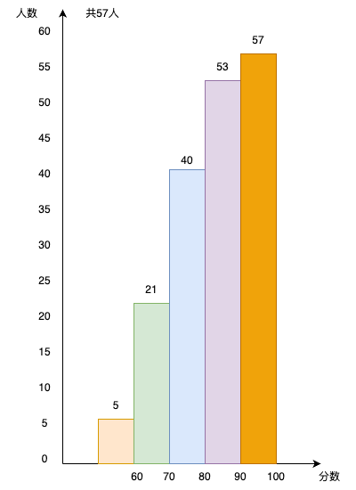

# 基于prometheus client监控应用


`prometheus` 的指标数据由`target`服务提供的。`prometheus`服务器定时从`target`服务上收集这些指标。在开发` prometheus client`之前，先介绍一下指标。


## 指标(`Metric`)定义

`Prometheus`的指标(`Metric`)被统一定义为： 

```
<metric name>{<label_name_1>=<label_value_1>,<label_name_2>=<label_value_2>,...} 
```

说明：

- 指标名称(`metric name`)：反映被监控的样本,例如`prometheus_http_requests_total`表示 `Prometheus`接收到的`HTTP`请求数量; 指标名称(metric name)命名必须满足如下规则：
  - 指标名称必须有字母、数字、下划线或者冒号组成
  - 不能以数字开头，也就是说必须满足`[a-zA-Z_:][a-zA-Z0-9_:]*`
  - 冒号`:`不得使用于`exporter`
- 标签(`label`)反映样本的特征维度,通过这些维度`Prometheus`可以对样本数据进行过滤，聚合等.标签命名必须满足如下规则：
  - 标签名称必须有字母、数字、下划线或者冒号组成
  - 标签名称不能以数字开头，也就是说必须满足`[a-zA-Z_:][a-zA-Z0-9_:]*`
  - 前缀为`__`标签，是为系统内部使用而预留的。

注：`Prometheus`拉取到的指标(`Metric`)形式都是` <metric name>{<label_name_1>=<label_value_1>,<label_name_2>=<label_value_2>,...} `的。但在存储上，指标名称(`metric name`)将会以`__name__=<metric name>`的形式保存在数据库中的.例如`prometheus_http_requests_total{code="200",handler="/"}`① 会被转换成 `{__name__ = "prometheus_http_requests_total", code="200",handler="/"}`②。所以①、②是同一时序的不同表示而已。


## 指标(`Metric`)类型

`Prometheus`采集到的`Metric`类型有四种：`Counter`、`Gauge`、`Histogram`、`Summary`。  

### Counter(计数器类型)

Counter(计数器类型): 一般用于累计值，**只增不减**，例如记录请求次数、任务完成数、错误发生次数。类比: 人吃饭、喝水的次数  
例如: 接口`/metrics`，状态码为`200`的请求次数

```text
  prometheus_http_requests_total{code="200",handler="/metrics"} 851
```

展示：  


### Gauge(仪表盘类型)

Gauge(仪表盘类型): 一般的监控指标，波动的指标，**可增可减**，例如cpu使用率，可用内存。类比:人每顿吃了几碗饭。 

例如：`go`程序的内存分配情况  

```
# HELP go_memstats_alloc_bytes Number of bytes allocated and still in use.
# TYPE go_memstats_alloc_bytes gauge
go_memstats_alloc_bytes 2.1667616e+07
```

展示  
 


### Histogram(直方图类型) 

Histogram(直方图类型):表示一段时间范围内对数据进行采样（通常是请求持续时间或响应大小），并能够对其**指定区间**以及总数进行统计，通常它采集的数据展示为直方图。格式`xxxx_bucket{le="<数值>"[,其他标签]} <数值>`，*注：`le`是**向上包含**的,即**小于等于**。*

**例如**：下例截取自`prometheus`的监控数据，此为`prometheus`调用`/metrics`接口的耗时。

```
prometheus_http_request_duration_seconds_bucket{handler="/metrics",le="0.1"} 727
prometheus_http_request_duration_seconds_bucket{handler="/metrics",le="0.2"} 727
prometheus_http_request_duration_seconds_bucket{handler="/metrics",le="0.4"} 728
prometheus_http_request_duration_seconds_bucket{handler="/metrics",le="1"} 728
prometheus_http_request_duration_seconds_bucket{handler="/metrics",le="3"} 728
prometheus_http_request_duration_seconds_bucket{handler="/metrics",le="8"} 728
prometheus_http_request_duration_seconds_bucket{handler="/metrics",le="20"} 728
prometheus_http_request_duration_seconds_bucket{handler="/metrics",le="60"} 728
prometheus_http_request_duration_seconds_bucket{handler="/metrics",le="120"} 728
prometheus_http_request_duration_seconds_bucket{handler="/metrics",le="+Inf"} 728
prometheus_http_request_duration_seconds_sum{handler="/metrics"} 58.465142
prometheus_http_request_duration_seconds_count{handler="/metrics"} 728
```

说明：`request_time <= 0.1s`的请求数 `727`，`request_time <= 0.4s`的请求数 `728`。  

展示   


 #### `prometheus`的直方图与数学的直方图对比

数学上经常通过直方图表述数据分布。例如：一个班级学生的成绩分布情况


 

**说明**

- 每个区间仅统计当前区间的数据量，例如`70~80`之间的有`19`人
- 查询多个区间数据需要进行加法运算，例如计算小于`90`分的人数`5+16+19+13=53`
- 下一次考试成绩的统计不涉及本次考试成绩


`prometheus`中的直方图与数学的直方图进行了**优化**。上文中所提到的统计区间的数据会分组存储桶`bucket`，`prometheus`会称之为桶`bucket`。使用`prometheus`中的直方图展示本次考试成绩，如下图所示。


 

**说明**

- 每个桶的值是**小于或等于**桶的上限的数据之和。例如本次考试`<= 60` 有`5`人，`60<成绩<=70`有`16`人，`70<成绩<=80`有`19`人；那么桶`60~70`部分就是`5+16=21` ,桶`70~80`部分就是`5+16+19=40`

- 查询多个区间数据不再需要加法运算，例如计算小于`90`分的人数直接获取`53`

- `prometheus`中的直方图是时间序列，时间序列本身是**累积**的。类比此例，就是本次考试成绩会计入下一次考试中。

  - 本次考试`<= 60` 有`5`人，`60<成绩<=70`有`16`人，`70<成绩<=80`有`19`人；那么桶`60~70`部分就是`5+16=21` ,桶`70~80`部分就是`5+16+19=40`
  - 下次考试`<= 60` 有`3`人，`60<成绩<=70`有`12`人，`70<成绩<=80`有`22`人；那么桶`60~70`部分就是`(3+12)+21=36` ,桶`70~80`部分就是`(3+12+22)+40=77`

  由此可以看到，针对每个区间(`bucket`)来说，就转换成了**`Counter`**。
  
  

#### 稀疏直方图

在实际工作中，很多场景得益于`prometheus`的直方图，例如计算服务响应 `P95`、`P99`；热力图等。但直方图也引入了一个问题：**估算精度不够**。上例开始成绩小于等于`60`分的有5人,统计一下成绩低于`6`分的人数。假设一下：如果准确统计，只能把统计区间划分为`分数 <=6`、`6< 成绩 <= 60` 、`60 < 成绩 <= 70`......；如果用户需要再统计成绩低于`10.956`分、`14`分...呢？这样拆分下去的话，直方图的区间(`bucket`)就会越来越多，指标数量将会爆炸性的膨胀。显而易见，无论是业务上、还是技术上不断地拆分区间是不可取的。

因此，`Prometheus` 引入了` Histogram`的新方案: 稀疏直方图( `Sparse Histogram`)。


TODO


### Summary(摘要类型)

Summary(摘要类型):表示一段时间范围内对数据进行采样（通常是请求持续时间或响应大小)。格式`xxxx{quantile="< φ>"[,其他标签]} <数值>`，*注：`quantile`百分比*。
例如：

```
# HELP go_gc_duration_seconds A summary of the pause duration of garbage collection cycles.
# TYPE go_gc_duration_seconds summary

go_gc_duration_seconds{quantile="0"} 0.000024251
go_gc_duration_seconds{quantile="0.25"} 0.0003065
go_gc_duration_seconds{quantile="0.5"} 0.000597208
go_gc_duration_seconds{quantile="0.75"} 0. 000893082
go_gc_duration_seconds{quantile="1"} 0.001552459
```

展示：  


