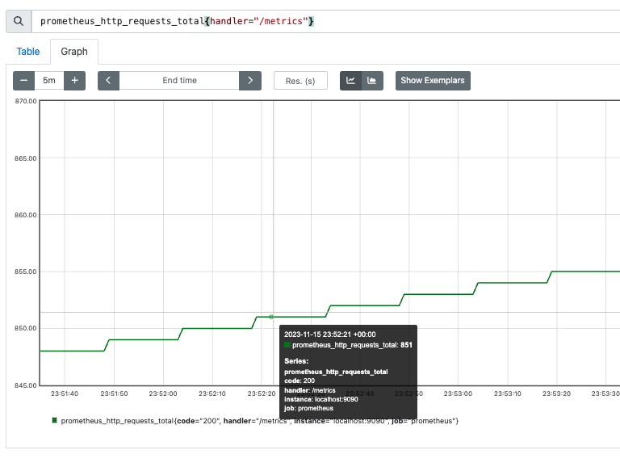

# 2.5 开发exporter

本节的目标：

- 了解`Metric`以及`Metric`数值统计的数学原理
- 具有完全开发`exporter`的能力


## 1.指标(`Metric`)

`prometheus` 的指标数据由`target`服务提供的。`prometheus`服务器定时从`target`服务上收集这些指标。在开发` prometheus exporter`之前，先介绍一下指标。

### 1.1 指标(`Metric`)定义

每个时间序列由指标名称(`metric name`)以及一组标签（可选的键值对）唯一标识。`Prometheus`的指标(`Metric`)被统一定义为： 

```
<metric name>{<label_name_1>=<label_value_1>,<label_name_2>=<label_value_2>,...} 
```

说明：

- 指标名称(`metric name`)：反映被监控的样本, 例如`prometheus_http_requests_total`表示 `Prometheus`接收到的`HTTP`请求数量; 

- 指标名称(`metric name`)命名必须满足如下规则：

  - 指标名称必须有字母、数字、下划线或者冒号组成
  - 不能以数字开头，也就是说必须满足`[a-zA-Z_:][a-zA-Z0-9_:]*`
  - 冒号`:`不得使用于`exporter`    注：冒号专门用来表示用户自定义的记录规则，不能在exporter或监控对象直接暴露的指标中使用冒号来表示指标名称。

- 标签(`label`)反映样本的特征维度,通过这些维度`Prometheus`可以对样本数据进行过滤，聚合等.标签命名必须满足如下规则：
  - 标签名称必须有字母、数字、下划线或者冒号组成

  - 标签名称不能以数字开头，也就是说必须满足`[a-zA-Z_][a-zA-Z0-9_]*`

  - 前缀为`__`标签，是为系统内部使用而预留的。

    

> [!TIP]
>
> `Prometheus`拉取到的指标(`Metric`)形式都是
>
> ```
>  <metric name>{<label_name_1>=<label_value_1>,<label_name_2>=<label_value_2>,...} 
> ```
>
> 但在数据库中，指标名称(`metric name`)将会以`__name__=<metric name>`的形式存储的。
>
> ```
> {__name__=<metric name>,<label_name_1>=<label_value_1>,<label_name_2>=<label_value_2>,...} 
> ```
>
> 是同一个时序的不同表示而已。
>
> 
>
> 例如： `metric`接口获取的指标`prometheus_http_requests_total{code="200",handler="/"}`会被转换成 `{__name__ = "prometheus_http_requests_total", code="200",handler="/"}`存储在数据库中。
>
> 


### 1.2 指标(`Metric`)类型

`Prometheus`采集到的`Metric`类型有四种：`Counter`、`Gauge`、`Histogram`、`Summary`。  

#### 1.2.1 Counter(计数器类型)

Counter(计数器类型): 一般用于累计值，**只增不减**，例如记录请求次数、任务完成数、错误发生次数。类比: 人吃饭、喝水的次数  
例如: 接口`/metrics`，状态码为`200`的请求次数

```text
prometheus_http_requests_total{code="200",handler="/metrics"}    851
```

展示：  


#### 1.2.2 Gauge(仪表盘类型)

Gauge(仪表盘类型): 一般的监控指标，波动的指标，**可增可减**，例如cpu使用率，可用内存。类比:人每顿吃了几碗饭。 

例如：`go`程序的内存分配情况  

```
# HELP go_memstats_alloc_bytes Number of bytes allocated and still in use.
# TYPE go_memstats_alloc_bytes gauge
go_memstats_alloc_bytes 2.1667616e+07
```

展示  
 


#### 1.2.3 Histogram(直方图类型) 

官方说明

``````text
A histogram samples observations (usually things like request durations or response sizes) and counts them in configurable buckets. It also provides a sum of all observed values.

Histogram(直方图类型):表示一段时间范围内对数据进行采样（通常是请求持续时间或响应大小），并能够对其指定区间以及总数进行统计。
``````


#####  数学中的直方图

直方图本质就是柱状图。先回顾一下数学中的柱状图。例如统计一个班级学生的两次成绩分布情况                                          


**要素**

- **采样次数** 每次统计的样本数都是 `57`，例如:一模中 `张三 73分`、`李四 46分`、`王五 91分`、.....  每个都是一个样本，一模成绩需要采样`57`个次。同样二模也需要采样`57`个次。
- **区间划分 **
  - 上图中区间划分为   `分数 <=60` 、 `60< 分数 <=70`、 `70< 分数 <=80`、 `80< 分数 <=90`、`90<分数 <=100`;
  - 每个区间仅统计当前区间的数据量，例如一模考试中，`70~80`之间的有`19`人;
  - 查询多个区间数据需要进行加法运算，例如计算一模考试中 小于`90`分的人数`5+16+19+13=53`
- 计算平均值 `总分数/采样数`。`(73 + 46 + 91 +.....) / 57`
- 下一次考试成绩的统计不涉及本次考试成绩，一模成绩、二模成绩不能混淆统计。例如：二模中 `张三 69分` 不会统计在一模的 `60 <分数 <=70`区间中；


##### prometheus中的直方图

`prometheus`中的`直方图`(或`柱状图`)与数学的`直方图`(或`柱状图`)进行了"**优化**"：**累加直方图**


说明：

- 数学直方图区间对应的就是`prometheus`中的`直方图`的桶，也就是`bucket`。每个桶的值是**小于或等于**桶的上限的数据之和。例如本次考试`成绩<= 60` 有`5`人，`60<成绩<=70`有`16`人，`70<成绩<=80`有`19`人；那么桶`60~70`部分就是`5+16=21` ,桶`70~80`部分就是`5+16+19=40`
- 查询多个区间数据不再需要加法运算，例如计算小于`90`分的人数直接获取`53`
- `prometheus`中的直方图是时间序列，时间序列本身是**累积**的。类比此例，就是本次考试成绩会计入下一次考试中。


**计算方式**

<table>
  <capital>统计流程</capital>
  <tr>
    <th>成绩采样</th>
    <th rowspan=2 > prometheus <br>直方图初始数据 </th>
    <th colspan=3 > 张三/73/一模 </th>
    <th colspan=3> 李四/46/一模 </th>
    <th colspan=3> 王五/91/一模 </th>
    <th colspan=3> 张三/69/二模 </th>
    <th > ...</th>
  </tr>
  <tr>
    <th>区间</th>
    <th >采样</th>
    <th >数学直方图</th>
    <th >prometheus直方图</th>
    <th >采样</th>
    <th >数学直方图</th>
    <th >prometheus直方图</th>
    <th >采样</th>
    <th >数学直方图</th>
    <th >prometheus直方图</th>
    <th >采样</th>
    <th >数学直方图</th>
    <th >prometheus直方图</th>
    <th ></th>
  </tr>
    <tr>
    <th> 分数<=60 </th>
    <td >0</td>
    <td >0</td>
    <td >0</td>
    <td >0</td>
    <td >1</td>
    <td >1</td>
    <td >1</td>
    <td >0</td>
    <td >1</td>
    <td >1</td>
    <td >0</td>
    <td >1</td>
    <td >1</td>
    <td ></td>
  </tr>
  <tr>
    <th> 60<分数<=70 </th>
    <td >0</td>
    <td >0</td>
    <td >0</td>
    <td >0</td>
    <td >0</td>
    <td >0</td>
    <td >1</td>
    <td >0</td>
        <td >0</td>
    <td >1</td>
    <td >1</td>
        <td >1</td>
    <td >2</td>
    <td ></td>
  </tr>
  <tr>
    <th>70< 分数 <=80</th>
    <td >0</td>
    <td >1</td>
    <td >1</td>
    <td >1</td>
    <td >0</td>
    <td >1</td>
    <td >2</td>
    <td >0</td>
    <td >1</td>
    <td >2</td>
    <td >0</td>
    <td >1</td>
    <td >3</td>
    <td ></td>
  </tr>
    <tr>
    <th>80< 分数 <=90</th>
    <td >0</td>
    <td >0</td>
    <td >0</td>
    <td >1</td>
    <td >0</td>
        <td >0</td>
    <td >2</td>
    <td >0</td>
        <td >0</td>
    <td >2</td>
    <td >0</td>
        <td >0</td>
    <td >3</td>
    <td ></td>
  </tr>
    <tr>
    <th>90< 分数 <=100</th>
    <td >0</td>
    <td >0</td>
        <td >0</td>
    <td >1</td>
    <td >0</td>
        <td >0</td>
    <td >2</td>
    <td >1</td>
        <td >1</td>
    <td >3</td>
    <td >0</td>
        <td >1</td>
    <td >4</td>
    <td ></td>
  </tr>
    <tr>
    <th>总成绩</th>
    <td >0</td>
    <td >-</td>
    <td >73</td>
        <td >73</td>
    <td >-</td>
    <td >73+46=119</td>
    <td >73+46=119</td>
    <td >-</td>
    <td >73+46+91=210</td>
    <td >73+46+91=210</td>
    <td >-</td>
    <td >73+46+91+69=279</td>
    <td >73+46+91+69=279</td>
    <td >-</td>
  </tr>
    <tr>
    <th> 采样次数 </th>
    <td >0</td>
    <td colspan=3 >1</td>
    <td colspan=3 >2</td>
    <td colspan=3 >3</td>
    <td colspan=3 >4</td>
    <td ></td>
  </tr>
</table>


`prometheus`中的直方图格式`xxxx_bucket{le="<数值>"[,其他标签]} <数值>`，*注：`le`是**向上包含**的,即**小于等于**。*

直方图指标由三个部分：

- 采样次数即总样本数量，**累加的**，指标名称以`_count`结尾。
- 所有测量值之和,**累加的**，指标名称以`_sum`结尾。
- 一组直方图的桶，指标名称以`_bucket`结尾，标签包含`le`。每一个桶的数据是**累加的**。


**例如**：下例截取自`prometheus`的监控数据，此为`prometheus`调用`/metrics`接口的耗时。

```
prometheus_http_request_duration_seconds_bucket{handler="/metrics",le="0.1"} 210
prometheus_http_request_duration_seconds_bucket{handler="/metrics",le="0.2"} 250
prometheus_http_request_duration_seconds_bucket{handler="/metrics",le="0.4"} 255
prometheus_http_request_duration_seconds_bucket{handler="/metrics",le="1"}  255
prometheus_http_request_duration_seconds_bucket{handler="/metrics",le="3"} 255
prometheus_http_request_duration_seconds_bucket{handler="/metrics",le="8"} 255
prometheus_http_request_duration_seconds_bucket{handler="/metrics",le="20"} 255
prometheus_http_request_duration_seconds_bucket{handler="/metrics",le="60"} 255
prometheus_http_request_duration_seconds_bucket{handler="/metrics",le="120"} 255
prometheus_http_request_duration_seconds_bucket{handler="/metrics",le="+Inf"} 255
prometheus_http_request_duration_seconds_sum{handler="/metrics"} 58.465142
prometheus_http_request_duration_seconds_count{handler="/metrics"} 728
```

说明：`request_time <= 0.1s`的请求数 `727`，`request_time <= 0.4s`的请求数 `728`。  

展示   


#####  累加直方图有什么好处？

###### 分位数计算简单

分位数：对一批数据进行排序之后，排在`p%`位置的数值大小。例如：有100个数字，按照从小到大的顺序排列，`P75`就是第`75`位置上的数、`P90`就是第`90`位置上的数。上面一模成绩而言，`P90` 应该是顺序在`51`( 即： *`57 * 90%  ≈ 51`* )位置上的分数 。

如果使用数学直方图 找第`51`位置上的分数。

- [0 , 60]       5人                                            5   <  51
- [0, 70]        5 + 16 = 21人                           21  < 51
- [0, 70]        5 + 16  + 19 =  40人                40  < 51
- [0, 80]        5 + 16  + 19  + 13 =  53人      53   > 51          ====>       排序第`51`位置上的分数在`(70, 80]`区间。

如果使用prometheus直方图 找第`51`位置上的分数。

- [0 , 60]       5人            5   <  51
- [0, 70]        21人         21  < 51
- [0, 70]        40人         40  < 51
- [0, 80]        53人         53   > 51          ====>       排序第`51`位置上的分数在` (70, 80]`区间。

使用`prometheus`直方图 查找分位数无需进行**累加**计算。

> [!TIP]
>
> 延伸：`prometheus`直方图计算分位数的逻辑  
>
> 在工作中，`prometheus`直方图经常通过函数`histogram_quantile`来**估算**分位数，例如响应`P90`、`P95`、`P99`等。`histogram_quantile`是如何进行估算的呢？
>
> 1. `采样次数 * P%`  获得第几位上的样本。例如上例 `P90` 是顺序在`51`( 即： *`57 * 90%  ≈ 51`* )位上的分数 。
>
> 2. 依次比较每个`bucket`的数量，获取样本所在区间，即找到对应的`bucket`。见上例查找过程。
>
> 3. 不妨将对应的`bucket`暂时命名为`bucketA`。`prometheus`直方图会认为`bucketA`的样本都是**线性均匀**分布在这个区间里的。` (70, 80]`区间里有`13`个样本，这`13`个样本均匀分布于`70~80`之间，那么每个样本之间的间隔就是`(80-70)/13`;  `P90`的分数是这个` (70, 80]`区间里的第`11`位，那么估计值为`70 + (80-70)/13 * 11`
>
>    综上：估算公式  `bucketStart + (bucketEnd-bucketStart)*float64(rank/count)`    
>
>    -  `rank`    分位数在当前`bucket`中是第几位  
>    - `count`   当前`bucket`中的样本数量。
>    - `bucketStart`、` bucketEnd`  表示当前`bucket`的开始边界、结束边。
>
> 
>
> 既然是估算，那么一定是存在误差的。`prometheus`直方图要做的就是尽量减少误差，以确保精确。误差过大就没有意义了


#### 1.2.4 Summary(摘要类型)

`Summary`(摘要类型):表示一段时间范围内对数据进行采样（*通常是请求持续时间或响应大小*)，并能够对其**指定比例**以及**总数**进行统计。格式`xxxx{quantile="<φ>"[,其他标签]} <数值>`，`quantile`百分比，即**分位数**

`Summary`指标由三个部分：

- 观测对象发生的次数，类型`Counter`，指标名称以`_count`结尾。
- 所有测量值之和,类型`Counter`，指标名称以`_sum`结尾。
- 一组**分位数**数据，指标标签包含`quantile`，即：中位数(`quantile="0.5"`)、`9`分位(`quantile="0.9"`)

> 注：分位数，指将一个随机变量的概率分布范围分为几个等份的数值点。
>
> 例如,下面一组数据 2,  5,  67, 102, 487, 1200,  9032，中位数(`quantile="0.5"`)为102 

例如：

```text
# HELP go_gc_duration_seconds A summary of the pause duration of garbage collection cycles.
# TYPE go_gc_duration_seconds summary
go_gc_duration_seconds{quantile="0"} 2.4291e-05
go_gc_duration_seconds{quantile="0.25"} 3.75e-05
go_gc_duration_seconds{quantile="0.5"} 0.000167125
go_gc_duration_seconds{quantile="0.75"} 0.000247333
go_gc_duration_seconds{quantile="1"} 0.000343667
go_gc_duration_seconds_sum 0.001557791
go_gc_duration_seconds_count 10
```

说明

- `go`语言`gc`进行了`10`次，总耗时` 0.001557791s`
- 中位数(`quantile="0.5"`)耗时`0.000167125s`; `7.5`位数(`quantile="0.75"`)耗时`0.000247333s`


展示  


## 2. 开发export

### 2.1 开发一个全新的export 

代码见[代码](./prom-target/README.md)


### 2.2  二开node export


