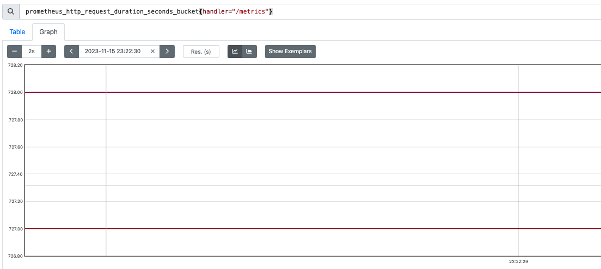
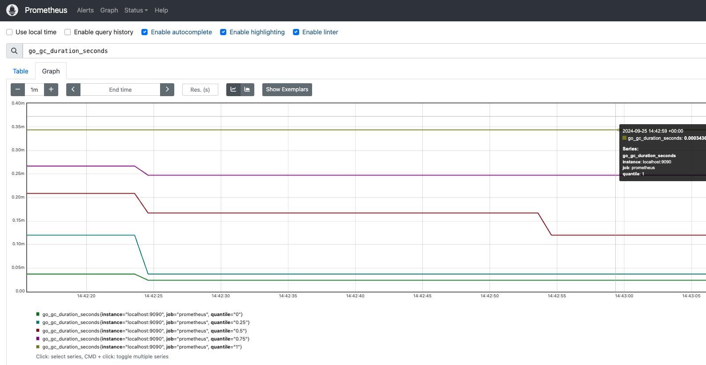

# 2.5 开发export

本节目录

- 1.指标(`Metric`)

  - 1.1 指标(`Metric`)定义

  - 1.2 指标(`Metric`)类型
    - 1.2.1 Counter(计数器类型)
    - 1.2.2 Gauge(仪表盘类型)
    - 1.2.3 Histogram(直方图类型) 
      - 1.2.3.1  `prometheus`的直方图与数学的直方图对比
      - 1.2.3.2 直方图的误差
    - 1.2.4 Summary(摘要类型)

- 2.开发export

  - 2.1 开发一个全新的export
  - 2.2  二开node export


## 1.指标(`Metric`)

`prometheus` 的指标数据由`target`服务提供的。`prometheus`服务器定时从`target`服务上收集这些指标。在开发` prometheus exporter`之前，先介绍一下指标。

### 1.1 指标(`Metric`)定义

`Prometheus`的指标(`Metric`)被统一定义为： 

```
<metric name>{<label_name_1>=<label_value_1>,<label_name_2>=<label_value_2>,...} 
```

说明：

- 指标名称(`metric name`)：反映被监控的样本,例如`prometheus_http_requests_total`表示 `Prometheus`接收到的`HTTP`请求数量; 指标名称(metric name)命名必须满足如下规则：
  - 指标名称必须有字母、数字、下划线或者冒号组成
  - 不能以数字开头，也就是说必须满足`[a-zA-Z_:][a-zA-Z0-9_:]*`
  - 冒号`:`不得使用于`exporter`
- 标签(`label`)反映样本的特征维度,通过这些维度`Prometheus`可以对样本数据进行过滤，聚合等.标签命名必须满足如下规则：
  - 标签名称必须有字母、数字、下划线或者冒号组成
  - 标签名称不能以数字开头，也就是说必须满足`[a-zA-Z_:][a-zA-Z0-9_:]*`
  - 前缀为`__`标签，是为系统内部使用而预留的。

注：`Prometheus`拉取到的指标(`Metric`)形式都是` <metric name>{<label_name_1>=<label_value_1>,<label_name_2>=<label_value_2>,...} `的。但在存储上，指标名称(`metric name`)将会以`__name__=<metric name>`的形式保存在数据库中的.例如`prometheus_http_requests_total{code="200",handler="/"}`① 会被转换成 `{__name__ = "prometheus_http_requests_total", code="200",handler="/"}`②。所以①、②是同一时序的不同表示而已。


### 1.2 指标(`Metric`)类型

`Prometheus`采集到的`Metric`类型有四种：`Counter`、`Gauge`、`Histogram`、`Summary`。  


#### 1.2.1 Counter(计数器类型)

Counter(计数器类型): 一般用于累计值，**只增不减**，例如记录请求次数、任务完成数、错误发生次数。类比: 人吃饭、喝水的次数  
例如: 接口`/metrics`，状态码为`200`的请求次数

```text
  prometheus_http_requests_total{code="200",handler="/metrics"} 851
```

展示：  


#### 1.2.2 Gauge(仪表盘类型)

Gauge(仪表盘类型): 一般的监控指标，波动的指标，**可增可减**，例如cpu使用率，可用内存。类比:人每顿吃了几碗饭。 

例如：`go`程序的内存分配情况  

```
# HELP go_memstats_alloc_bytes Number of bytes allocated and still in use.
# TYPE go_memstats_alloc_bytes gauge
go_memstats_alloc_bytes 2.1667616e+07
```

展示  
 


#### 1.2.3 Histogram(直方图类型) 

`Histogram`(直方图类型):表示**一段时间范围**内对数据进行采样（*通常是请求持续时间或响应大小*），并能够对其**指定区间**以及**总数**进行统计。

直方图本质就是柱状图。先回顾一下数学中的柱状图。例如统计一个班级学生的两次成绩分布情况                                          


**要素**

- 标注第几次采样。 一模考试、 二模考试等
- 标注采样的总人数说明 `57`人
- 区间划分 `分数 <=60` 、 `60< 分数 <=70`、 `70< 分数 <=80`、 `80< 分数 <=90`、`90< 分数 <=100`


格式`xxxx_bucket{le="<数值>"[,其他标签]} <数值>`，*注：`le`是**向上包含**的,即**小于等于**。*

直方图指标由三个部分：

- 测量次数，类型`Counter`，指标名称以`_count`结尾。
- 所有测量值之和,类型`Counter`，指标名称以`_sum`结尾。
- 一组直方图的桶，指标名称以`_bucket`结尾，标签包含`le`。


**例如**：下例截取自`prometheus`的监控数据，此为`prometheus`调用`/metrics`接口的耗时。

```
prometheus_http_request_duration_seconds_bucket{handler="/metrics",le="0.1"} 727
prometheus_http_request_duration_seconds_bucket{handler="/metrics",le="0.2"} 727
prometheus_http_request_duration_seconds_bucket{handler="/metrics",le="0.4"} 728
prometheus_http_request_duration_seconds_bucket{handler="/metrics",le="1"} 728
prometheus_http_request_duration_seconds_bucket{handler="/metrics",le="3"} 728
prometheus_http_request_duration_seconds_bucket{handler="/metrics",le="8"} 728
prometheus_http_request_duration_seconds_bucket{handler="/metrics",le="20"} 728
prometheus_http_request_duration_seconds_bucket{handler="/metrics",le="60"} 728
prometheus_http_request_duration_seconds_bucket{handler="/metrics",le="120"} 728
prometheus_http_request_duration_seconds_bucket{handler="/metrics",le="+Inf"} 728
prometheus_http_request_duration_seconds_sum{handler="/metrics"} 58.465142
prometheus_http_request_duration_seconds_count{handler="/metrics"} 728
```

说明：`request_time <= 0.1s`的请求数 `727`，`request_time <= 0.4s`的请求数 `728`。  

展示   




##### 1.2.3.1  `prometheus`的直方图与数学的直方图对比

数学上经常通过直方图表述数据分布。例如：一个班级学生的成绩分布情况


 

**说明**

- 每个区间仅统计当前区间的数据量，例如`70~80`之间的有`19`人
- 查询多个区间数据需要进行加法运算，例如计算小于`90`分的人数`5+16+19+13=53`
- 下一次考试成绩的统计不涉及本次考试成绩


`prometheus`中的直方图与数学的直方图进行了"**优化**"。上文中所提到的统计区间的数据会分组存储桶`bucket`，`prometheus`会称之为桶`bucket`。使用`prometheus`中的直方图展示本次考试成绩，如下图所示。


 

**说明**

- 每个桶的值是**小于或等于**桶的上限的数据之和。例如本次考试`<= 60` 有`5`人，`60<成绩<=70`有`16`人，`70<成绩<=80`有`19`人；那么桶`60~70`部分就是`5+16=21` ,桶`70~80`部分就是`5+16+19=40`

- 查询多个区间数据不再需要加法运算，例如计算小于`90`分的人数直接获取`53`

- `prometheus`中的直方图是时间序列，时间序列本身是**累积**的。类比此例，就是本次考试成绩会计入下一次考试中。

  - 本次考试`<= 60` 有`5`人，`60<成绩<=70`有`16`人，`70<成绩<=80`有`19`人；那么桶`60~70`部分就是`5+16=21` ,桶`70~80`部分就是`5+16+19=40`
  - 下次考试`<= 60` 有`3`人，`60<成绩<=70`有`12`人，`70<成绩<=80`有`22`人；那么桶`60~70`部分就是`(3+12)+21=36` ,桶`70~80`部分就是`(3+12+22)+40=77`

  由此可以看到，针对每个区间(`bucket`)来说，就转换成了**`Counter`**。
  
  

##### 1.2.3.2 直方图的误差

在实际工作中`prometheus`指标数据是定期采集的，在时间上都是离散的；样本数据也是划分区间的，例如直方图统计小于等于某值的数量和，而不是把所有的数据枚举值都记录下来。所以`prometheus`根据采集的数据会估算其他时刻或者其他数据的状态。虽然是估算，但**误差**必须足够小。

如果要求误差为`5%`，统计响应时间为`50ms`的请求数量，允许误差为`2.5ms`，即可以接受响应时间为`50ms ± 2.5ms`的请求；统计响应时间为`100ms`的请求数量，允许误差为`5ms`，即可以接受响应时间为`100ms ± 5ms`的请求；统计响应时间为`500ms`的请求数量，允许误差为`25ms`，即可以接受响应时间为`500ms ± 25ms`的请求。虽然误差为`5%`，但是统计的对象的值(`50ms`、`100ms`、`500ms`)增大，误差的绝对值也会越大(`2.5ms`、`5ms`、`25ms`)。因此，**区间不能等距划分**。统计小数据的指标时，区间跨度也要小一些；统计大数据的指标时，区间跨度要大一些。


#### 1.2.4 Summary(摘要类型)

`Summary`(摘要类型):表示一段时间范围内对数据进行采样（*通常是请求持续时间或响应大小*)，并能够对其**指定比例**以及**总数**进行统计。格式`xxxx{quantile="<φ>"[,其他标签]} <数值>`，`quantile`百分比，即**分位数**

`Summary`指标由三个部分：

- 观测对象发生的次数，类型`Counter`，指标名称以`_count`结尾。
- 所有测量值之和,类型`Counter`，指标名称以`_sum`结尾。
- 一组**分位数**数据，指标标签包含`quantile`，即：中位数(`quantile="0.5"`)、`9`分位(`quantile="0.9"`)

> 注：分位数，指将一个随机变量的概率分布范围分为几个等份的数值点。
>
> 例如,下面一组数据 2,  5,  67, 102, 487, 1200,  9032，中位数(`quantile="0.5"`)为102 

例如：

```text
# HELP go_gc_duration_seconds A summary of the pause duration of garbage collection cycles.
# TYPE go_gc_duration_seconds summary
go_gc_duration_seconds{quantile="0"} 2.4291e-05
go_gc_duration_seconds{quantile="0.25"} 3.75e-05
go_gc_duration_seconds{quantile="0.5"} 0.000167125
go_gc_duration_seconds{quantile="0.75"} 0.000247333
go_gc_duration_seconds{quantile="1"} 0.000343667
go_gc_duration_seconds_sum 0.001557791
go_gc_duration_seconds_count 10
```

说明

- `go`语言`gc`进行了`10`次，总耗时` 0.001557791s`
- 中位数(`quantile="0.5"`)耗时`0.000167125s`; `7.5`位数(`quantile="0.75"`)耗时`0.000247333s`


展示  



## 2. 开发export

### 2.1 开发一个全新的export 

代码见[代码](./prom-target/README.md)


### 2.2  二开node export


