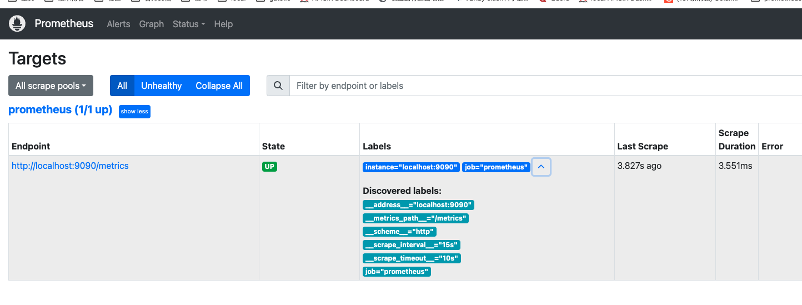

# 项目简述

## 前言

github：[https://github.com/tylitianrui/readcode](https://github.com/tylitianrui/readcode)

版本：`2.53.0`

内容：

- prometheus的配置、部署、使用
- prometheus原理、数学模型
- prometheus源码解析以及二开


为什么选择版本`2.53.0`？

最新的LTS版本 , 详见官方文档 [https://prometheus.io/docs/introduction/release-cycle/#long-term-support](https://prometheus.io/docs/introduction/release-cycle/#long-term-support)


## 环境准备

### 代码版本

- 仓库地址: [https://github.com/prometheus/prometheus](https://github.com/prometheus/prometheus)

- commit: **4c35b9250afefede41c5f5acd76191f90f625898**

- version: [v2.53.0](https://github.com/prometheus/prometheus/commits/v2.53.0)

- release: https://github.com/prometheus/prometheus/releases/tag/v2.53.0

- 官方文档: https://prometheus.io/docs/prometheus/2.53/getting_started/

  

> [!TIP]
>
> 说明
>
> - `Prometheus` 小版本迭代周期约6周,更新周期快
> - `Prometheus LTS`版本支持时长一年,只接受`fixbug`、安全性和文档的`pr`，不再有新功能
> - `Prometheus`建议通过升级版本的方式解决`bug` 
>


### 阅读环境

- vscode
- Grafana
- golang  1.21.12
- node.js v22.1.0

#### docker部署grafana

`docker-compose.yaml` 内容：

```yaml
version: '3'

services:
  grafana:
    image: grafana/grafana-enterprise
    container_name: grafana
    ports:
      - "3000:3000"
    volumes:
    - ./data:/var/lib/grafana:rw
```


启动容器：`docker-conmpose  up  -d`

grafana地址: [http://localhost:3000](http://localhost:3000/login)

初始账号密码`admin`

## 代码

### 下载代码

```shell
# git clone  git@github.com:prometheus/prometheus.git
git clone  git@github.com:tylitianrui/prometheus.git

# 代码版本
cd prometheus
git checkout  v2.53.0

```

### 手动编译安装

进入到项目的根目录，进行编译，命令如下：

```shell
sudo  make build 
```

编译后，会创建两个可执行文件:

 1. prometheus :  `prometheus`的可执行文件
 2. promtool  :   `promtool` 是 `Prometheus` 提供的一个运维工具，用来对 `Prometheus` 进行检查.  


### 运行

```shell
 ./prometheus --config.file=documentation/examples/prometheus.yml
```


启动`prometheus`, 访问[http://127.0.0.1:9090/targets?search=](http://127.0.0.1:9090/targets?search=) 可见:




## 拉取演示

### prometheus配置  

上述演示是基于`prometheus`官方提供的默认配置，文件:[documentation/examples/prometheus.yml](https://github.com/prometheus/prometheus/blob/v2.53.0/documentation/examples/prometheus.yml)

```yaml
# my global config
global:
  scrape_interval: 15s # Set the scrape interval to every 15 seconds. Default is every 1 minute.
  evaluation_interval: 15s # Evaluate rules every 15 seconds. The default is every 1 minute.
  # scrape_timeout is set to the global default (10s).

# Alertmanager configuration
alerting:
  alertmanagers:
    - static_configs:
        - targets:
          # - alertmanager:9093

# Load rules once and periodically evaluate them according to the global 'evaluation_interval'.
rule_files:
  # - "first_rules.yml"
  # - "second_rules.yml"

# A scrape configuration containing exactly one endpoint to scrape:
# Here it's Prometheus itself.
scrape_configs:
  # The job name is added as a label `job=<job_name>` to any timeseries scraped from this config.
  - job_name: "prometheus"

    # metrics_path defaults to '/metrics'
    # scheme defaults to 'http'.

    static_configs:
      - targets: ["localhost:9090"]
```

 `prometheus`是通过定期(*配置`scrape_interval`*)向监控目标发送`http`请求(*默认接口`GET /metrics`*)获取监控指标的。上述配置`prometheus`每`15s`向`localhost:9090/metrics`发送请求获取自身的监控指标。


### `prometheus`拉取指标的请求信息

虽然知道了`prometheus`会向`localhost:9090/metrics`发送请求，但请求的相关参数是什么呢？我们对`prometheus`接口`GET /metrics`进行改造：打印请求的方法、`url`、`header`、`query string`、`body`。

**代码改造**  

原代码

```golang
router.Get("/metrics", promhttp.Handler().ServeHTTP)
```

改造为

```golang
router.Get("/metrics", func(resp http.ResponseWriter, req *http.Request) {
  // 方法
  stdlog.Print("method:", req.Method)
  // url
  stdlog.Print("url:", req.Host, req.URL)
  // headers
  stdlog.Print("-----header start")
  for k, vals := range req.Header {
    val := strings.Join(vals, ";;")
    stdlog.Printf("%s:%s", k, val)
  }
  stdlog.Print("-----header end------")
  stdlog.Print("-----query start")
  querys := req.URL.Query()
  for key, query := range querys {
    val := strings.Join(query, ";;")
    stdlog.Printf("%s:%s", key, val)
  }
  stdlog.Print("-----query end------")
  stdlog.Print("-----body start")
  s, _ := io.ReadAll(req.Body)
  if len(s) > 0 {
    stdlog.Print("body:", string(s))
  }
  stdlog.Print("-----body end------")
  promhttp.Handler().ServeHTTP(resp, req)
})

```

[代码详见](https://github.com/tylitianrui/prometheus/blob/print_scrape_req/web/web.go#L387)  

运行打印日志如下：

```text
2024/09/09 10:14:38 method:GET
2024/09/09 10:14:38 url:localhost:9090/metrics
2024/09/09 10:14:38 -----header start
2024/09/09 10:14:38 User-Agent:Prometheus/2.53.0
2024/09/09 10:14:38 Accept:application/openmetrics-text;version=1.0.0;q=0.5,application/openmetrics-text;version=0.0.1;q=0.4,text/plain;version=0.0.4;q=0.3,*/*;q=0.2
2024/09/09 10:14:38 Accept-Encoding:gzip
2024/09/09 10:14:38 X-Prometheus-Scrape-Timeout-Seconds:10
2024/09/09 10:14:38 -----header end------
2024/09/09 10:14:38 -----query start
2024/09/09 10:14:38 -----query end------
2024/09/09 10:14:38 -----body start
2024/09/09 10:14:38 -----body end------
```

由上可知请求无`query`、 `body`等,只是通过`header`传递参数。使用`curl`命令形式展示请求

```shell
curl --location 'http://localhost:9090/metrics' \
--header 'User-Agent: Prometheus/2.53.0' \
--header 'Accept: application/openmetrics-text;version=1.0.0;q=0.5,application/openmetrics-text;version=0.0.1;q=0.4,text/plain;version=0.0.4;q=0.3,*/*;q=0.2' \
--header 'Accept-Encoding: gzip' \
--header 'X-Prometheus-Scrape-Timeout-Seconds: 10'
```


> [!NOTE]
>
> 在终端使用上述curl命令会报错
>
> ```
> Warning: Binary output can mess up your terminal. Use "--output -" to tell
> Warning: curl to output it to your terminal anyway, or consider "--output
> Warning: <FILE>" to save to a file.
> ```
>
> 因为`header 'Accept-Encoding: gzip' ` 响应被压缩成二进制文件，所以提示需要指定一个文件来保存二进制文件。
> 解决方法you两种：
>
> 1. 去掉`header 'Accept-Encoding: gzip'` ，然后在终端请求。
> 2. 使用`postman`等工具进行请求
>    


## 代码debug

IDE: Vscode
